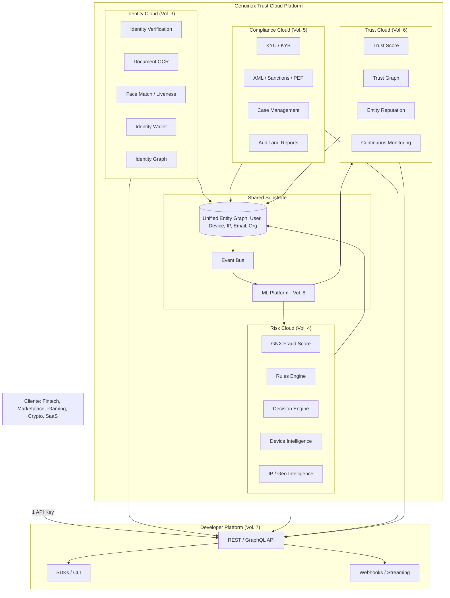
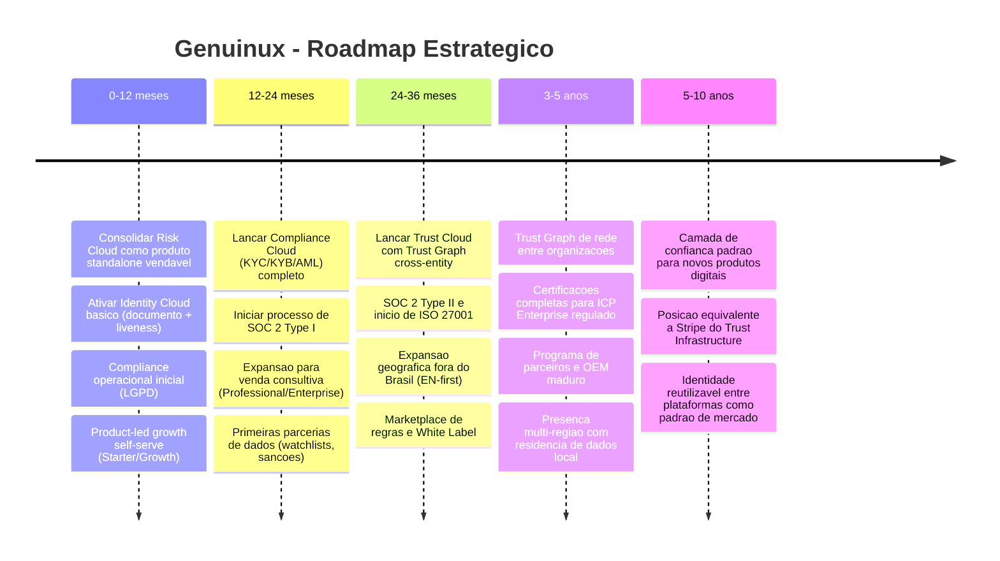

# GENUINUX MASTER PRODUCT SPECIFICATION (MPS)

## Volume 1 — Vision & Product Strategy

**Número do volume:** 1 de 12
**Título:** Vision & Product Strategy
**Status:** Draft v1.0
**Relação com os demais volumes:** Este é o volume fundacional. Todos os demais volumes (Platform Architecture, Identity Cloud, Risk Cloud, Compliance Cloud, Trust Cloud, Developer Platform, Data & Machine Learning, Security Architecture, Administration Platform, Commercial Platform, Master Roadmap) derivam suas prioridades, critérios de sucesso e restrições de negócio deste documento. Nenhuma decisão técnica nos volumes seguintes deve contradizer o posicionamento, o ICP ou os diferenciais definidos aqui sem uma revisão explícita deste volume.

---

## Índice

1. Objetivo do Volume
2. Escopo
3. Missão
4. Visão
5. Posicionamento (Positioning Statement)
6. Mercado — TAM / SAM / SOM
7. ICP (Ideal Customer Profile)
8. Personas
9. Problemas Resolvidos (Jobs To Be Done)
10. Proposta de Valor
11. Diferenciais Estratégicos
12. Arquitetura de Produto — Visão das Quatro Clouds
13. Comparação com Concorrentes
14. Casos de Uso
15. Regras de Negócio (nível estratégico)
16. Requisitos Funcionais (nível estratégico)
17. Requisitos Não Funcionais (nível estratégico)
18. Roadmap Estratégico (12 / 24 / 36 meses / 5 anos / 10 anos — visão executiva)
19. Riscos
20. Dependências
21. Decisões Arquiteturais Tomadas (ADRs de nível estratégico)
22. Glossário
23. Resumo Executivo
24. Questões em Aberto
25. Próximos Volumes

---

## 1. Objetivo do Volume

Estabelecer a base estratégica e comercial sobre a qual toda a arquitetura técnica da Genuinux será construída nos volumes 2 a 12. Este volume responde a três perguntas antes de qualquer decisão de engenharia:

1. **Por que a Genuinux existe?** (missão, visão, problemas resolvidos)
2. **Para quem a Genuinux existe?** (ICP, personas, mercado)
3. **O que torna a Genuinux estruturalmente diferente** dos players estabelecidos, de forma que a arquitetura técnica precise refletir essa diferença desde o primeiro componente?

Toda decisão nos volumes técnicos subsequentes deve poder ser rastreada até uma necessidade de negócio descrita aqui.

## 2. Escopo

**Dentro do escopo deste volume:**
- Estratégia de produto, posicionamento de mercado e modelo de valor.
- Definição do ICP e personas que guiam prioridades de UX, latência, compliance e pricing.
- Visão macro dos quatro domínios de produto (Identity, Risk, Compliance, Trust Cloud) — o detalhamento técnico de cada um está nos Volumes 3–6.
- Roadmap estratégico de alto nível (o roadmap tático e sequenciado por dependências técnicas está no Volume 12).
- Comparação competitiva a nível de posicionamento (comparação técnica campo-a-campo está distribuída nos volumes de domínio correspondentes).

**Fora do escopo deste volume:**
- Especificação de API, schema de banco de dados, diagramas de infraestrutura — Volumes 2–10.
- Modelo de pricing detalhado por unidade de consumo — Volume 11.
- Cronograma técnico com dependências de engenharia — Volume 12.

## 3. Missão

> **Unificar Identidade, Risco, Conformidade e Confiança em uma única camada de decisão em tempo real, para que qualquer empresa digital — de uma fintech early-stage a um marketplace global — possa saber, em milissegundos, se pode confiar em uma pessoa, um dispositivo ou uma transação.**

A fragmentação é o problema estrutural do mercado atual: uma empresa em crescimento tipicamente contrata um fornecedor de KYC, outro de fraude transacional, outro de device fingerprinting e constrói internamente uma camada de regras para unir os três. Cada integração é um contrato, uma superfície de ataque, uma fonte de latência e um ponto de falha. A missão da Genuinux é eliminar essa fragmentação sendo, desde a arquitetura, uma única plataforma de decisão — não quatro produtos vendidos sob uma marca comum.

## 4. Visão

**Visão de 10 anos:** Ser a camada de confiança padrão da internet transacional — o equivalente, em Trust Infrastructure, ao que a Stripe se tornou em pagamentos e a Twilio em comunicações: uma API que praticamente todo produto digital que lida com contas, transações ou identidade chama por padrão, em qualquer geografia, sob qualquer regime regulatório.

Isso implica três compromissos arquiteturais de longo prazo, herdados por todos os volumes seguintes:
- **API-first e multi-tenant desde o dia zero** — nunca uma reescrita "SaaS-to-platform".
- **Latência como feature de produto**, não como detalhe de implementação — decisões de risco em produção competem com o tempo de resposta esperado de um checkout, não de um dashboard.
- **Modularidade vendável** — cada Cloud (Identity, Risk, Compliance, Trust) deve poder ser adotada, precificada e desligada independentemente, mesmo que internamente compartilhem dados e infraestrutura.

## 5. Posicionamento (Positioning Statement)

> Para empresas digitais que precisam prevenir fraude, verificar identidade e cumprir requisitos regulatórios sem integrar cinco fornecedores diferentes, a **Genuinux Trust Cloud** é a plataforma unificada de Identity, Risk, Compliance e Trust que substitui a pilha fragmentada de antifraude por uma única camada de decisão em tempo real — diferente de Sumsub, Persona, SEON ou Sift, que resolvem apenas um pedaço do problema, a Genuinux é arquitetada, desde a base de dados até o modelo de billing, para que os quatro domínios compartilhem um único grafo de identidade, um único histórico de eventos e uma única API.

**One-liner comercial:** *"Identity, Risk, Compliance e Trust — uma API, uma decisão."*

## 6. Mercado — TAM / SAM / SOM

| Métrica | Definição | Estimativa | Racional |
|---|---|---|---|
| **TAM** (Total Addressable Market) | Mercado global combinado de Identity Verification + Fraud Prevention + AML/KYC/KYB Compliance software | **~US$ 45–55 bilhões/ano** (projeção 2026–2030, combinando os segmentos de IDV ~US$14B, Fraud Detection & Prevention ~US$25B, RegTech/AML ~US$15B, com sobreposição descontada) | Soma dos mercados que a Genuinux endereça de forma unificada, ajustada para evitar dupla contagem de clientes que hoje compram os três separadamente. |
| **SAM** (Serviceable Addressable Market) | Empresas digitais (fintechs, marketplaces, plataformas SaaS B2C, iGaming, crypto/Web3, ticketing, e-commerce de alto risco) que processam decisões de conta/transação via API e operam em geografias onde a Genuinux pode competir com compliance local (LGPD, GDPR inicialmente; PCI DSS via parceiros) | **~US$ 8–12 bilhões/ano** | Recorte por canal de distribuição (self-serve + vendas diretas via API), excluindo grandes bancos/enterprise que exigem RFPs longos e certificações que a Genuinux ainda não possui nos primeiros anos (SOC 2 Type II, ISO 27001 — ver Volume 9). |
| **SOM** (Serviceable Obtainable Market) | Fatia capturável nos primeiros 3–5 anos, dado o estágio atual (produto em fase de ativação Phase 2C/3, sem certificações formais ainda, foco geográfico inicial Brasil/LatAm + expansão EN/US self-serve) | **~US$ 40–80 milhões/ano** de receita recorrente potencial até o ano 5, assumindo captura de 0.5–1% do SAM via product-led growth + parcerias | Consistente com o modelo de planos do Volume 11 (Starter → Enterprise) e com a estratégia de crescimento self-serve descrita na Seção 18. |

**Nota metodológica:** estes números são estimativas direcionais construídas a partir de relatórios públicos de mercado (categorias de Identity Verification, Fraud Detection and Prevention, e AML Software) combinados com o posicionamento declarado da Genuinux. Devem ser revalidados trimestralmente com dados de pipeline real assim que existir tração comercial mensurável; não devem ser tratados como número auditado.

## 7. ICP (Ideal Customer Profile)

### ICP Primário — "Scale-up Digital de Alto Risco Transacional"
- **Perfil:** Empresas digitais com 50–2.000 funcionários, processando entre 10 mil e 10 milhões de eventos de risco/mês (signups, logins, transações, saques, checkouts).
- **Verticais-alvo:** Fintechs e neobanks, marketplaces (P2P e B2C), plataformas de apostas/iGaming reguladas, exchanges e produtos cripto/Web3, plataformas de ticketing/eventos, programas de afiliados/referral, produtos SaaS com componente de pagamento embutido.
- **Sinal de maturidade:** já tentaram resolver fraude com regras internas em planilha/SQL ad-hoc e sentem a dor de manutenção; ou já pagam por 2+ fornecedores pontuais (ex.: um para device fingerprinting, outro para KYC) e sentem a dor de integração duplicada.
- **Motivador de compra:** incidente de fraude recente, exigência de investidor/auditoria para compliance, ou bloqueio de expansão para mercado regulado sem KYC/AML.
- **Modelo de compra:** self-serve com cartão de crédito para Starter/Growth; venda consultiva assistida para Professional/Enterprise.

### ICP Secundário — "Enterprise Regulado"
- **Perfil:** Bancos digitais, instituições de pagamento licenciadas, grandes marketplaces globais.
- **Necessidade:** compliance formal (SOC 2, ISO 27001, auditoria), SLA contratual, deployment dedicado ou VPC peering, suporte a White Label/OEM (Volume 11).
- **Papel no roadmap:** não é o motor de crescimento inicial (exige certificações que ainda não existem — ver Riscos, Seção 19), mas define os requisitos não funcionais de segurança e auditoria que a arquitetura precisa suportar desde o Volume 2, para que a entrada neste segmento não exija reescrita.

### Fora do ICP (explicitamente)
- Pequenos e-commerces de baixíssimo volume sem exposição regulatória — melhor atendidos por soluções antifraude embutidas em gateways de pagamento (custo de aquisição não compensa).
- Empresas que exigem exclusivamente verificação de identidade presencial/biométrica de altíssima segurança governamental (ex.: emissão de documentos oficiais) — fora do domínio de Trust Infrastructure comercial.

## 8. Personas

| Persona | Cargo típico | O que compra | Métrica que mais importa | Onde vive no produto |
|---|---|---|---|---|
| **Rafael, Head of Risk/Fraud** | Head of Risk, Fraud Manager | Risk Cloud, Rules Engine, Review Queue | Redução de fraud loss sem aumentar false positive rate | `Dashboard/Risk Events`, `Dashboard/Queue`, `Dashboard/Rules` |
| **Marina, Compliance Officer** | Head of Compliance, MLRO (Money Laundering Reporting Officer) | Compliance Cloud (KYC/KYB/AML), Case Management, Audit Trails | Tempo de resposta a auditoria regulatória; % de casos com trilha de evidência completa | `Compliance Cloud/Cases`, `Admin/Audit Logs` |
| **Diego, Staff/Principal Engineer** | Engenheiro responsável pela integração | Developer Platform — API, SDKs, Webhooks, Sandbox | Latência p95, clareza da documentação, previsibilidade de breaking changes | `/docs`, `Dashboard/API Keys`, `Dashboard/Webhooks` |
| **Camila, VP Product/COO** | Decisora de budget, dona do P&L de risco | Planos comerciais, relatórios executivos | ROI mensurável (custo por decisão vs. fraude evitada), simplicidade de billing | `Dashboard/Analytics`, faturas, Customer Portal (Volume 11) |
| **Bruno, Platform Admin (Genuinux)** | Interno — Growth/Ops da própria Genuinux | N/A — usuário interno | Saúde da plataforma, uso por organização, incidentes | `/admin` (Admin Console) |

## 9. Problemas Resolvidos (Jobs To Be Done)

1. **"Quando um usuário se cadastra, eu preciso decidir em <100ms se aprovo, reviso ou bloqueio, sem contratar 3 APIs diferentes."** → Risk Cloud + Decision Engine.
2. **"Quando eu preciso operar em um país com exigência regulatória de KYC/AML, eu não quero construir um módulo de compliance do zero."** → Compliance Cloud.
3. **"Eu preciso provar, numa auditoria, que uma decisão foi tomada de forma justificável e rastreável."** → Audit Trails + Case Management (Compliance Cloud) + Trust Timeline (Trust Cloud).
4. **"Eu quero reduzir o atrito de onboarding para usuários legítimos sem abrir a porta para fraudadores."** → Identity Cloud (verificação adaptativa) + Continuous Risk Score.
5. **"Eu preciso saber se um dispositivo, e-mail ou IP já foi associado a fraude em qualquer conta da minha base — ou, no futuro, na rede da Genuinux."** → Entity Reputation / Trust Graph.
6. **"Eu quero testar e evoluir minhas regras de risco sem depender do time de engenharia para cada mudança."** → Rules Engine self-serve.
7. **"Eu preciso que meu time de risco valide decisões de forma manual quando o sistema não tem certeza suficiente."** → Review Queue + Case Management.

## 10. Proposta de Valor

| Para o comprador | O que a Genuinux entrega | Prova/mecanismo |
|---|---|---|
| Reduzir fraude sem aumentar fricção | Score único (GNX) combinando 300+ sinais de risco, identidade e reputação | Risk Engine determinístico + Continuous Risk (Volume 4) |
| Reduzir custo de integração | Uma API para Identity + Risk + Compliance + Trust | Developer Platform unificada (Volume 7) |
| Reduzir tempo até compliance | Módulos de KYC/KYB/AML prontos, não construídos do zero | Compliance Cloud (Volume 5) |
| Reduzir risco de vendor lock-in | Exportação de dados, rules engine legível (não caixa-preta), documentação pública completa | Requisito não funcional transversal (Seção 17) |
| Confiança auditável | Todo evento gera trilha auditável e explicável (feature importance, fatores do score) | GNX Score explainability (Volume 8) |

## 11. Diferenciais Estratégicos

1. **Grafo de identidade unificado entre domínios** — um dispositivo, e-mail ou documento identificado no Identity Cloud enriquece automaticamente o score no Risk Cloud e o histórico no Trust Cloud, sem replicação manual de dados entre produtos (diferente da maioria dos concorrentes, que vende módulos como produtos tecnicamente isolados sob uma mesma marca).
2. **Regras legíveis e editáveis pelo cliente**, não um modelo de caixa-preta — decisão estratégica de transparência que reduz a barreira de confiança em compliance regulado (Marina, a Compliance Officer, precisa explicar decisões a um regulador).
3. **Latência como requisito de primeira classe** — arquitetura de hot-path otimizada (cache, resposta antecipada, escrita assíncrona) desde o primeiro volume técnico, não como otimização tardia.
4. **Shadow Mode e Champion/Challenger nativos** — clientes podem testar novos modelos de ML e novas regras em produção real sem risco, antes de promovê-los — reduz o medo de "quebrar produção" que trava adoção de módulos avançados.
5. **Modularidade comercial genuína** — cada Cloud é vendável e desligável independentemente (Volume 11), permitindo entrada de baixo custo (só Risk Cloud) com expansão natural para Compliance/Identity/Trust conforme a empresa do cliente amadurece regulatoriamente.
6. **Reputação de rede (visão de longo prazo)** — à medida que mais organizações usam a Genuinux, o Trust Graph cross-org (com anonimização e consentimento adequados — ver riscos de privacidade no Volume 9) melhora a detecção para todos, criando efeito de rede — diferencial estrutural difícil de replicar por concorrentes com base de clientes menor.

## 12. Arquitetura de Produto — Visão das Quatro Clouds

**Princípio arquitetural central:** as quatro Clouds são produtos comercialmente independentes, mas tecnicamente compartilham o mesmo **Unified Entity Graph** e o mesmo **Event Bus**. Isso é uma decisão estratégica, não apenas técnica: é o que torna verdadeira a promessa "uma API, uma decisão" da Seção 5, e é o que impede a Genuinux de se tornar, com o tempo, quatro produtos vendidos sob um logo comum (o erro estrutural que a Seção 11.1 aponta nos concorrentes). O detalhamento técnico desse substrato compartilhado é objeto do Volume 2.

## 13. Comparação com Concorrentes

| Dimensão | Sumsub | Persona | Veriff | SEON | Sift | Fingerprint | Alloy | Sardine | Legitimuz | **Genuinux** |
|---|---|---|---|---|---|---|---|---|---|---|
| Foco principal | KYC/AML | Identity verification flexível | Liveness/IDV | Fraude + enriquecimento de dados | Fraude e-commerce/ML | Device fingerprinting puro | Orquestração de compliance (KYC+risco via parceiros) | Fraude + compliance para fintech | KYC/antifraude LatAm | **Identity + Risk + Compliance + Trust unificados nativamente** |
| Módulo de Risco transacional nativo | Parcial | Não (parceiros) | Não | Sim | Sim | Não (só device) | Não (orquestra terceiros) | Sim | Sim | **Sim (GNX Score)** |
| Módulo de Compliance nativo (KYC/AML) | Sim | Sim | Sim | Parcial | Não | Não | Sim (orquestração) | Parcial | Sim | **Sim (nativo, não orquestrado)** |
| Regras editáveis pelo cliente, não caixa-preta | Parcial | Não | Não | Sim | Parcial | N/A | Sim | Parcial | Não | **Sim, com preview de sentença em linguagem natural** |
| Grafo de identidade unificado entre módulos | Não | Não | Não | Parcial | Não | Não | Não | Parcial | Não | **Sim (Unified Entity Graph, Vol. 2)** |
| Shadow Mode / Champion-Challenger nativo | Não documentado | Não | Não | Não documentado | Sim (interno) | N/A | Não | Não documentado | Não | **Sim (ML Shadow Mode, Vol. 8)** |
| Foco em latência de API como métrica pública | Não enfatizado | Não enfatizado | Não enfatizado | Não enfatizado | Não enfatizado | Sim (forte) | Não enfatizado | Não enfatizado | Não enfatizado | **Sim (< 50ms hot path como claim de produto)** |
| Presença/adequação LatAm (LGPD nativo) | Fraca | Fraca | Fraca | Fraca | Fraca | Fraca | Fraca | Fraca | Forte | **Forte (base + expansão global)** |
| Certificações formais (SOC 2, ISO 27001) | Sim | Sim | Sim | Sim | Sim | Sim | Sim | Sim | Parcial | **Não ainda — gap explícito (ver Riscos)** |

**Onde somos melhores (estrutural, não apenas de feature):** unificação real de domínio de dados entre Identity/Risk/Compliance/Trust; transparência de regras; latência como característica de arquitetura.

**Onde somos equivalentes:** cobertura de sinais de risco individuais (device, IP, velocity) — paridade funcional é alcançável e está especificada no Volume 4.

**Onde precisamos evoluir (gap honesto):** certificações formais de segurança/compliance (bloqueador para ICP Secundário/Enterprise — ver Volume 9), cobertura de watchlists globais de sanções com atualização em tempo real (depende de parcerias de dados, não apenas engenharia — ver Volume 5), maturidade de biometria facial/liveness (Volume 3 precisa definir se é build vs. buy nos primeiros anos).

## 14. Casos de Uso

1. **Onboarding de fintech:** signup → Identity Cloud verifica documento + liveness → Risk Cloud calcula GNX Score inicial → Compliance Cloud roda KYC/sanctions screening → Decision Engine aprova, revisa ou bloqueia → evento fica disponível no Trust Timeline do usuário para decisões futuras.
2. **Checkout de marketplace de alto risco:** transação → Risk Cloud avalia velocity + device + IP intelligence → Rules Engine do cliente aplica regra customizada ("bloquear se país = X e valor > Y") → decisão em <100ms → webhook notifica o backend do cliente.
3. **Auditoria regulatória:** Compliance Officer precisa provar a um regulador que uma conta foi corretamente classificada como alto risco → Case Management + Audit Trails reconstroem a decisão, os sinais usados e quem revisou manualmente.
4. **Prevenção de account takeover:** usuário recorrente loga de um dispositivo novo, IP de outro país → Continuous Risk Score (Trust Cloud) recalcula risco em tempo real → Decision Engine aciona MFA adicional em vez de bloqueio direto, reduzindo fricção para usuários legítimos.
5. **Expansão modular:** cliente que começou apenas com Risk Cloud (self-serve, cartão de crédito) recebe exigência regulatória e ativa Compliance Cloud sem re-integração — mesma API Key, mesmo Entity Graph.

## 15. Regras de Negócio (nível estratégico)

- **RN-01:** Nenhum módulo pode exigir re-onboarding técnico completo de um cliente existente para ser ativado — ativação de nova Cloud deve ser incremental (mesma API Key/organização).
- **RN-02:** Toda decisão automatizada de risco/compliance deve ser explicável e auditável — nenhum modelo pode operar como caixa-preta sem trilha de fatores (ver GNX Score explainability, Volume 8).
- **RN-03:** Dados de um cliente (organização) nunca são expostos a outro cliente, exceto em agregações anonimizadas explicitamente consentidas para o Trust Graph de rede (visão de longo prazo, Seção 11.6).
- **RN-04:** Todo plano comercial (Volume 11) deve mapear para limites tecnicamente aplicáveis (rate limit, volume mensal) — nunca um limite apenas contratual sem enforcement técnico.
- **RN-05:** A entrada em qualquer novo mercado geográfico regulado exige avaliação prévia de compliance (LGPD, GDPR, e regulação setorial local) antes do go-to-market, não depois.

## 16. Requisitos Funcionais (nível estratégico)

- **RF-01:** A plataforma deve suportar múltiplas organizações (multi-tenant) com isolamento total de dados.
- **RF-02:** A plataforma deve expor uma API pública documentada como principal canal de valor (a UI é operacional/administrativa, não o produto central).
- **RF-03:** Cada uma das quatro Clouds deve ser ativável/desativável por organização, com billing independente.
- **RF-04:** A plataforma deve suportar ambiente de Sandbox isolado de Produção, com os mesmos contratos de API.
- **RF-05:** A plataforma deve fornecer um Admin Console interno para operação, suporte e monitoramento de saúde global — não apenas dashboards por cliente.

## 17. Requisitos Não Funcionais (nível estratégico)

| Categoria | Requisito | Justificativa |
|---|---|---|
| Latência | p95 do hot path de decisão de risco < 200ms no ano 1, trajetória para < 50ms conforme Volume 2 evolui | Decisões de risco competem com tempo de resposta de checkout |
| Disponibilidade | 99.9% no ano 1, trajetória para 99.99% em componentes críticos por região | Cliente em produção não pode ter checkout bloqueado por indisponibilidade da Genuinux |
| Segurança | Trilha de auditoria imutável para toda decisão e toda ação administrativa | Requisito de compliance regulatório (Volume 9) |
| Escalabilidade | Suportar crescimento de 10x em volume de eventos sem re-arquitetura de domínio | Alinhado à visão de 10 anos (Seção 4) |
| Portabilidade de dados | Cliente pode exportar 100% dos seus dados a qualquer momento | Reduz percepção de vendor lock-in (Seção 11) |
| Internacionalização | Plataforma e documentação em PT-BR e EN desde o início da expansão | ICP secundário e expansão fora do Brasil (Seção 7) |

## 18. Roadmap Estratégico (visão executiva)

> Este é o roadmap de **posicionamento de negócio**. O sequenciamento técnico detalhado, com dependências de engenharia entre módulos, está no **Volume 12 — Master Roadmap**.

## 19. Riscos

| Risco | Impacto | Probabilidade | Mitigação |
|---|---|---|---|
| Ausência de certificações formais (SOC 2, ISO 27001) bloqueia ICP Enterprise | Alto | Alta (é o estado atual) | Priorizar SOC 2 Type I no roadmap de 12–24 meses (Volume 9); ser transparente sobre o gap em vendas até lá |
| Complexidade de manter 4 domínios unificados tecnicamente pode atrasar time-to-market de cada Cloud individual | Médio-Alto | Média | Arquitetura modular desde o Volume 2 — cada Cloud deve poder ser lançada de forma independente sobre o substrato compartilhado, sem esperar as outras três estarem prontas |
| Dependência de dados de terceiros para watchlists de sanções/PEP (Compliance Cloud) | Alto | Média | Avaliar parcerias de dados como parte do Volume 5, não assumir construção 100% interna |
| Efeito de rede do Trust Graph cross-org depende de massa crítica de clientes — não existe nos primeiros anos | Médio | Alta (é esperado) | Não vender o efeito de rede como diferencial disponível hoje; tratá-lo como visão de 5–10 anos (Seção 18) |
| Risco de privacidade/regulatório ao compartilhar reputação entre organizações diferentes | Alto | Média | Requer desenho jurídico e técnico de anonimização/consentimento antes de qualquer implementação — gate explícito no Volume 9 antes do Volume 6 evoluir para rede cross-org |
| Concorrentes estabelecidos (Sumsub, SEON) têm certificações e base de clientes muito maiores | Médio | Alta | Competir por modularidade, transparência de regras e latência, não por paridade de feature-count no curto prazo |

## 20. Dependências

- Este volume não depende de nenhum outro (é fundacional).
- **Volume 2 (Platform Architecture)** depende deste volume para: requisitos não funcionais (Seção 17), princípio do Unified Entity Graph (Seção 12), e modelo multi-tenant (RF-01).
- **Volumes 3–6 (as quatro Clouds)** dependem deste volume para: escopo funcional de cada domínio (Seções 12 e 14) e priorização relativa (Seção 18).
- **Volume 7 (Developer Platform)** depende deste volume para: RF-02 (API como canal principal de valor) e RF-04 (Sandbox/Produção).
- **Volume 9 (Security Architecture)** depende deste volume para: gap de certificações (Seção 19) e RN-03 (isolamento de dados entre clientes).
- **Volume 11 (Commercial Platform)** depende deste volume para: ICP (Seção 7), personas (Seção 8) e RN-04 (limites de plano tecnicamente aplicáveis).
- **Volume 12 (Master Roadmap)** depende deste volume para: sequenciamento estratégico (Seção 18), a ser detalhado tecnicamente.

## 21. Decisões Arquiteturais Tomadas (ADRs de nível estratégico)

**ADR-001 — Unificação de domínio via Entity Graph compartilhado, não integração entre produtos separados**
- **Contexto:** poderíamos construir Identity, Risk, Compliance e Trust como quatro produtos com bancos de dados separados, integrados via API interna (como a maioria dos concorrentes de orquestração, ex. Alloy).
- **Decisão:** os quatro domínios compartilham um Unified Entity Graph e Event Bus desde a fundação (Seção 12).
- **Justificativa:** é o único caminho técnico que sustenta a promessa de posicionamento "uma API, uma decisão" (Seção 5) e o diferencial estratégico nº1 (Seção 11.1). Sem isso, a Genuinux seria apenas uma marca sobre quatro produtos, replicando o problema que a missão (Seção 3) existe para resolver.
- **Trade-off aceito:** maior complexidade de engenharia inicial e acoplamento entre domínios — mitigado no Volume 2 com limites de módulo (bounded contexts) claros mesmo sobre dado compartilhado.

**ADR-002 — Regras legíveis pelo cliente em vez de modelo de decisão 100% caixa-preta**
- **Contexto:** modelos de ML puros tendem a performar melhor em métricas agregadas, mas são difíceis de explicar a reguladores.
- **Decisão:** o Rules Engine permanece legível e editável pelo cliente (Seção 11.2); ML (GNX Score, Volume 8) complementa mas não substitui a camada de regras explicáveis.
- **Justificativa:** a persona Marina (Compliance Officer, Seção 8) e o caso de uso de auditoria (Seção 14.3) exigem explicabilidade como requisito de produto, não apenas de engenharia responsável.

**ADR-003 — Latência tratada como requisito não funcional de primeira classe desde o Volume 1**
- **Contexto:** a maioria dos concorrentes não expõe latência como métrica pública de produto.
- **Decisão:** latência (Seção 17) é um diferencial competitivo declarado (Seção 11.3), não apenas uma característica de engenharia.
- **Justificativa:** decisões de risco em produção competem diretamente com a experiência de checkout do cliente final — latência alta é, na prática, uma barreira de adoção equivalente a uma feature ausente.

## 22. Glossário

| Termo | Definição |
|---|---|
| **ICP** | Ideal Customer Profile — perfil de cliente-alvo prioritário |
| **GNX Score** | Score proprietário de risco/fraude da Genuinux, combinando múltiplos sinais |
| **Unified Entity Graph** | Grafo de dados compartilhado entre as quatro Clouds, relacionando usuários, dispositivos, IPs, e-mails e organizações |
| **Trust Graph** | Extensão do Entity Graph focada em reputação contínua, potencialmente cross-organização no longo prazo |
| **Shadow Mode** | Execução de um novo modelo/regra em produção sem afetar a decisão real, para validação antes de promoção |
| **Champion/Challenger** | Padrão de comparação entre o modelo em produção (champion) e um candidato (challenger) |
| **KYC / KYB** | Know Your Customer / Know Your Business — verificação de identidade de pessoa física/jurídica |
| **AML** | Anti-Money Laundering — prevenção à lavagem de dinheiro |
| **PEP** | Pessoa Exposta Politicamente — categoria de risco em compliance |
| **UBO** | Ultimate Beneficial Owner — beneficiário final de uma entidade jurídica |
| **White Label / OEM** | Modelo comercial em que a plataforma é revendida sob a marca de um parceiro |
| **Hot path** | Caminho crítico de execução onde a latência é mais sensível (ex.: decisão de risco em tempo real) |

---

## 23. Resumo Executivo

A Genuinux se posiciona como uma **Trust Infrastructure Platform** que unifica quatro domínios — Identity, Risk, Compliance e Trust — historicamente vendidos como produtos separados pelo mercado (Sumsub, Persona, SEON, Sift, Fingerprint, Alloy, Sardine, Legitimuz). O diferencial estrutural não é paridade de feature-count, mas a decisão arquitetural de compartilhar um único Entity Graph e um único Event Bus entre os quatro domínios (ADR-001), sustentando o posicionamento "uma API, uma decisão". O ICP primário é a scale-up digital de alto risco transacional (fintechs, marketplaces, iGaming, crypto); o ICP secundário — Enterprise regulado — é reconhecido como bloqueado hoje pela ausência de certificações formais (SOC 2, ISO 27001), um gap explicitamente assumido e priorizado no roadmap de 12–24 meses. O modelo de crescimento combina product-led growth self-serve (Starter/Growth) com venda consultiva para os planos superiores. A transparência de regras (ADR-002) e a latência como característica de produto (ADR-003) são os dois compromissos técnicos que os volumes seguintes devem preservar em toda decisão de arquitetura.

## 24. Questões em Aberto

1. **Build vs. buy para biometria facial/liveness** (Face Match, Passive/Active Liveness) — decisão de fornecedor terceiro vs. construção interna deve ser resolvida no Volume 3, com impacto direto no roadmap de 12 meses.
2. **Estratégia de dados para watchlists de sanções/PEP** — parceria de dados vs. agregação própria; decisão de negócio (custo/licenciamento) que precede o desenho técnico do Volume 5.
3. **Desenho jurídico do Trust Graph cross-organização** — antes de qualquer implementação técnica no Volume 6, é necessário parecer jurídico sobre LGPD/GDPR para compartilhamento de reputação entre clientes distintos (ver Risco na Seção 19).
4. **Sequenciamento entre certificação formal e expansão geográfica** — se SOC 2 deve preceder ou pode correr em paralelo à expansão para fora do Brasil é uma decisão a validar com o Volume 12.
5. **Modelo de precificação do efeito de rede** (Trust Graph de longo prazo) — ainda não definido se será monetizado como add-on ou embutido no plano Enterprise; a decidir no Volume 11.

## 25. Próximos Volumes

| Vol. | Título | Depende deste volume via |
|---|---|---|
| 2 | Platform Architecture | Unified Entity Graph (Seção 12), RNFs (Seção 17), multi-tenancy (RF-01) |
| 3 | Identity Cloud | Escopo funcional (Seção 12), questão em aberto nº1 |
| 4 | Risk Cloud | Escopo funcional (Seção 12), diferencial de latência (Seção 11.3) |
| 5 | Compliance Cloud | Escopo funcional (Seção 12), questão em aberto nº2 |
| 6 | Trust Cloud | Escopo funcional (Seção 12), questão em aberto nº3 |
| 7 | Developer Platform | RF-02, RF-04 |
| 8 | Data & Machine Learning | ADR-002 (explicabilidade), diferencial nº4 (Shadow Mode) |
| 9 | Security Architecture | Riscos (Seção 19), RN-03, questão em aberto nº3 |
| 10 | Administration Platform | RF-05 |
| 11 | Commercial Platform | ICP (Seção 7), personas (Seção 8), RN-04, questão em aberto nº5 |
| 12 | Master Roadmap | Roadmap estratégico (Seção 18), todas as dependências acima consolidadas |

**Próximo volume a produzir: Volume 2 — Platform Architecture**, quando solicitado.
