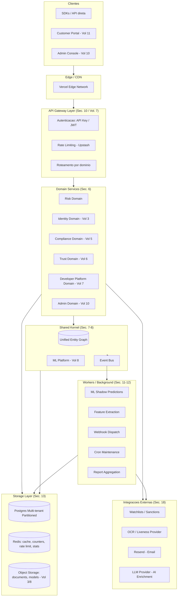
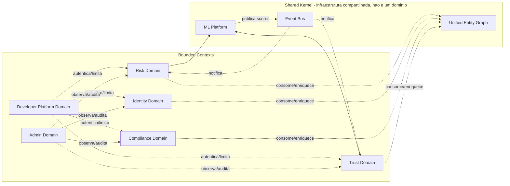
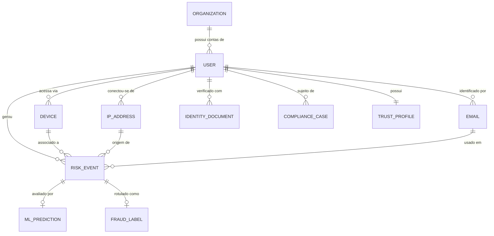
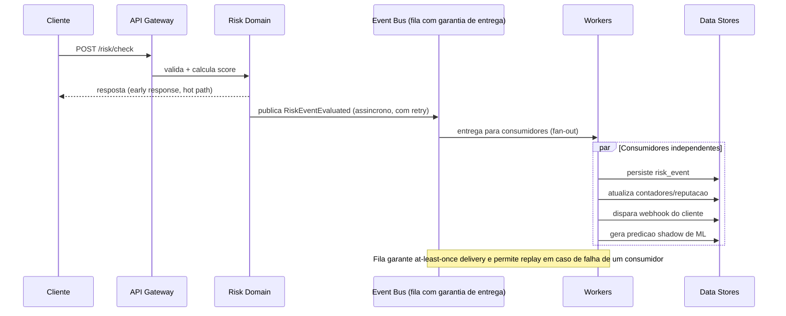
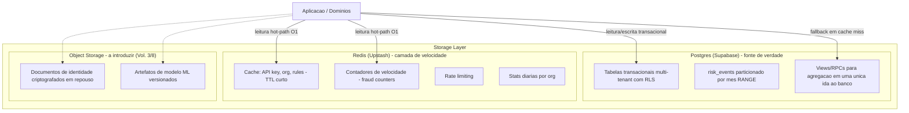
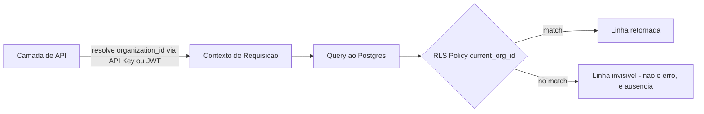
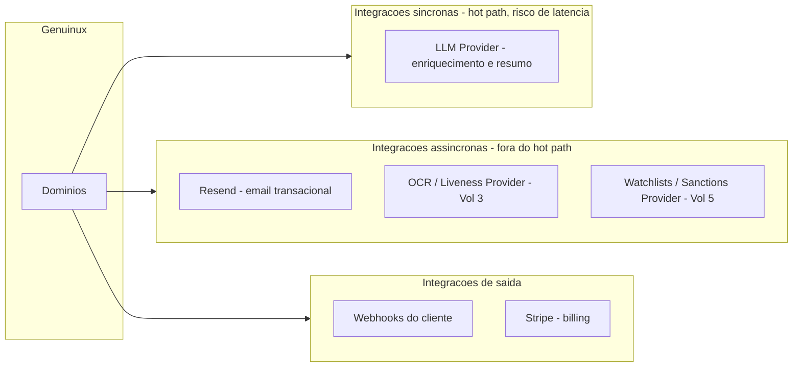
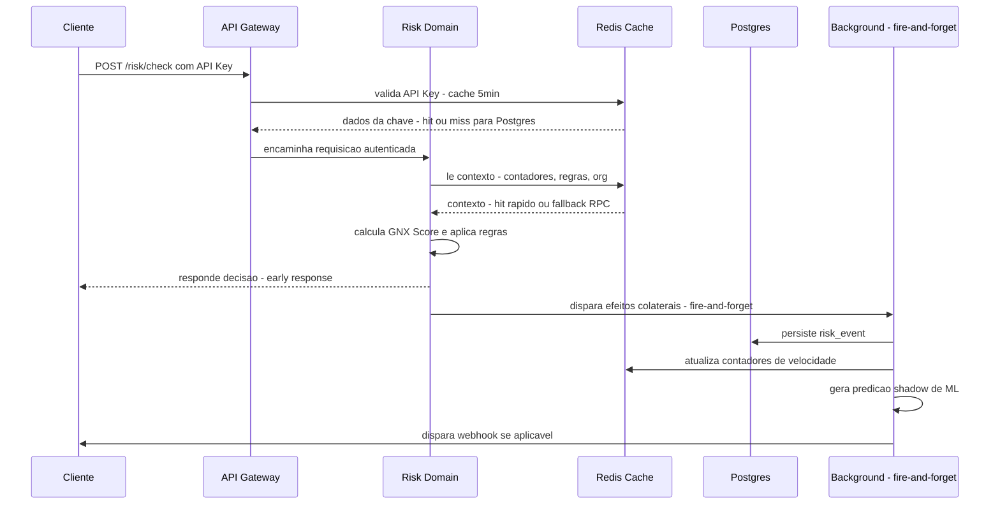
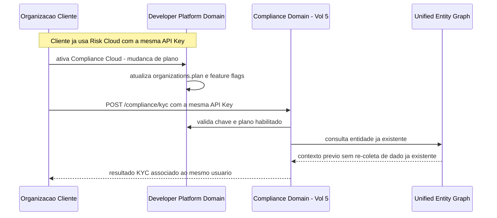
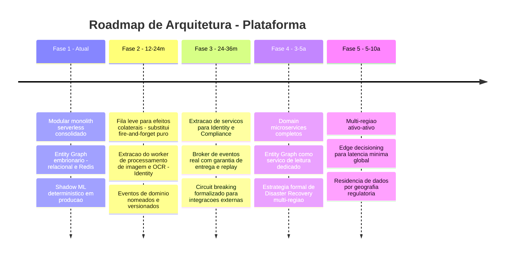

# GENUINUX MASTER PRODUCT SPECIFICATION (MPS)

## Volume 2 — Platform Architecture

**Número do volume:** 2 de 12
**Título:** Platform Architecture
**Status:** Draft v1.0
**Relação com os demais volumes:** Este volume traduz os compromissos do **Volume 1 — Vision & Product Strategy** (Unified Entity Graph, multi-tenancy, latência como requisito de primeira classe, modularidade comercial) em uma arquitetura técnica concreta. É o volume mais estrutural da coleção: os Volumes 3–6 (as quatro Clouds) constroem *sobre* os domínios e o substrato compartilhado definidos aqui; o Volume 7 (Developer Platform) especializa a camada de API Gateway aqui descrita; o Volume 8 (Data & ML) especializa o Event Bus e o ML Platform aqui descritos; o Volume 9 (Security) aprofunda o modelo de multi-tenancy e IAM aqui apenas esboçado; o Volume 10 (Administration) aprofunda a camada de observabilidade global.

---

## Índice

1. Objetivo do Volume
2. Escopo
3. Princípios Arquiteturais (herdados do Volume 1)
4. Estado Atual vs. Estado-Alvo — Postura Honesta de Arquitetura
5. Visão Geral da Arquitetura (Diagrama Mestre)
6. Domínios (Bounded Contexts)
7. Unified Entity Graph — Design Detalhado
8. Event Bus e Arquitetura Orientada a Eventos
9. Modular Monolith vs. Microserviços — Decisão e Trajetória
10. Camada de API Gateway
11. Workers e Processamento em Background
12. Filas (Queues) e Processamento Assíncrono
13. Arquitetura de Storage
14. Modelo Multi-Tenant
15. Observabilidade
16. Escalabilidade e Performance
17. Alta Disponibilidade e Resiliência
18. Arquitetura de Integrações
19. Segurança — Visão Geral (detalhe no Volume 9)
20. Fluxos Críticos (Diagramas de Sequência)
21. Casos de Uso Arquiteturais
22. Regras de Negócio Arquiteturais
23. Requisitos Funcionais
24. Requisitos Não Funcionais
25. Roadmap Específico de Arquitetura
26. Riscos
27. Dependências
28. Decisões Arquiteturais Tomadas (ADRs)
29. Glossário
30. Revisão de Consistência com o Volume 1
31. Resumo Executivo
32. Questões em Aberto
33. Próximos Volumes

---

## 1. Objetivo do Volume

Definir a arquitetura técnica que sustenta as quatro Clouds (Identity, Risk, Compliance, Trust) e a Developer Platform como uma única plataforma coesa, não como produtos integrados a posteriori. Este volume responde tecnicamente à pergunta estratégica deixada em aberto no Volume 1: *como* o Unified Entity Graph e a promessa "uma API, uma decisão" (Vol. 1, Seção 5 e ADR-001) se traduzem em domínios, serviços, dados e fluxos concretos — sem, ainda, entrar no detalhe funcional de cada Cloud (isso é objeto dos Volumes 3–6).

## 2. Escopo

**Dentro do escopo:** arquitetura geral da plataforma; mapa de domínios (bounded contexts); design do Unified Entity Graph e do Event Bus; decisão modular monolith vs. microserviços e sua trajetória; arquitetura de workers, filas e storage; modelo multi-tenant; observabilidade; escalabilidade; alta disponibilidade; arquitetura de integrações; visão geral de segurança.

**Fora do escopo:** especificação funcional de cada Cloud (Volumes 3–6); especificação de endpoints de API, SDKs e billing de desenvolvedor (Volume 7); design detalhado de feature store e model registry (Volume 8); modelo de ameaças, IAM detalhado e certificações (Volume 9); ferramentas específicas do Admin Console (Volume 10); modelo comercial (Volume 11).

## 3. Princípios Arquiteturais (herdados do Volume 1)

Toda decisão neste volume é avaliada contra os seguintes princípios, herdados diretamente do Volume 1:

| Princípio | Origem no Volume 1 | Como se manifesta na arquitetura |
|---|---|---|
| **Um substrato de dados, quatro produtos comerciais** | ADR-001 | Unified Entity Graph compartilhado entre domínios (Seção 7) |
| **Latência como requisito de primeira classe** | ADR-003, RNF Seção 17 | Hot path desacoplado de escrita, cache em múltiplas camadas (Seção 16) |
| **Explicabilidade, não caixa-preta** | ADR-002 | Toda decisão automatizada carrega os fatores que a geraram, persistidos e auditáveis (Seção 7.3, Seção 17) |
| **Multi-tenant desde o dia zero** | RF-01 | Isolamento por `organization_id` em todas as camadas, não apenas na API (Seção 14) |
| **Modularidade comercial genuína** | RF-03, Diferencial nº5 | Domínios com fronteiras claras que podem evoluir para serviços independentes sem reescrita (Seção 9) |
| **Portabilidade de dados** | RNF Seção 17 | Nenhuma camada de storage usa formato proprietário não exportável |

## 4. Estado Atual vs. Estado-Alvo — Postura Honesta de Arquitetura

Diferente de uma especificação greenfield, a Genuinux já possui uma implementação em produção do que este documento chama de **Risk Domain** e de parte do **Shared Kernel** (Unified Entity Graph embrionário, ML Platform embrionário). Este volume adota uma postura deliberadamente honesta: descreve o **estado atual (Fase 1)** como uma decisão arquitetural válida para o estágio atual do negócio (ICP primário definido no Vol. 1, Seção 7 — scale-ups que não exigem isolamento físico de serviço), e projeta a evolução para os **estados-alvo (Fases 2–5)** conforme volume, latência e requisitos de compliance (ICP secundário) o exigirem.

| | **Fase 1 — Atual** | **Fase 2 (12–24m)** | **Fase 3 (24–36m)** | **Fase 4 (3–5a)** | **Fase 5 (5–10a)** |
|---|---|---|---|---|---|
| Estilo | Modular Monolith Serverless | Monolith + Workers extraídos | Microserviços seletivos por domínio | Domain Microservices completos | Multi-região ativo-ativo, edge decisioning |
| Compute | Vercel Functions (Node/TS) | + Worker service dedicado (ML, OCR) | + Serviços de Identity e Compliance isolados | Todos os domínios como serviços independentes | Serviços replicados por região com roteamento por latência |
| Dados | Supabase Postgres (single-region) | Postgres + read replicas | Postgres particionado por domínio | Data stores dedicados por domínio + Entity Graph como serviço | Postgres multi-região com residência de dados local |
| Cache | Upstash Redis (single-region) | Redis multi-namespace maduro (já parcialmente implementado) | Redis regional | Cache distribuído multi-região | Edge cache |
| Comunicação entre domínios | Chamadas de função in-process + fire-and-forget `Promise.all` | Fire-and-forget + fila leve (ex.: Upstash QStash) | Broker de eventos real (Seção 8) | Broker de eventos com garantias de entrega e replay | Streaming global com particionamento geográfico |
| Justificativa de negócio | ICP primário não exige isolamento físico; velocidade de iteração > isolamento de serviço | Cargas de trabalho com perfil de compute divergente (ML training, processamento de imagem) já justificam separação | Identity/Compliance têm SLAs e perfis de escala distintos de Risk (Vol. 1, Seção 19 — risco de complexidade) | Suporte a ICP Enterprise regulado (Vol. 1, Seção 7) exige isolamento e auditoria por domínio | Visão de 10 anos do Vol. 1 (Seção 4) — camada de confiança padrão da internet |

Esta tabela é o contrato central deste volume: **nenhuma decisão de Fase 1 é tratada como definitiva**, mas também nenhuma decisão de Fase 1 é tratada como "dívida técnica a corrigir depois" — é uma escolha arquitetural correta para o estágio atual, com um caminho de evolução explícito e não especulativo.

## 5. Visão Geral da Arquitetura (Diagrama Mestre)

**Nota de leitura:** os blocos `Identity Domain`, `Compliance Domain` e `Trust Domain` representam a **fronteira arquitetural alvo**; na Fase 1 atual, partes de Trust (reputação de entidade) e do ML Platform já existem implementadas dentro do mesmo processo do Risk Domain. A fronteira lógica (bounded context) já existe no código mesmo quando a fronteira física (serviço separado) ainda não existe — este é precisamente o ponto da Seção 9.

## 6. Domínios (Bounded Contexts)

| Domínio | Responsabilidade | Estado na Fase 1 (atual) | Dados que possui (ownership) |
|---|---|---|---|
| **Risk Domain** | Cálculo de score de risco, regras, decisão, inteligência de dispositivo/IP/velocidade | **Implementado** — motor de risco puro sem efeitos colaterais, regras customizadas por organização, motor de decisão | `risk_events` (particionado), `rules`, `review_queue` |
| **Shared Kernel — Entity Graph** | Identidade unificada de usuário, dispositivo, IP, e-mail, organização, através de todos os domínios | **Parcialmente implementado** — hoje expresso como colunas relacionadas em `risk_events`/`users_checked` mais contadores de velocidade em Redis; ainda não é um grafo de primeira classe (ver ADR-007) | `users_checked`, contadores Redis `gnx:cnt:*` |
| **Shared Kernel — ML Platform** | Feature store, treinamento, shadow mode, model registry | **Parcialmente implementado** — feature store (`fraud_features`), training dataset, shadow predictor determinístico (`shadow-v1`) já em produção | `fraud_features`, `training_dataset`, `ml_predictions`, `feature_importance` |
| **Trust Domain** | Score de confiança contínuo, reputação de entidade, trust graph | **Embrionário** — `entity_reputation` existe como RPC atômica, mas sem produto/API de Trust Cloud dedicado ainda (Volume 6 formaliza) | `entity_reputation` |
| **Identity Domain** | Verificação de identidade, OCR, biometria, wallet | **Não implementado** — a construir no Volume 3 | — |
| **Compliance Domain** | KYC/KYB/AML, sanções, case management | **Não implementado além dos rótulos de fraude (`fraud_labels`) que hoje servem ao ML, não a compliance regulatório** — a construir no Volume 5 | `fraud_labels` (uso atual é de rotulagem de ML, não compliance formal) |
| **Developer Platform Domain** | API Keys, webhooks, organizações, billing, rate limits | **Implementado** — chaves com hash SHA-256, webhooks com HMAC, planos por organização | `api_keys`, `webhooks`, `webhook_deliveries`, `organizations` |
| **Admin Domain** | Operação interna, saúde da plataforma, suporte, auditoria global | **Implementado** — Admin Console com guarda de `is_platform_admin`, métricas de plataforma | `profiles.is_platform_admin`, `audit_logs` (escopo global) |

**Regra de fronteira (importante para os Volumes 3–6):** um domínio **nunca** escreve diretamente nas tabelas de outro domínio. Toda comunicação entre domínios passa pelo Shared Kernel (Entity Graph para leitura/enriquecimento de contexto, Event Bus para notificação de mudança de estado). Isso é o que preserva a decisão da Fase 3 de extrair domínios em serviços separados sem reescrever lógica de negócio — apenas a camada de transporte muda, de chamada in-process para chamada de rede/evento.

## 7. Unified Entity Graph — Design Detalhado

O Unified Entity Graph é o mecanismo técnico que cumpre o ADR-001 do Volume 1. Ele modela cinco tipos de entidade e suas relações, observadas através dos quatro domínios:

### 7.1 Três camadas de representação

1. **Camada de eventos (fato bruto):** cada interação (signup, login, transação, verificação de documento) gera um evento imutável — hoje `risk_events`, estendido nos Volumes 3–6 para `identity_events`, `compliance_events`. É a fonte de verdade.
2. **Camada de entidade (estado agregado):** perfis derivados por entidade — hoje `users_checked` (usuário) e `entity_reputation` (dispositivo/IP/e-mail); a evoluir para um verdadeiro grafo de nós e arestas na Fase 3 (ver Questão em Aberto nº1).
3. **Camada de contexto em tempo real (cache):** contadores de velocidade e reputação com TTL curto em Redis (`gnx:cnt:*`, `gnx:flag:*`) — existe **apenas** para servir o hot path de decisão com latência de leitura O(1); nunca é a fonte de verdade, sempre reconstruível a partir da camada de eventos.

### 7.2 Por que não é um grafo de banco de dados nativo (Neo4j/similar) na Fase 1

**Decisão:** a Fase 1 usa Postgres relacional + Redis, não um banco de grafos dedicado.
**Justificativa:** as consultas de hoje (contagem de usuários distintos por IP, dispositivos por usuário, reputação por e-mail) são consultas de agregação de profundidade 1–2, plenamente atendidas por índices relacionais e contadores em Redis (ver `get_risk_context()` RPC e `fraudCounters.ts` documentados na base de código atual). Um banco de grafos nativo adiciona complexidade operacional (mais um sistema para operar, replicar e proteger) sem ganho mensurável na profundidade de consulta atual.
**Gatilho de revisão:** quando o Trust Graph cross-organização (Volume 6, visão de longo prazo do Vol. 1 Seção 18) exigir travessias de profundidade 3+ (ex.: "dispositivos que compartilham e-mail com usuários bloqueados em outras organizações, que por sua vez compartilham IP com..."), a arquitetura deve reavaliar um motor de grafo dedicado como camada de leitura derivada — nunca como substituto da camada de eventos.

### 7.3 Explicabilidade como propriedade do grafo, não add-on

Cumprindo o ADR-002 do Volume 1, toda leitura agregada do Entity Graph que alimenta uma decisão (GNX Score, Trust Score) deve persistir os fatores que a compuseram — já implementado hoje via `gnx_score_factors` (JSONB) e `feature_importance`. Este padrão é herdado como requisito não funcional (Seção 24) para Identity e Compliance nos Volumes 3 e 5: nenhum novo domínio pode introduzir uma decisão automatizada sem um campo equivalente de fatores persistidos.

## 8. Event Bus e Arquitetura Orientada a Eventos

### 8.1 Estado atual (Fase 1) — honestidade arquitetural

Hoje **não existe um Event Bus físico** (nenhum Kafka/SNS/SQS). O que existe é um padrão de **"fire-and-forget" in-process**: após responder ao cliente (`res.status(200).json(response)`), o handler dispara `Promise.all([...])` para gravações e efeitos colaterais (persistência de evento, atualização de contadores Redis, disparo de webhook, predição shadow de ML) sem bloquear a resposta.

**Vantagem:** elimina a latência dessas operações do hot path (é a base do princípio de latência do Volume 1, ADR-003).
**Risco assumido (ver Seção 26):** não há garantia de entrega nem retry automático — se a função serverless for encerrada entre a resposta e a conclusão do `Promise.all`, os efeitos colaterais daquela requisição são perdidos silenciosamente. Este é um risco conhecido e documentado, não uma omissão.

### 8.2 Estado-alvo — Event Bus real (Fase 2 em diante)

**Decisão de transição:** a Fase 2 introduz uma fila leve (padrão *at-least-once*, ex. Upstash QStash ou SQS) **apenas** para os efeitos colaterais que hoje já são fire-and-forget — o contrato de resposta ao cliente (early response) não muda. Isso significa que a migração é aditiva e não quebra o hot path já otimizado.

**Eventos de domínio nomeados (canônicos, versionados desde a Fase 2):**

| Evento | Domínio publicador | Domínios consumidores |
|---|---|---|
| `risk.event.evaluated` | Risk Domain | ML Platform, Trust Domain, Developer Platform (webhooks) |
| `identity.verification.completed` (Vol. 3) | Identity Domain | Risk Domain, Compliance Domain, Trust Domain |
| `compliance.case.opened` / `.resolved` (Vol. 5) | Compliance Domain | Trust Domain, Admin Domain |
| `trust.score.recalculated` (Vol. 6) | Trust Domain | Risk Domain |
| `ml.prediction.generated` | ML Platform | Admin Domain (métricas) |
| `org.plan.changed` | Developer Platform Domain | Admin Domain, todos os domínios (para reavaliar limites) |

## 9. Modular Monolith vs. Microserviços — Decisão e Trajetória

**Decisão (ADR-004, ver Seção 28):** a Genuinux permanece um **modular monolith** na Fase 1 e parte da Fase 2, com extração seletiva de microserviços a partir da Fase 3, guiada por **divergência de perfil de carga**, não por preferência estética de arquitetura.

**Justificativa técnica:**
- Um modular monolith bem particionado por bounded context (Seção 6) entrega grande parte do benefício de isolamento de um microserviço (testabilidade, clareza de dono, possibilidade de extração futura) com uma fração do custo operacional (sem service mesh, sem orquestração de múltiplos deploys, sem complexidade de transação distribuída).
- O ICP primário do Volume 1 (Seção 7) não exige SLA por domínio diferenciado — um cliente Starter/Growth não paga por isolamento de infraestrutura entre Risk e Trust.
- A extração prematura de serviços antes de perfis de carga divergentes é a causa mais comum de complexidade acidental em plataformas SaaS em estágio de crescimento — reconhecido explicitamente como risco no Volume 1 (Seção 19, "complexidade de manter 4 domínios unificados pode atrasar time-to-market").

**Critério objetivo de extração (aplicado por domínio, não à plataforma inteira de uma vez):**

| Critério | Threshold que dispara extração |
|---|---|
| Perfil de compute diverge (CPU-bound/GPU vs. I/O-bound) | Ex.: processamento de imagem/OCR do Identity Cloud (Volume 3) é CPU/GPU-intensivo — candidato natural a serviço dedicado já na Fase 2 |
| Perfil de latência diverge | Hot path de Risk (<100ms) vs. fluxo de Case Management de Compliance (segundos a minutos, orientado a workflow humano) — candidato à extração na Fase 3 |
| Escala de dados diverge | Volume de `risk_events` cresce ordens de magnitude mais rápido que `compliance_cases` — já mitigado hoje via particionamento (Seção 13), não exige extração de serviço por si só |
| Requisito de compliance/isolamento diverge | ICP Enterprise (Vol. 1) pode exigir deployment dedicado/VPC peering para Compliance Cloud especificamente — gatilho de negócio, não técnico, mas com implicação arquitetural direta |

## 10. Camada de API Gateway

Especificação completa no Volume 7; aqui se define apenas a fronteira arquitetural que a Developer Platform deve preencher:

1. **Autenticação:** duas modalidades coexistentes — API Key (hash SHA-256, uso máquina-a-máquina, hot path) e JWT de sessão Supabase (uso dashboard, usuário humano). Decisão já validada em produção (`api/risk/label.ts` detecta o tipo pelo formato do token).
2. **Rate limiting:** aplicado por API Key/organização antes de qualquer processamento de domínio (sliding window, hoje via Upstash).
3. **Roteamento por domínio:** o Gateway não contém lógica de negócio — apenas autentica, limita e encaminha para o domínio correto. Esta separação é o que permite que domínios migrem de função serverless para serviço dedicado (Seção 9) sem que o cliente da API perceba qualquer mudança de contrato.
4. **Versionamento:** contrato de API estável por versão (detalhado no Volume 7); este volume apenas estabelece que a camada de Gateway é o único lugar onde versionamento é resolvido — domínios internos não implementam lógica de versionamento de API.

## 11. Workers e Processamento em Background

| Worker | Função | Gatilho | Estado atual |
|---|---|---|---|
| ML Shadow Prediction Runner | Executa `extractFeatures → predictShadow → save` | Fire-and-forget após resposta de risco | Implementado |
| Feature Extraction/Persistence | Grava vetor de features para treinamento | Fire-and-forget, gated por flag | Implementado |
| Dataset Builder | Junta eventos + features + labels em dataset de treino | Fire-and-forget no submit de label | Implementado |
| Webhook Dispatcher | Envia payload assinado (HMAC) ao endpoint do cliente | Fire-and-forget após decisão de review | Implementado |
| Cron Maintenance | Purga caches expirados, agrega estatísticas diárias, particiona tabelas futuras | Agendado (03:00 UTC) | Implementado |
| Report Aggregation (Vol. 5/11) | Consolida métricas de compliance e billing | Agendado | A construir |
| Document/Biometry Processing (Vol. 3) | OCR, face match, liveness | Assíncrono, orientado a fila | A construir — candidato a serviço dedicado desde o início (Seção 9) |

**Princípio:** todo worker é **idempotente** — pode ser reexecutado com o mesmo input sem duplicar efeito (já um padrão estabelecido, ex. `UPSERT ... ON CONFLICT` em `fraud_labels` e `training_dataset`). Este princípio é herdado como requisito não funcional obrigatório (Seção 24) para qualquer worker novo introduzido pelos Volumes 3–6.

## 12. Filas (Queues) e Processamento Assíncrono

**Estado atual:** ausência de fila física — coberto na Seção 8.1.
**Estado-alvo (Fase 2+):** fila leve para efeitos colaterais do hot path; fila robusta com *dead-letter queue* (DLQ) e replay para fluxos de Identity/Compliance que envolvem processamento longo (minutos) e não podem depender de fire-and-forget sem perda aceitável de dado (diferente de um contador de risco, a perda de um resultado de verificação de documento é inaceitável).

**Regra de design:** filas são adotadas por domínio conforme o **custo de perda de mensagem** daquele domínio, não uniformemente. Risk Domain tolera fire-and-forget para contadores (perda é rara e de baixo impacto); Compliance Domain (Volume 5) nunca tolera fire-and-forget para submissão de caso, por implicação regulatória.

## 13. Arquitetura de Storage

**Princípios de storage:**
1. **Postgres é sempre a fonte de verdade.** Redis é estritamente uma camada de velocidade, reconstruível a partir do Postgres — nunca armazena dado que não possa ser perdido sem consequência além de latência temporária (já um padrão em produção: todas as funções de cache "fail-open").
2. **Particionamento por tempo para tabelas de alto volume** (já aplicado a `risk_events`) — herdado como padrão obrigatório para qualquer tabela de eventos introduzida nos Volumes 3–6 que se espera crescer sem limite (`identity_events`, `compliance_events`).
3. **Object Storage é introduzido apenas quando o Volume 3 (documentos de identidade, fotos) e o Volume 8 (artefatos de modelo) exigirem** — não existe especulativamente na Fase 1.
4. **Toda tabela nova é multi-tenant por design** (Seção 14) — nenhuma tabela é criada sem `organization_id` e política de RLS correspondente, exceto tabelas de escopo global explícito (ex. `feature_importance`, que é intencionalmente compartilhada entre organizações).

## 14. Modelo Multi-Tenant

**Estratégia:** *pooled multi-tenancy* (todas as organizações compartilham o mesmo schema e instância de banco), com isolamento garantido por **Row-Level Security (RLS)** no nível do banco de dados — não apenas por filtro de aplicação. Esta é uma decisão deliberada: filtro apenas em nível de aplicação é uma classe de vulnerabilidade recorrente (esquecer o `WHERE organization_id = ...` em uma única query expõe dados entre tenants); RLS torna essa classe de erro estruturalmente impossível no nível de dado.

**Funções auxiliares já em produção** (`current_org_id()`, `current_user_role()`, ambas `SECURITY DEFINER`) são o mecanismo central e são herdadas como padrão obrigatório para toda nova tabela introduzida pelos Volumes 3–6. Nenhuma tabela de domínio novo pode ser criada sem política RLS equivalente antes de aceitar tráfego de produção — este é um **gate de arquitetura**, não uma recomendação (ver Volume 9 para o modelo de ameaças completo).

**Modelo de papéis (herdado, não redefinido aqui):** `owner > admin > member` por organização, mais o papel transversal `is_platform_admin` (Admin Domain, fora do escopo de qualquer organização). Detalhamento de RBAC completo é objeto do Volume 9.

## 15. Observabilidade

| Pilar | Implementação atual | Estado-alvo |
|---|---|---|
| **Error tracking** | `captureException` / `captureMessage`, integração com Sentry (`SENTRY_DSN`) | Mantido; adicionar tracing distribuído quando serviços forem extraídos (Fase 3) |
| **Instrumentação de latência** | Medição por etapa (`step()` helper: key_ms, org_ms, context_ms, engine_ms, gnx_ms, persist_ms) no hot path de risco | Padrão obrigatório para todo novo hot path introduzido pelos Volumes 3–6 |
| **Auditoria de requisições lentas** | Sink dedicado (`risk.check.slow` em `audit_logs`) quando `total_ms > 1000` | Generalizar para um sink único de "slow request" por domínio |
| **Saúde operacional agregada** | Go Live Monitor (`/api/admin/monitoring/go-live`) — status healthy/warning/critical com razões explícitas | Expandir para painel por domínio conforme Volumes 3–6 amadurecem (Volume 10) |
| **Saúde do pipeline de dados derivados** | Pipeline Health (contagem por tabela nas últimas 24h, com tratamento explícito de "migração pendente") | Padrão a replicar para toda nova tabela derivada (feature stores de Identity/Compliance) |
| **Detecção de cold start** | Captura explícita de inicialização de singleton por invocação serverless | Relevante enquanto a Fase 1/2 permanecer serverless; menos relevante em Fase 3+ com serviços long-running |

**Princípio herdado do Volume 1 (RN-02):** nenhuma decisão automatizada é observável apenas como "sucesso/falha" — todo pipeline de decisão (risco, identidade, compliance, confiança) deve expor os fatores intermediários que levaram ao resultado, tanto para debugging quanto para auditoria regulatória.

## 16. Escalabilidade e Performance

A arquitetura de hot path já implementada no Risk Domain é tratada como o **padrão de referência** que os Volumes 3–6 devem replicar sempre que expuserem uma decisão síncrona:

1. Singleton de cliente de banco reutilizado entre invocações (evita custo de conexão a frio).
2. Cache em Redis com TTL curto para dados que mudam raramente dentro da janela (chave de API, plano da organização, regras).
3. Uma única chamada RPC ao banco para agregações que antes exigiam múltiplas idas (`get_risk_context()`), com fallback para contadores em Redis quando disponíveis (mais rápido ainda).
4. **Resposta antecipada ao cliente** antes de gravações não essenciais à decisão em si (fire-and-forget, Seção 8).
5. Índices de expressão dedicados para os padrões de consulta reais do hot path (não apenas índices genéricos de chave estrangeira).
6. Particionamento por tempo em tabelas de alto volume, com purga automática via job de manutenção.

**Meta herdada do Volume 1 (RNF, Seção 17):** p95 do hot path de decisão < 200ms na Fase 1, com trajetória para < 50ms — hoje, com contadores em Redis ativados (`REDIS_COUNTERS_ENABLED=true`), o caminho de leitura de contexto já é o gargalo dominante a ser eliminado (de ~565ms via RPC Postgres para ~80ms via Redis), validando que a arquitetura de cache em camadas é o mecanismo correto, não apenas uma otimização pontual.

## 17. Alta Disponibilidade e Resiliência

| Mecanismo | Descrição | Estado |
|---|---|---|
| **Fail-open de cache** | Toda função de cache (chave de API, org, regras, contadores) devolve `null`/cache-miss em vez de lançar exceção quando Redis está indisponível, caindo de volta para a fonte de verdade (Postgres) | Implementado — padrão obrigatório para qualquer cache introduzido nos volumes seguintes |
| **Degradação graciosa de serviços opcionais** | Envio de e-mail (Resend), enriquecimento por IA (LLM) e Sentry funcionam como no-op quando não configurados, sem quebrar o fluxo principal | Implementado |
| **Purga e retenção automatizada** | Job de manutenção agendado remove dados expirados e antigos, evitando degradação de performance por crescimento não controlado | Implementado |
| **Particionamento como estratégia de resiliência operacional** | Permite `DROP`/arquivamento de partições antigas sem lock em tabela inteira | Implementado (`risk_events`) |
| **Disaster Recovery** | Backup do Postgres gerenciado pelo provedor (Supabase); ainda sem estratégia formal de multi-região / RPO-RTO documentada | **Gap explícito** — a endereçar no Volume 9 (Security) antes de qualquer cliente Enterprise regulado (ICP secundário do Vol. 1) |
| **Circuit breaking para integrações externas** | Ainda não implementado como padrão explícito (ex. para provedores de OCR/watchlist do Vol. 3/5) | **A construir** — requisito não funcional obrigatório antes do Volume 3/5 integrarem qualquer fornecedor terceiro síncrono no hot path |

## 18. Arquitetura de Integrações

**Regra de arquitetura:** nenhuma integração externa síncrona é permitida no hot path de decisão de risco (por isso o enriquecimento por IA hoje é usado para resumos e não para o cálculo do score em si). Integrações de Identity (OCR/liveness) e Compliance (watchlists) são, por natureza, mais lentas e devem ser desenhadas como assíncronas desde a concepção nos Volumes 3 e 5 — não como uma otimização tardia.

## 19. Segurança — Visão Geral (detalhe no Volume 9)

Este volume estabelece apenas os três compromissos de segurança que são pré-condição arquitetural para tudo o mais:

1. **Isolamento multi-tenant garantido no nível de dado (RLS)**, não apenas de aplicação (Seção 14) — não negociável.
2. **Segredos nunca residem em código ou em resposta de API** — chaves de API são armazenadas com hash, nunca em texto plano após a criação; segredos de webhook seguem o mesmo padrão.
3. **Toda ação administrativa e toda decisão automatizada gera trilha de auditoria imutável** — já implementado via `audit_logs`, herdado como requisito obrigatório para os Volumes 3–6.

O modelo de ameaças completo, IAM detalhado, Zero Trust, e o caminho para certificações formais (SOC 2, ISO 27001) — o gap explicitamente reconhecido no Volume 1, Seção 19 — são objeto exclusivo do **Volume 9**.

## 20. Fluxos Críticos (Diagramas de Sequência)

### 20.1 Fluxo de decisão em tempo real (hot path — padrão de referência)

### 20.2 Fluxo de onboarding modular (ativação de nova Cloud sem re-integração)

## 21. Casos de Uso Arquiteturais

1. **Cliente Starter ativa apenas Risk Cloud** — arquitetura garante que nenhum custo de infraestrutura de Identity/Compliance é incorrido (feature flags por organização, Seção 20.2).
2. **Cliente cresce e precisa de Compliance Cloud** — reaproveita o mesmo Entity Graph, sem re-onboarding técnico (cumpre RN-01 do Volume 1).
3. **Pico de tráfego sazonal (ex. Black Friday para um marketplace cliente)** — hot path desacoplado de escrita permite absorver pico sem degradar tempo de resposta ao cliente, mesmo que a persistência de eventos tenha lag temporário.
4. **Auditoria regulatória exige reconstrução de decisão de 6 meses atrás** — possível graças à combinação de eventos particionados (não purgados antes de 365 dias) + fatores persistidos (`gnx_score_factors`) + audit trail imutável.
5. **Falha do Redis em produção** — sistema degrada para Postgres (fail-open), com latência maior mas sem indisponibilidade — cumpre RNF de disponibilidade do Volume 1.

## 22. Regras de Negócio Arquiteturais

- **RN-A01:** Nenhum domínio pode escrever diretamente em tabela pertencente a outro domínio (Seção 6) — toda interação passa pelo Shared Kernel.
- **RN-A02:** Nenhuma tabela multi-tenant pode ser criada sem política RLS equivalente antes de aceitar tráfego de produção (Seção 14) — gate de arquitetura obrigatório.
- **RN-A03:** Nenhuma decisão automatizada pode ser publicada como evento sem os fatores que a compuseram anexados ou referenciáveis (Seção 7.3) — cumprimento direto do ADR-002 do Volume 1.
- **RN-A04:** Integrações síncronas de terceiros são proibidas no hot path de decisão de risco (Seção 18) — qualquer exceção exige revisão explícita deste volume.
- **RN-A05:** Todo worker fire-and-forget deve ser idempotente (Seção 11) — reexecução nunca duplica efeito.

## 23. Requisitos Funcionais

- **RF-A01:** A plataforma deve permitir a ativação/desativação de cada domínio (Cloud) por organização sem impacto nos demais domínios já ativos.
- **RF-A02:** A plataforma deve expor uma visão de saúde operacional agregada por domínio para o Admin Domain (Volume 10).
- **RF-A03:** A plataforma deve permitir a extração de qualquer domínio para um serviço fisicamente separado sem alteração de contrato de API percebida pelo cliente externo.
- **RF-A04:** A plataforma deve permitir replay de eventos de domínio a partir do Event Bus (a partir da Fase 2) para fins de recuperação e reprocessamento.

## 24. Requisitos Não Funcionais

| Categoria | Requisito | Herdado de |
|---|---|---|
| Latência | p95 < 200ms no hot path de decisão síncrona (Fase 1), trajetória < 50ms | Volume 1, Seção 17 |
| Isolamento de dado | RLS obrigatório em toda tabela multi-tenant, sem exceção | RN-A02 |
| Idempotência | Todo processamento assíncrono deve ser seguro para reexecução | RN-A05 |
| Auditabilidade | Toda decisão automatizada e ação administrativa gera registro imutável | Volume 1, RN-02 |
| Explicabilidade | Toda decisão automatizada persiste seus fatores | Volume 1, ADR-002 |
| Portabilidade | Nenhum dado do cliente é preso a um formato proprietário não exportável | Volume 1, Seção 17 |
| Resiliência | Indisponibilidade de um componente de cache/enriquecimento opcional nunca deve causar indisponibilidade total do domínio | Seção 17 deste volume |

## 25. Roadmap Específico de Arquitetura

## 26. Riscos

| Risco | Impacto | Probabilidade | Mitigação |
|---|---|---|---|
| Perda silenciosa de efeito colateral em fire-and-forget se a função serverless for encerrada antes do `Promise.all` concluir | Médio | Baixa-Média | Migrar para fila com garantia de entrega já na Fase 2 (Seção 8.2); monitorar via Pipeline Health (Seção 15) enquanto isso |
| Ausência de estratégia formal de Disaster Recovery multi-região | Alto | Baixa hoje, cresce com o ICP Enterprise (Vol. 1) | Endereçar no Volume 9 antes de qualquer contrato Enterprise regulado |
| Extração prematura de microserviços por pressão de "melhores práticas" sem perfil de carga divergente real | Médio | Média | Critério objetivo de extração formalizado na Seção 9 — decisão nunca estética |
| Ausência de circuit breaking para integrações externas síncronas (a introduzir pelos Volumes 3/5) | Médio-Alto | Alta se não endereçado antes do Volume 3 | Requisito não funcional obrigatório antes de qualquer integração síncrona de terceiro (Seção 17) |
| Grafo de entidade relacional (não nativo) pode não escalar para travessias profundas do Trust Graph de rede (visão 5-10 anos) | Médio | Baixa no curto prazo, incerta no longo prazo | Gatilho de revisão explícito na Seção 7.2 — decisão não fechada para sempre |

## 27. Dependências

- Este volume depende do **Volume 1** para: princípios arquiteturais (Seção 3), ICP e seu impacto na decisão modular monolith vs. microserviços (Seção 9), e a lista de riscos de negócio que se tornam gatilhos técnicos (Seção 26).
- **Volumes 3–6** dependem deste volume para: fronteiras de domínio (Seção 6), padrão de hot path de referência (Seção 16), padrão de idempotência de workers (Seção 11), e regra de integração assíncrona (Seção 18).
- **Volume 7 (Developer Platform)** depende deste volume para: contrato da camada de API Gateway (Seção 10).
- **Volume 8 (Data & ML)** depende deste volume para: design do Entity Graph (Seção 7) e do Event Bus (Seção 8), que o Volume 8 especializa para feature store e model registry.
- **Volume 9 (Security)** depende deste volume para: modelo multi-tenant (Seção 14) e os gaps explícitos de Disaster Recovery e circuit breaking (Seção 17, Seção 26).
- **Volume 10 (Administration)** depende deste volume para: pilares de observabilidade (Seção 15).

## 28. Decisões Arquiteturais Tomadas (ADRs)

**ADR-004 — Modular Monolith na Fase 1, extração seletiva de microserviços por perfil de carga divergente**
- **Contexto:** o padrão de mercado para plataformas "enterprise-grade" costuma assumir microserviços desde o início; a Genuinux avaliou essa opção contra o estágio atual de negócio.
- **Decisão:** permanecer modular monolith serverless até que critérios objetivos de divergência de perfil de carga (Seção 9) sejam atingidos por domínio.
- **Justificativa:** alinhado ao ICP primário do Volume 1 (não exige isolamento físico) e ao risco já identificado no Volume 1 (Seção 19) de que complexidade de manutenção de 4 domínios unificados pode atrasar time-to-market.
- **Trade-off aceito:** menor isolamento de falha entre domínios na Fase 1 — mitigado por fronteiras lógicas rígidas (RN-A01) que tornam a extração futura mecânica, não uma reescrita.

**ADR-005 — Redis como camada de velocidade, nunca fonte de verdade**
- **Contexto:** seria possível usar Redis como armazenamento primário para contadores de alta frequência, reduzindo escrita no Postgres.
- **Decisão:** Postgres permanece a única fonte de verdade; Redis é estritamente reconstruível.
- **Justificativa:** cumpre o requisito de portabilidade e auditabilidade do Volume 1 (Seção 17) — um dado que existe apenas em cache com TTL não pode sustentar uma reconstrução de decisão para fins de auditoria regulatória (caso de uso 21.4).

**ADR-006 — Fila real adiada para a Fase 2, fire-and-forget aceito conscientemente na Fase 1**
- **Contexto:** poderíamos introduzir uma fila com garantia de entrega desde o primeiro dia.
- **Decisão:** aceitar fire-and-forget in-process na Fase 1, com o risco documentado (Seção 26) e um gatilho de migração claro (Seção 8.2), em vez de adicionar a complexidade operacional de uma fila antes de haver volume que a justifique.
- **Justificativa:** consistente com ADR-004 — complexidade adicionada apenas quando o perfil de uso a exige, nunca especulativamente.

**ADR-007 — Postgres relacional em vez de banco de grafos nativo para o Entity Graph na Fase 1**
- **Contexto:** "Entity Graph" sugere um banco de grafos, mas a decisão técnica não segue o nome do conceito.
- **Decisão:** manter Postgres relacional + Redis; banco de grafos nativo é uma extensão futura condicional (Seção 7.2).
- **Justificativa:** as consultas reais de hoje não exigem travessias profundas; adicionar um banco de grafos seria complexidade antecipada sem gatilho de uso real, violando o mesmo princípio do ADR-004.

## 29. Glossário

| Termo | Definição |
|---|---|
| **Bounded Context** | Fronteira lógica de um domínio, dentro da qual um modelo de dados e uma linguagem de negócio são consistentes |
| **Shared Kernel** | Infraestrutura e dados compartilhados entre bounded contexts (Entity Graph, Event Bus, ML Platform) |
| **Fire-and-forget** | Padrão onde uma operação é disparada sem que o chamador aguarde ou garanta sua conclusão |
| **Fail-open** | Padrão de resiliência onde a falha de um componente opcional degrada a experiência sem interromper o fluxo principal |
| **RLS (Row-Level Security)** | Mecanismo de banco de dados que restringe visibilidade de linhas por política, aplicado no nível do dado, não da aplicação |
| **Hot path** | Caminho de execução síncrono e sensível a latência (decisão em tempo real) |
| **At-least-once delivery** | Garantia de fila onde uma mensagem é entregue uma ou mais vezes, nunca zero — exige consumidores idempotentes |
| **Modular Monolith** | Arquitetura de processo único com fronteiras internas de domínio rigorosamente aplicadas, preparada para extração futura |

---

## 30. Revisão de Consistência com o Volume 1

### 30.1 Decisões arquiteturais (rastreabilidade Volume 1 → Volume 2)

| Decisão do Volume 1 | Como o Volume 2 a implementa |
|---|---|
| ADR-001 (Unified Entity Graph compartilhado) | Seção 7 — Entity Graph em 3 camadas; Seção 6 — regra de que domínios nunca escrevem em tabelas de outro domínio |
| ADR-002 (regras legíveis, não caixa-preta) | Seção 7.3 e RN-A03 — toda decisão automatizada persiste seus fatores |
| ADR-003 (latência como requisito de primeira classe) | Seção 16 — hot path de referência; ADR-006 (fire-and-forget consciente) |
| RF-01 (multi-tenant desde o dia zero) | Seção 14 — RLS obrigatório, não apenas filtro de aplicação |
| RF-03 (Clouds ativáveis/desativáveis independentemente) | Seção 20.2 — fluxo de ativação modular sem re-integração |
| RF-04 (Sandbox isolado de Produção) | Herdado como responsabilidade do Volume 7 (Seção 10) |

**Nenhuma contradição identificada.** Todas as decisões deste volume são extensões diretas, não revisões, dos ADRs do Volume 1.

### 30.2 Dependências confirmadas
Volume 2 consumiu do Volume 1: princípios (Seção 3), ICP (base do ADR-004), RNFs de latência/disponibilidade (Seção 24). Volume 2 produz para os volumes seguintes: fronteiras de domínio, Entity Graph, Event Bus, padrão de hot path — listados formalmente na Seção 27.

### 30.3 Riscos herdados e seu tratamento neste volume

| Risco do Volume 1 | Tratamento no Volume 2 |
|---|---|
| "Complexidade de manter 4 domínios unificados pode atrasar time-to-market" (Vol. 1, Seção 19) | Mitigado por ADR-004 (modular monolith, extração só quando justificada) |
| "Risco de privacidade ao compartilhar reputação entre organizações" (Vol. 1, Seção 19) | Endereçado parcialmente pela Seção 7.2 (gatilho de revisão do Entity Graph) — decisão jurídica completa permanece no Volume 9, conforme já apontado no Volume 1 |
| "Ausência de certificações formais bloqueia ICP Enterprise" (Vol. 1, Seção 19) | Volume 2 identifica o gap técnico correspondente (Disaster Recovery multi-região, Seção 17/26) que o Volume 9 precisará fechar como pré-condição de certificação |

**Risco novo introduzido por este volume** (não existia no Volume 1, nasce da decisão técnica): perda silenciosa de efeito colateral em fire-and-forget (Seção 26) — assumido conscientemente via ADR-006, com gatilho de migração explícito.

### 30.4 Questões em aberto do Volume 1 — status após este volume

| Questão do Volume 1 | Status |
|---|---|
| Nº1 — Build vs. buy para biometria/liveness | **Ainda aberta** — este volume estabelece que, seja qual for a decisão, o processamento deve ser assíncrono e candidato a serviço dedicado desde a Fase 2 (Seção 9, Seção 18); a decisão de fornecedor em si é do Volume 3 |
| Nº2 — Estratégia de dados para watchlists/PEP | **Ainda aberta** — este volume estabelece que a integração, seja qual for o fornecedor, é assíncrona por regra (RN-A04); decisão de negócio permanece no Volume 5 |
| Nº3 — Desenho jurídico do Trust Graph cross-org | **Ainda aberta, com refinamento técnico** — este volume adiciona o gatilho técnico de quando um banco de grafos nativo seria necessário (Seção 7.2), o que informa o Volume 6 e o Volume 9 |
| Nº4 — Sequenciamento certificação vs. expansão geográfica | **Não endereçada neste volume** — permanece do Volume 12 |
| Nº5 — Modelo de precificação do efeito de rede | **Não endereçada neste volume** — permanece do Volume 11 |

### 30.5 Impactos nos volumes seguintes

- **Volume 3 (Identity Cloud):** deve tratar OCR/liveness como processamento assíncrono desde a concepção (Seção 18) e avaliar extração de serviço dedicado já na Fase 2 (Seção 9) devido a perfil de compute divergente.
- **Volume 4 (Risk Cloud):** deve documentar o Risk Domain já implementado (Seção 6) como especificação funcional formal, preservando o hot path de referência (Seção 16) sem regressão.
- **Volume 5 (Compliance Cloud):** deve tratar toda submissão de caso como não-tolerante a fire-and-forget (Seção 12), exigindo fila com garantia desde o primeiro dia, diferente do Risk Domain.
- **Volume 6 (Trust Cloud):** deve formalizar o que hoje é `entity_reputation` embrionário em um produto completo, respeitando o gatilho de revisão de banco de grafos (Seção 7.2) sem assumi-lo prematuramente.
- **Volume 7 (Developer Platform):** deve especificar completamente a camada de Gateway esboçada na Seção 10, incluindo versionamento de contrato de API.
- **Volume 8 (Data & ML):** deve especializar o Entity Graph (Seção 7) e o Event Bus (Seção 8) para feature store, model registry e shadow mode, mantendo compatibilidade com o que já está em produção (`fraud_features`, `training_dataset`, `ml_predictions`).
- **Volume 9 (Security):** deve fechar os gaps explícitos desta seção — RLS como gate obrigatório (Seção 14), Disaster Recovery multi-região (Seção 17), e o parecer jurídico do Trust Graph cross-org.
- **Volume 10 (Administration):** deve construir sobre os pilares de observabilidade já existentes (Seção 15), expandindo para visão por domínio.

---

## 31. Resumo Executivo

O Volume 2 traduz o compromisso estratégico do Volume 1 — um substrato de dados compartilhado sustentando quatro Clouds comercialmente independentes — em uma arquitetura técnica concreta: um **Unified Entity Graph** de três camadas (eventos, entidade agregada, cache de contexto), um **Event Bus** hoje implementado como fire-and-forget in-process com trajetória clara para uma fila com garantia de entrega, e seis **domínios (bounded contexts)** com fronteiras rígidas que nunca se escrevem diretamente. A decisão central deste volume (ADR-004) é permanecer um **modular monolith serverless** enquanto o perfil de carga dos domínios não divergir o suficiente para justificar a complexidade operacional de microserviços — uma postura deliberadamente contrária ao reflexo de "arquitetura enterprise = microserviços desde o dia um", fundamentada tanto no ICP do Volume 1 quanto no risco de complexidade já ali identificado. A arquitetura de hot path do Risk Domain, já validada em produção (cache em camadas, resposta antecipada, particionamento, RLS), é formalmente adotada como o padrão de referência que os Volumes 3–6 devem replicar. Três gaps são assumidos conscientemente e documentados, não escondidos: ausência de garantia de entrega em efeitos colaterais (Seção 26), ausência de estratégia formal de Disaster Recovery multi-região, e ausência de circuit breaking para integrações externas síncronas — todos com gatilho de mitigação explícito nos volumes seguintes.

## 32. Questões em Aberto

1. **Escolha do broker de eventos para a Fase 2** (Upstash QStash vs. SQS vs. alternativa) — decisão de custo/operação a validar antes do Volume 8 especializar o Event Bus.
2. **Ponto exato de extração do worker de OCR/biometria** — Fase 2 ou já na especificação inicial do Volume 3, dado o perfil de compute divergente identificado na Seção 9.
3. **Formato de versionamento de eventos de domínio** (Seção 8.2) — schema evolution strategy ainda não definida, relevante antes de qualquer consumidor externo depender de eventos.
4. **Gatilho quantitativo exato para banco de grafos nativo** (Seção 7.2) — "travessias de profundidade 3+" é qualitativo; precisa de métrica objetiva (ex. p95 de latência de uma consulta de reputação) antes do Volume 6.
5. **Estratégia de Disaster Recovery multi-região** — dependência direta e não resolvida para o Volume 9, sem a qual o ICP Enterprise do Volume 1 permanece inacessível.

## 33. Próximos Volumes

| Vol. | Título | Depende deste volume via |
|---|---|---|
| 3 | Identity Cloud | Seção 6 (fronteira de domínio), Seção 9 (candidato a extração), Seção 18 (integração assíncrona) |
| 4 | Risk Cloud | Seção 6 (Risk Domain já implementado), Seção 16 (hot path de referência) |
| 5 | Compliance Cloud | Seção 6, Seção 12 (fila obrigatória, não fire-and-forget) |
| 6 | Trust Cloud | Seção 7 (Entity Graph e seu gatilho de evolução), Seção 6 (Trust Domain embrionário) |
| 7 | Developer Platform | Seção 10 (contrato de Gateway) |
| 8 | Data & Machine Learning | Seção 7 (Entity Graph), Seção 8 (Event Bus) |
| 9 | Security Architecture | Seção 14 (multi-tenancy/RLS), Seção 17 e 26 (gaps de DR e circuit breaking) |
| 10 | Administration Platform | Seção 15 (pilares de observabilidade) |
| 11 | Commercial Platform | Seção 20.2 (ativação modular sem re-integração) |
| 12 | Master Roadmap | Seção 25 (roadmap de arquitetura por fase) |

**Próximo volume a produzir: Volume 3 — Identity Cloud**, quando solicitado.
