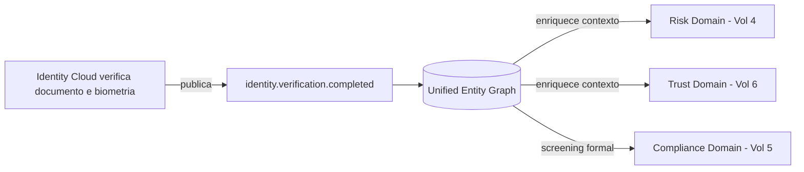
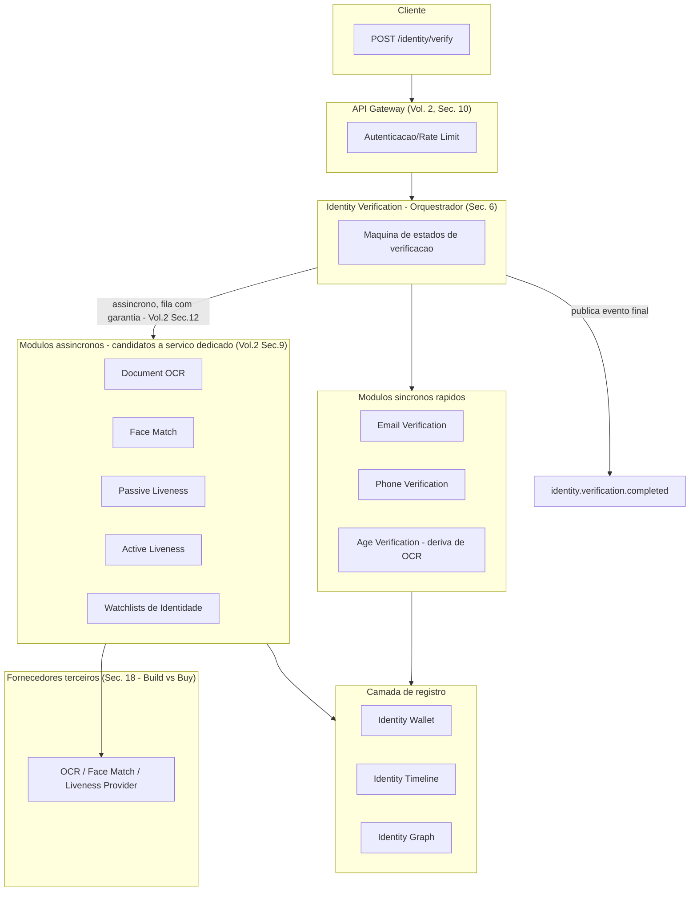
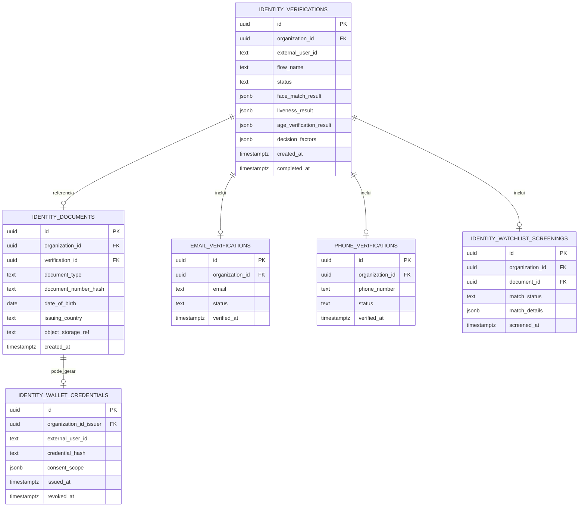
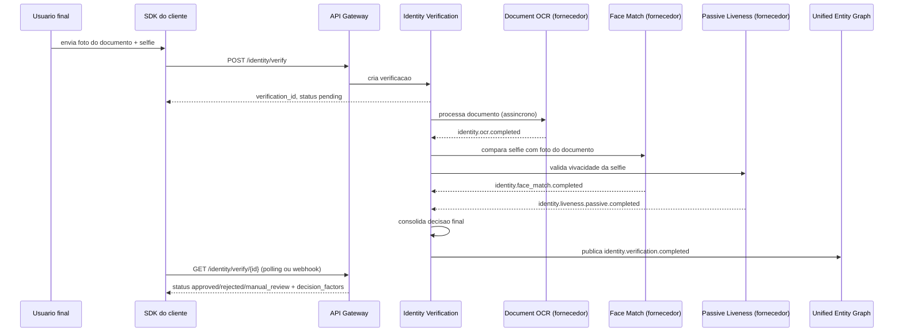
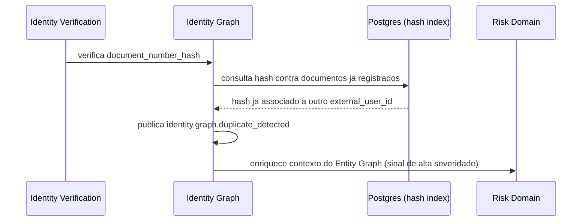
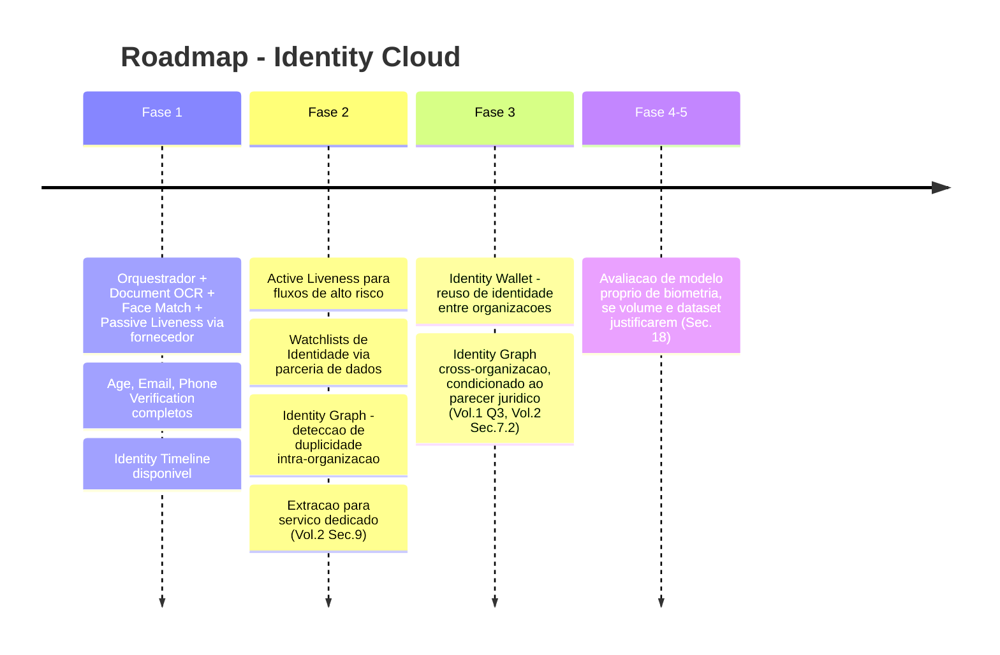

# GENUINUX MASTER PRODUCT SPECIFICATION (MPS)

## Volume 3 — Identity Cloud

**Número do volume:** 3 de 12
**Título:** Identity Cloud
**Status:** Draft v1.0
**Relação com os demais volumes:** Primeiro volume de domínio funcional construído sobre o **Volume 2 — Platform Architecture**: o Identity Cloud é o `Identity Domain` mapeado na Seção 6 do Volume 2, hoje **não implementado**. Este volume resolve a **Questão em Aberto nº1 do Volume 1** (build vs. buy para biometria/liveness) e aplica diretamente os padrões arquiteturais do Volume 2 — integração assíncrona obrigatória (RN-A04), candidatura à extração de serviço dedicado por divergência de perfil de compute (Seção 9 do Vol. 2), e uso do Unified Entity Graph como camada de identidade compartilhada (Seção 7 do Vol. 2). Fornece a `IDENTITY_DOCUMENT` e o `TRUST_PROFILE` já antecipados no diagrama ER do Volume 2 e alimenta o Risk Cloud (Volume 4), o Compliance Cloud (Volume 5) e o Trust Cloud (Volume 6) com sinais de identidade verificada.

---

## Índice

1. Objetivo do Volume
2. Escopo
3. Relação com o Unified Entity Graph e o Risk Domain
4. Arquitetura do Identity Cloud
5. Mapa de Módulos
6. Módulo — Identity Verification (Orquestrador)
7. Módulo — Document OCR
8. Módulo — Face Match
9. Módulo — Passive Liveness
10. Módulo — Active Liveness
11. Módulo — Age Verification
12. Módulo — Email Verification
13. Módulo — Phone Verification
14. Módulo — Watchlists (Identidade)
15. Módulo — Identity Wallet
16. Módulo — Identity Timeline
17. Módulo — Identity Graph
18. Build vs. Buy — Decisão de Fornecedores
19. Banco de Dados (Schema do Domínio)
20. Eventos de Domínio
21. APIs — Contratos do Domínio
22. Fluxos (Diagramas de Sequência)
23. Casos de Uso
24. Regras de Negócio
25. Requisitos Funcionais
26. Requisitos Não Funcionais
27. Segurança e Proteção de PII
28. Escalabilidade
29. Observabilidade
30. Roadmap Específico
31. Riscos
32. Dependências
33. Decisões Arquiteturais Tomadas (ADRs)
34. Glossário
35. Revisão de Consistência com os Volumes 1 e 2
36. Resumo Executivo
37. Questões em Aberto
38. Próximos Volumes

---

## 1. Objetivo do Volume

Especificar completamente o `Identity Domain` deixado como fronteira lógica não implementada no Volume 2: os módulos que permitem à Genuinux verificar que uma pessoa é quem diz ser (documento, biometria, contato) e emitir uma identidade verificada reutilizável (Identity Wallet), sem nunca comprometer o requisito de latência do Risk Domain (o Identity Cloud é, por natureza, mais lento e assíncrono) nem o requisito de explicabilidade herdado do Volume 1 (ADR-002).

## 2. Escopo

**Dentro do escopo:** Identity Verification (orquestração), Document OCR, Face Match, Passive Liveness, Active Liveness, Age Verification, Email Verification, Phone Verification, Watchlists de identidade (documentos roubados/inválidos — **não** sanções/AML, ver Seção 14), Identity Wallet, Identity Timeline, Identity Graph, banco de dados e eventos do domínio, contratos de API específicos deste domínio.

**Fora do escopo:** screening de sanções/PEP/adverse media regulatório (Compliance Cloud, Volume 5); score de risco transacional (Risk Cloud, Volume 4); score de confiança contínua pós-verificação (Trust Cloud, Volume 6); especificação de SDK/CLI (Volume 7); certificações formais de segurança (Volume 9).

## 3. Relação com o Unified Entity Graph e o Risk Domain

O Identity Cloud **não substitui** nem duplica o Unified Entity Graph do Volume 2 — ele é o principal **produtor** de um novo tipo de aresta nesse grafo: a ligação entre um `USER` e um `IDENTITY_DOCUMENT` verificado. Uma vez que essa aresta existe, o Risk Domain (Volume 4) e o Trust Domain (Volume 6) a consultam como mais um sinal de contexto — nunca duplicam o processo de verificação.

**Regra herdada (RN-A01, Volume 2):** o Identity Domain nunca escreve diretamente em `risk_events`, `entity_reputation` ou tabelas de Compliance — toda comunicação passa pelo evento `identity.verification.completed` (Seção 20) consumido pelos demais domínios.

## 4. Arquitetura do Identity Cloud

**Decisão herdada:** diferente do Risk Domain (hot path síncrono), o Identity Cloud é desenhado como um **fluxo predominantemente assíncrono** desde a concepção (cumprindo RN-A04 do Volume 2) — a resposta imediata ao cliente é um identificador de verificação (`verification_id`) com status `pending`, não um resultado final.

## 5. Mapa de Módulos

| Módulo | Natureza | Síncrono/Assíncrono | Estado |
|---|---|---|---|
| Identity Verification | Orquestrador | Síncrono na criação, assíncrono na resolução | A construir |
| Document OCR | Processamento de imagem | Assíncrono | A construir — via fornecedor (Seção 18) |
| Face Match | Biometria | Assíncrono | A construir — via fornecedor |
| Passive Liveness | Biometria | Assíncrono | A construir — via fornecedor |
| Active Liveness | Biometria + interação do usuário | Assíncrono (com componente síncrono de UX no SDK) | A construir — via fornecedor |
| Age Verification | Derivado de OCR | Assíncrono (deriva do resultado do OCR) | A construir — lógica própria |
| Email Verification | Verificação de posse de e-mail | Assíncrono (envio + confirmação) | A construir — lógica própria |
| Phone Verification | Verificação de posse de telefone (OTP) | Assíncrono (envio + confirmação) | A construir — lógica própria |
| Watchlists (Identidade) | Checagem de documentos inválidos/roubados | Assíncrono | A construir — via fornecedor/dado público |
| Identity Wallet | Armazenamento de credencial reutilizável | N/A (registro) | A construir — Fase 3+ (Seção 30) |
| Identity Timeline | Histórico de eventos de identidade por usuário | N/A (leitura agregada) | A construir |
| Identity Graph | Extensão do Unified Entity Graph para entidades de identidade | N/A (camada de dado) | A construir |

## 6. Módulo — Identity Verification (Orquestrador)

| Campo | Especificação |
|---|---|
| **Objetivo** | Coordenar a execução dos módulos de verificação necessários para um fluxo específico (ex.: "onboarding fintech" = OCR + Face Match + Passive Liveness + Age Verification), consolidando o resultado em uma decisão única e explicável |
| **Responsabilidades** | Criar e versionar "fluxos de verificação" configuráveis por organização (RF-B03); gerenciar máquina de estados (`pending → processing → approved/rejected/manual_review`); agregar resultados parciais em um veredito final; publicar o evento de conclusão |
| **Limites** | Não executa OCR/biometria diretamente (delega aos módulos especializados); não decide risco transacional (isso é Risk Domain); não decide compliance regulatório (isso é Compliance Domain) |
| **APIs** | `POST /identity/verify` (cria verificação, retorna `verification_id` + `status: pending`), `GET /identity/verify/{id}` (consulta status/resultado) — contrato completo no Volume 7 |
| **Banco de dados** | `identity_verifications` (Seção 19) |
| **Eventos** | Publica `identity.verification.started`, `identity.verification.completed` (Seção 20) |
| **Segurança** | Nenhum dado biométrico bruto transita por este módulo — apenas referências e resultados (Seção 27) |
| **Escalabilidade** | Stateless; estado vive em `identity_verifications`, não em memória — permite reprocessamento e auditoria |
| **Observabilidade** | Tempo total do fluxo (do `pending` ao veredito final) como métrica pública de produto, análoga ao p95 do Risk Domain |
| **Roadmap** | Fase 1: fluxos fixos por vertical (fintech, marketplace); Fase 2: fluxos configuráveis via regras (reaproveitando o Rules Engine do Risk Cloud, Volume 4) |

## 7. Módulo — Document OCR

| Campo | Especificação |
|---|---|
| **Objetivo** | Extrair dados estruturados (nome, data de nascimento, número do documento, validade) de uma imagem de documento de identidade |
| **Responsabilidades** | Validar qualidade da imagem antes de processar (evita custo de chamada a fornecedor com imagem inutilizável); extrair campos estruturados; detectar sinais de adulteração/template forjado |
| **Limites** | Não verifica se a pessoa na foto do documento é quem está enviando (isso é Face Match); não decide validade legal do documento (delegado a Watchlists/Compliance quando aplicável) |
| **APIs** | Endpoint interno chamado pelo orquestrador — não exposto diretamente ao cliente externo na Fase 1 (reduz superfície de contrato enquanto o fornecedor pode mudar, ver Seção 18) |
| **Banco de dados** | `identity_documents` (armazena apenas metadados extraídos + referência criptografada à imagem em Object Storage, nunca a imagem em linha na tabela — Seção 27) |
| **Eventos** | `identity.document.uploaded`, `identity.ocr.completed` |
| **Segurança** | Imagem original criptografada em repouso, com política de retenção mínima necessária (Seção 27); acesso auditado |
| **Escalabilidade** | Assíncrono, orientado a fila (Volume 2, Seção 12) — perfil de compute CPU/GPU-intensivo, candidato a serviço dedicado desde a Fase 2 (Volume 2, Seção 9) |
| **Observabilidade** | Taxa de rejeição por qualidade de imagem (sinal de UX do SDK do cliente, não apenas saúde do sistema) |
| **Roadmap** | Fase 1: via fornecedor terceiro (Seção 18); Fase 3+: avaliação de modelo próprio se volume justificar custo |

## 8. Módulo — Face Match

| Campo | Especificação |
|---|---|
| **Objetivo** | Comparar a face extraída do documento (OCR) com uma selfie enviada pelo usuário, retornando um score de similaridade |
| **Responsabilidades** | Alinhar as duas imagens; calcular score de similaridade; aplicar threshold configurável por organização |
| **Limites** | Não detecta se a selfie é de uma pessoa viva (isso é Liveness); não avalia a qualidade do documento em si (isso é OCR) |
| **APIs** | Endpoint interno — mesmo padrão do módulo de OCR |
| **Banco de dados** | Resultado (score, threshold aplicado, decisão) em `identity_verifications.face_match_result` (JSONB) — nunca armazena o vetor biométrico bruto além do necessário para a decisão pontual (Seção 27) |
| **Eventos** | `identity.face_match.completed` |
| **Segurança** | Dado biométrico é categoria sensível (LGPD Art. 5º II / GDPR Art. 9) — tratado com base legal explícita de consentimento, nunca reaproveitado para outro fim sem novo consentimento |
| **Escalabilidade** | Assíncrono, mesma classe de compute do OCR |
| **Observabilidade** | Distribuição de scores por organização (detecta desvio de qualidade de captura por cliente) |
| **Roadmap** | Fase 1: via fornecedor terceiro (Seção 18) |

## 9. Módulo — Passive Liveness

| Campo | Especificação |
|---|---|
| **Objetivo** | Determinar se a selfie enviada corresponde a uma pessoa real presente no momento da captura, sem exigir ação do usuário (ex.: piscar, virar o rosto) |
| **Responsabilidades** | Análise de textura/profundidade de imagem única para detectar spoofing (foto de foto, tela, máscara) |
| **Limites** | Nível de segurança inferior ao Active Liveness — não deve ser o único controle em fluxos de altíssimo risco (Regra de Negócio RN-C04, Seção 24) |
| **APIs** | Endpoint interno |
| **Banco de dados** | Resultado em `identity_verifications.liveness_result` |
| **Eventos** | `identity.liveness.passive.completed` |
| **Segurança** | Mesma classificação de dado sensível do Face Match |
| **Escalabilidade** | Assíncrono |
| **Observabilidade** | Taxa de detecção de spoofing por organização/vertical (iGaming e cripto tendem a ter tentativas de fraude mais sofisticadas — sinal relevante para o Risk Domain) |
| **Roadmap** | Fase 1: via fornecedor certificado (ex. certificação iBeta/NIST PAD — critério de seleção de fornecedor, Seção 18) |

## 10. Módulo — Active Liveness

| Campo | Especificação |
|---|---|
| **Objetivo** | Mesma finalidade do Passive Liveness, com maior garantia via desafio interativo (ex.: seguir instruções na tela) |
| **Responsabilidades** | Gerar desafio aleatório; validar resposta do usuário em tempo real (componente síncrono no SDK do cliente) e depois processar o resultado biométrico de forma assíncrona |
| **Limites** | Maior fricção de UX — não deve ser aplicado indiscriminadamente; uso condicionado ao nível de risco do fluxo (decisão do orquestrador, Seção 6) |
| **APIs** | Endpoint interno + componente de SDK client-side (Volume 7) |
| **Banco de dados** | Resultado em `identity_verifications.liveness_result` (mesmo campo do Passive, com `method: 'active'`) |
| **Eventos** | `identity.liveness.active.completed` |
| **Segurança** | Mesma classificação de dado sensível |
| **Escalabilidade** | Assíncrono na parte de processamento; o desafio em si é uma interação do SDK, fora do backend |
| **Observabilidade** | Taxa de abandono do desafio (sinal de fricção de produto, reportado ao cliente via Analytics) |
| **Roadmap** | Fase 1: via fornecedor terceiro; ativado apenas para fluxos de alto risco (RN-C04) |

## 11. Módulo — Age Verification

| Campo | Especificação |
|---|---|
| **Objetivo** | Confirmar que o usuário atende a um requisito mínimo de idade (crítico para iGaming, produtos financeiros, marketplaces de conteúdo restrito) |
| **Responsabilidades** | Derivar idade da data de nascimento extraída pelo OCR; aplicar threshold configurável por organização/jurisdição |
| **Limites** | Depende inteiramente da qualidade do OCR — não é um módulo biométrico independente |
| **APIs** | Resultado exposto como parte do veredito do orquestrador, não como endpoint isolado |
| **Banco de dados** | `identity_verifications.age_verification_result` |
| **Eventos** | `identity.age.verified` |
| **Segurança** | Data de nascimento é dado pessoal comum (não sensível na maioria das jurisdições), mas tratado com o mesmo rigor de retenção do documento de origem |
| **Escalabilidade** | Trivial (cálculo local, sem chamada a fornecedor) |
| **Observabilidade** | Taxa de reprovação por idade, por organização |
| **Roadmap** | Fase 1: completo desde o lançamento (não depende de fornecedor externo) |

## 12. Módulo — Email Verification

| Campo | Especificação |
|---|---|
| **Objetivo** | Confirmar posse de um endereço de e-mail |
| **Responsabilidades** | Enviar código/link de verificação (reaproveitando a infraestrutura de e-mail já existente na plataforma, Volume 2 Seção 18); validar formato e domínio (detecção de e-mail descartável, já um sinal existente no Risk Domain) |
| **Limites** | Não avalia reputação de e-mail para fins de risco (isso já existe no Risk Domain — este módulo apenas confirma posse) |
| **APIs** | `POST /identity/email/verify` |
| **Banco de dados** | `email_verifications` |
| **Eventos** | `identity.email.verified` |
| **Segurança** | Rate limiting agressivo por e-mail/IP para evitar abuso de envio (RN-C05) |
| **Escalabilidade** | Trivial, reaproveita infraestrutura de e-mail existente |
| **Observabilidade** | Taxa de entrega e taxa de confirmação |
| **Roadmap** | Fase 1: completo desde o lançamento |

## 13. Módulo — Phone Verification

| Campo | Especificação |
|---|---|
| **Objetivo** | Confirmar posse de um número de telefone via OTP (SMS/WhatsApp) |
| **Responsabilidades** | Gerar e validar código de uso único; detectar padrões de fraude em verificação de SMS (SMS pumping/toll fraud — risco financeiro direto) |
| **Limites** | Não avalia reputação do número para fins de risco transacional (isso é Risk Domain) |
| **APIs** | `POST /identity/phone/verify` |
| **Banco de dados** | `phone_verifications` |
| **Eventos** | `identity.phone.verified` |
| **Segurança** | Rate limiting rígido por número/IP/organização — **requisito não funcional crítico** (Seção 26), dado o risco financeiro direto de SMS pumping fraud contra o próprio cliente da Genuinux |
| **Escalabilidade** | Depende de fornecedor de SMS/WhatsApp (integração assíncrona, RN-A04) |
| **Observabilidade** | Custo por verificação e taxa de fraude de SMS pumping monitorados como métrica financeira, não apenas técnica |
| **Roadmap** | Fase 1: completo via fornecedor de SMS |

## 14. Módulo — Watchlists (Identidade)

| Campo | Especificação |
|---|---|
| **Objetivo** | Verificar se um documento apresentado consta em bases de documentos roubados, perdidos ou inválidos |
| **Responsabilidades** | Consultar bases públicas/parceiras de documentos comprometidos; sinalizar (não bloquear automaticamente — decisão do orquestrador/cliente) |
| **Limites — fronteira crítica com o Volume 5** | Este módulo **não** realiza screening de sanções internacionais, PEP ou adverse media — essa é responsabilidade exclusiva do Compliance Cloud (Volume 5). A distinção é deliberada: Watchlists de Identidade responde "este documento é genuíno e válido?"; Sanctions/PEP do Compliance Cloud responde "esta pessoa pode legalmente ser cliente, dado o regime regulatório?" — perguntas diferentes, com bases de dados, custo de licenciamento e obrigação legal diferentes |
| **APIs** | Endpoint interno, consumido pelo orquestrador |
| **Banco de dados** | `identity_watchlist_screenings` |
| **Eventos** | `identity.watchlist.screened` |
| **Segurança** | Resultado positivo (documento comprometido) tratado como sinal de alta severidade, propagado ao Risk Domain via Entity Graph |
| **Escalabilidade** | Assíncrono, depende de fornecedor/base de dados externa |
| **Observabilidade** | Taxa de match por país/tipo de documento |
| **Roadmap** | Fase 2 — depende de parceria de dados (mesma classe de decisão de negócio da Questão em Aberto nº2 do Volume 1, aplicada aqui a documentos em vez de sanções) |

## 15. Módulo — Identity Wallet

| Campo | Especificação |
|---|---|
| **Objetivo** | Permitir que um usuário final reutilize uma identidade já verificada em uma organização ao se cadastrar em outra organização cliente da Genuinux, mediante consentimento explícito |
| **Responsabilidades** | Armazenar credenciais de verificação de forma portátil e assinada (não os documentos brutos); gerenciar consentimento granular por organização de destino |
| **Limites** | **Não é lançado na Fase 1** — depende de massa crítica de organizações e de um desenho jurídico de consentimento equivalente ao exigido para o Trust Graph cross-org (Volume 1, Questão em Aberto nº3; Volume 2, Seção 7.2) |
| **APIs** | `GET /identity/wallet/{user_id}` — a especificar em detalhe quando o módulo for priorizado |
| **Banco de dados** | `identity_wallet_credentials` (schema reservado na Seção 19, não populado até a Fase 3) |
| **Eventos** | `identity.wallet.credential.issued`, `identity.wallet.credential.shared` |
| **Segurança** | Consentimento explícito e revogável por organização de destino é requisito não funcional inegociável (RN-C06) |
| **Escalabilidade** | N/A na Fase 1 |
| **Observabilidade** | N/A na Fase 1 |
| **Roadmap** | Fase 3+ — mesma condição de maturidade jurídica do Trust Graph cross-org (Volume 6) |

## 16. Módulo — Identity Timeline

| Campo | Especificação |
|---|---|
| **Objetivo** | Apresentar, por usuário, o histórico cronológico de todos os eventos de identidade (verificações tentadas, aprovadas, rejeitadas, credenciais emitidas) |
| **Responsabilidades** | Agregação de leitura sobre `identity_verifications` + eventos relacionados — não é uma tabela própria de fatos, é uma projeção |
| **Limites** | Não é o Trust Timeline (Volume 6), que agrega eventos de **todos** os domínios, não apenas identidade |
| **APIs** | `GET /identity/timeline/{user_id}` |
| **Banco de dados** | Nenhuma tabela própria — view/query sobre `identity_verifications` e tabelas de módulo |
| **Eventos** | Consome todos os eventos deste volume (Seção 20); não publica eventos próprios |
| **Segurança** | Acesso restrito por RLS (organização) + auditoria de acesso, dado que expõe histórico de PII |
| **Escalabilidade** | Padrão de leitura agregada, mesma classe de otimização do hot path do Risk Domain (índices dedicados) |
| **Observabilidade** | Latência de consulta como métrica de produto (usada no Customer Portal, Volume 11) |
| **Roadmap** | Fase 1 — disponível assim que o primeiro módulo de verificação estiver em produção |

## 17. Módulo — Identity Graph

| Campo | Especificação |
|---|---|
| **Objetivo** | Extensão do Unified Entity Graph (Volume 2, Seção 7) especificamente para relações de identidade: um documento pode estar associado a múltiplos usuários (sinal de fraude — documento reciclado); uma selfie pode corresponder a múltiplos documentos (sinal de fraude — identidade sintética) |
| **Responsabilidades** | Detectar reuso de documento/biometria entre contas, inclusive entre organizações diferentes quando o consentimento do Identity Wallet permitir (Fase 3+) |
| **Limites** | Segue integralmente a decisão do Volume 2 (ADR-007) — implementado sobre Postgres relacional, não grafo nativo, até que o gatilho de revisão (travessias profundas) seja atingido |
| **APIs** | Não exposto diretamente — consumido internamente pelo Risk Domain e Trust Domain via Entity Graph |
| **Banco de dados** | Índices de hash sobre documento/biometria em `identity_documents` (hash do documento, nunca o documento em si, para permitir detecção de reuso sem re-expor PII) |
| **Eventos** | Consome eventos deste volume; publica `identity.graph.duplicate_detected` quando reuso é identificado |
| **Segurança** | Uso de hash unidirecional para comparação — nunca compara documentos em texto/imagem plana entre organizações |
| **Escalabilidade** | Mesma trajetória do Entity Graph geral (Volume 2, Seção 7.2) |
| **Observabilidade** | Taxa de detecção de duplicidade como sinal de saúde antifraude do domínio |
| **Roadmap** | Fase 2 — detecção dentro da mesma organização; Fase 3+ — cross-organização, condicionado ao Identity Wallet |

## 18. Build vs. Buy — Decisão de Fornecedores

Esta seção resolve formalmente a **Questão em Aberto nº1 do Volume 1**.

**Decisão (ADR-008, Seção 33):** Document OCR, Face Match, Passive Liveness e Active Liveness são adquiridos via fornecedor terceiro especializado na Fase 1 e Fase 2. A Genuinux constrói e possui a **orquestração, o armazenamento, o Identity Wallet, o Identity Timeline e o Identity Graph** — a camada de valor proprietário — não o modelo de biometria em si.

**Justificativa:**
1. **Certificação regulatória de terceiros é um ativo, não uma commodity.** Liveness anti-spoofing exige certificações específicas (ex. padrões de detecção de apresentação de ataque) que levam anos e auditorias externas para obter — replicar isso internamente atrasaria o roadmap de 12-24 meses do Volume 1 sem gerar diferencial competitivo (o diferencial da Genuinux, por posicionamento do Volume 1, é a unificação de domínios, não o melhor modelo de biometria isolado).
2. **Risco de responsabilidade civil/regulatória é menor com fornecedor certificado** — decisões de liveness com falso negativo/positivo têm consequência direta em fraude de identidade; um fornecedor especializado com track record reduz esse risco versus um modelo interno nascente.
3. **Consistente com ADR-004 do Volume 2** (complexidade adicionada apenas quando justificada) — construir um modelo de biometria competitivo exige um time de ML especializado e dados de treinamento em escala que a Genuinux não possui como vantagem inicial.

**Critério de seleção de fornecedor (obrigatório, não apenas recomendado):**
- Certificação de liveness reconhecida no mercado (equivalente a padrões PAD - Presentation Attack Detection).
- Conformidade com LGPD/GDPR para tratamento de dado biométrico, incluindo localização de processamento quando exigido por regulação setorial do cliente.
- SLA de latência compatível com a natureza assíncrona do domínio (Seção 4) — não precisa ser tão rápido quanto o hot path do Risk Domain, mas precisa ser previsível.
- Contrato que **não** impõe retenção de dado biométrico pelo fornecedor além do estritamente necessário — a Genuinux não pode garantir portabilidade de dado (Volume 1, RNF Seção 17) se o fornecedor retém dado fora do controle contratual do cliente final.

**Gatilho de revisão (build):** se o volume de verificações justificar o custo por transação de um modelo próprio **e** a Genuinux tiver acumulado dataset suficiente (via labels do Compliance Cloud, Volume 5) para treinar um modelo competitivo, a construção interna é reavaliada — não antes da Fase 3.

## 19. Banco de Dados (Schema do Domínio)

**Padrões herdados do Volume 2, obrigatórios para toda tabela acima:**
- `organization_id` + política RLS em toda tabela (RN-A02).
- Particionamento por tempo em `identity_verifications` desde o primeiro dia, mesmo com volume inicial baixo — mais barato que migrar depois (lição já aplicada a `risk_events`).
- `object_storage_ref` em vez de blob em linha — documentos e imagens nunca residem no Postgres transacional (Seção 27).
- `document_number_hash` em vez de número em texto plano — permite detecção de duplicidade (Identity Graph, Seção 17) sem expor o dado bruto em índice.

## 20. Eventos de Domínio

| Evento | Publicador | Consumidores | Payload essencial |
|---|---|---|---|
| `identity.verification.started` | Identity Verification | Admin Domain (observabilidade) | `verification_id`, `flow_name`, `organization_id` |
| `identity.document.uploaded` | Document OCR | Identity Timeline | `verification_id`, `document_type` |
| `identity.ocr.completed` | Document OCR | Identity Verification (orquestrador), Age Verification | `verification_id`, campos extraídos, score de qualidade |
| `identity.face_match.completed` | Face Match | Identity Verification | `verification_id`, `score`, `decision` |
| `identity.liveness.passive.completed` | Passive Liveness | Identity Verification | `verification_id`, `score`, `decision` |
| `identity.liveness.active.completed` | Active Liveness | Identity Verification | `verification_id`, `score`, `decision` |
| `identity.age.verified` | Age Verification | Identity Verification | `verification_id`, `age`, `meets_threshold` |
| `identity.email.verified` | Email Verification | Identity Verification, Risk Domain | `verification_id`, `email` |
| `identity.phone.verified` | Phone Verification | Identity Verification, Risk Domain | `verification_id`, `phone_number` |
| `identity.watchlist.screened` | Watchlists (Identidade) | Identity Verification, Risk Domain | `verification_id`, `match_status` |
| `identity.graph.duplicate_detected` | Identity Graph | Risk Domain, Trust Domain, Admin Domain | `document_hash`, entidades envolvidas |
| **`identity.verification.completed`** | Identity Verification (evento canônico final, já referenciado no Volume 2) | Risk Domain, Compliance Domain, Trust Domain | `verification_id`, `final_decision`, `decision_factors` |
| `identity.wallet.credential.issued` (Fase 3+) | Identity Wallet | Admin Domain | `credential_hash`, `consent_scope` |

**Cumprimento de RN-A03 (Volume 2):** o evento canônico `identity.verification.completed` carrega `decision_factors` — todos os resultados parciais (OCR, Face Match, Liveness, Age, Watchlist) que compuseram a decisão final, nunca apenas um booleano `approved`.

## 21. APIs — Contratos do Domínio

> Especificação completa de autenticação, versionamento e SDKs é do Volume 7. Esta seção define apenas os contratos funcionais que o Identity Domain expõe ao Gateway.

| Endpoint | Método | Síncrono/Assíncrono | Descrição |
|---|---|---|---|
| `/identity/verify` | POST | Cria assíncrono (retorna `pending`) | Inicia um fluxo de verificação |
| `/identity/verify/{id}` | GET | Síncrono | Consulta status/resultado |
| `/identity/email/verify` | POST | Assíncrono | Inicia verificação de e-mail |
| `/identity/email/verify/confirm` | POST | Síncrono | Confirma código |
| `/identity/phone/verify` | POST | Assíncrono | Inicia verificação de telefone (OTP) |
| `/identity/phone/verify/confirm` | POST | Síncrono | Confirma OTP |
| `/identity/timeline/{external_user_id}` | GET | Síncrono | Retorna Identity Timeline |
| `/identity/wallet/{external_user_id}` | GET | Síncrono | Retorna credenciais reutilizáveis (Fase 3+) |

**Regra herdada (Volume 2, Seção 10):** todo endpoint acima passa pela mesma camada de autenticação/rate limiting do Risk Domain — nenhuma lógica de autenticação duplicada dentro do Identity Domain.

## 22. Fluxos (Diagramas de Sequência)

### 22.1 Fluxo completo de onboarding com verificação de identidade

### 22.2 Fluxo de detecção de documento reciclado (Identity Graph)

## 23. Casos de Uso

1. **Onboarding de exchange cripto** — fluxo completo (OCR + Face Match + Active Liveness, dado o alto risco da vertical) antes de liberar depósito.
2. **Onboarding de marketplace de baixo risco** — fluxo reduzido (OCR + Age Verification apenas), configurado pelo cliente via orquestrador.
3. **Detecção de identidade sintética** — mesmo documento hash usado em 3 contas diferentes da mesma organização em 24h → sinal propagado ao Risk Domain via Identity Graph.
4. **Verificação assíncrona não bloqueia UX crítica** — usuário completa cadastro e pode navegar no produto do cliente com acesso limitado enquanto verificação está `pending`, sem travar o fluxo (decisão de produto do cliente, habilitada pela natureza assíncrona do domínio).
5. **Auditoria de decisão de identidade** — Compliance Officer (persona do Volume 1) reconstrói por que uma verificação foi para `manual_review`, usando `decision_factors` do evento canônico.

## 24. Regras de Negócio

- **RN-C01:** Nenhum documento ou imagem biométrica bruta é armazenado fora de Object Storage criptografado — nunca em coluna de banco relacional (Seção 27).
- **RN-C02:** Toda verificação deve resultar em um de três estados terminais: `approved`, `rejected`, `manual_review` — nunca um estado ambíguo sem ação definida.
- **RN-C03:** O Identity Domain nunca decide risco transacional ou compliance regulatório — apenas identidade (Seção 3).
- **RN-C04:** Active Liveness só é aplicado quando o orquestrador classificar o fluxo como alto risco — não é padrão para todo fluxo, por causa do custo de fricção de UX (Seção 10).
- **RN-C05:** Email/Phone Verification aplicam rate limiting por identificador e por IP, com bloqueio automático de abuso — herdado como requisito não funcional crítico (Seção 26).
- **RN-C06:** Identity Wallet exige consentimento explícito, granular e revogável por organização de destino antes de qualquer reuso de credencial entre organizações (Seção 15).

## 25. Requisitos Funcionais

- **RF-C01:** A plataforma deve permitir configurar fluxos de verificação distintos por organização (quais módulos executar, em que ordem, com quais thresholds).
- **RF-C02:** A plataforma deve expor o status de uma verificação em tempo real via polling e via webhook (reaproveitando a infraestrutura de webhooks do Volume 2/7).
- **RF-C03:** A plataforma deve permitir reprocessamento de uma verificação específica (ex.: nova tentativa após rejeição por qualidade de imagem) sem criar um novo registro duplicado — idempotência por `verification_id`.
- **RF-C04:** A plataforma deve disponibilizar o Identity Timeline por usuário para consulta no Customer Portal (Volume 11).

## 26. Requisitos Não Funcionais

| Categoria | Requisito | Herdado de / Justificativa |
|---|---|---|
| Latência | Não aplicável ao padrão de hot path (< 200ms) do Volume 2 — meta própria: p95 do fluxo completo de verificação < 30 segundos | Natureza assíncrona do domínio (Seção 4) |
| Segurança de dado biométrico | Toda captura biométrica requer consentimento explícito e registrado antes do processamento | LGPD Art. 5º II / GDPR Art. 9 |
| Rate limiting de OTP/e-mail | Limite rígido por identificador + IP + organização, com backoff exponencial | Risco financeiro direto de SMS pumping (Seção 13) |
| Idempotência | Reprocessamento de verificação não duplica registro nem cobra o cliente duas vezes pelo mesmo fornecedor terceiro | RN-A05 (Volume 2) aplicado ao contexto de custo por chamada de fornecedor |
| Retenção de dado | Documentos e imagens biométricas retidos apenas pelo prazo mínimo necessário, configurável por organização dentro de limites regulatórios | Volume 1, RNF de portabilidade; preparação para certificações do Volume 9 |
| Explicabilidade | Toda decisão de verificação carrega `decision_factors` completos | ADR-002 (Volume 1), RN-A03 (Volume 2) |

## 27. Segurança e Proteção de PII

O Identity Cloud é, por definição, o domínio que processa a maior concentração de dado pessoal sensível da plataforma (documentos de identidade, biometria, data de nascimento). Três controles são obrigatórios, antecipando o Volume 9:

1. **Criptografia em repouso para todo dado de Object Storage**, com chaves gerenciadas separadamente do acesso padrão de aplicação.
2. **Hashing unidirecional para campos usados em detecção de duplicidade** (`document_number_hash`) — nunca comparação em texto plano entre organizações (Seção 17).
3. **Política de retenção configurável e aplicada automaticamente** (job de manutenção equivalente ao já existente no Volume 2, Seção 11, generalizado para este domínio) — dado biométrico nunca é retido indefinidamente por padrão.

**Nota de dependência:** o modelo de ameaças completo, incluindo classificação formal de dado (PII comum vs. sensível vs. biométrico) e o mapeamento para LGPD/GDPR artigo por artigo, é objeto do **Volume 9** — este volume apenas estabelece os controles que não podem esperar por aquele volume para existir.

## 28. Escalabilidade

Segue a Seção 9 do Volume 2: o Identity Domain é o **primeiro candidato natural** à extração de serviço dedicado (Fase 2, não Fase 3), porque:
- Perfil de compute diverge fortemente do Risk Domain (processamento de imagem/vídeo vs. cálculo numérico leve).
- Picos de carga são orientados a onboarding (não constante como tráfego transacional), permitindo escalonamento independente.
- Dependência de fornecedores externos síncronos-do-ponto-de-vista-do-domínio (mesmo sendo assíncronos do ponto de vista do cliente da Genuinux) cria um perfil de latência de cauda longa que não deve compartilhar recursos com o hot path do Risk Domain.

## 29. Observabilidade

Herda os pilares do Volume 2 (Seção 15), com uma métrica adicional específica do domínio: **tempo até decisão terminal** (do `pending` ao `approved`/`rejected`/`manual_review`), reportado por organização e por fornecedor, permitindo identificar degradação de um fornecedor terceiro específico antes que vire um incidente de produto.

## 30. Roadmap Específico

## 31. Riscos

| Risco | Impacto | Probabilidade | Mitigação |
|---|---|---|---|
| Dependência de fornecedor terceiro para funcionalidade core do domínio | Alto | Média | Contrato com SLA claro; camada de abstração interna que permite troca de fornecedor sem impacto no contrato de API do cliente (Seção 21) |
| Vazamento de dado biométrico/documento seria o incidente de maior severidade possível na plataforma | Crítico | Baixa (com controles da Seção 27) | Controles de criptografia, hashing e retenção mínima obrigatórios desde a Fase 1, não adiados para o Volume 9 |
| SMS pumping fraud contra Phone Verification gera custo financeiro direto à Genuinux/cliente | Médio-Alto | Média sem mitigação | Rate limiting rígido (RNF Seção 26) como requisito não funcional crítico, não best-effort |
| Fricção de UX do Active Liveness reduz conversão do cliente | Médio | Média | Uso condicionado a risco (RN-C04), nunca padrão universal |
| Ausência de parceria de dados para Watchlists de Identidade atrasa a Fase 2 | Médio | Média | Mesma classe de risco/decisão de negócio já identificada no Volume 1 (Questão nº2), agora aplicada à Fase 2 deste domínio |

## 32. Dependências

- Depende do **Volume 1** para: resolução da Questão em Aberto nº1 (Seção 18) e ICP/casos de uso por vertical (Seção 23).
- Depende do **Volume 2** para: fronteira do `Identity Domain` (Seção 6), padrão de integração assíncrona (RN-A04), padrão RLS/multi-tenant (RN-A02), critério de extração de serviço (Seção 9).
- **Volume 4 (Risk Cloud)** depende deste volume para: consumo do evento `identity.verification.completed` e dos sinais de Watchlist/Identity Graph como contexto de risco.
- **Volume 5 (Compliance Cloud)** depende deste volume para: a fronteira explícita entre Watchlists de Identidade (aqui) e Sanctions/PEP (lá) — Seção 14.
- **Volume 6 (Trust Cloud)** depende deste volume para: o `TRUST_PROFILE` alimentado por verificação de identidade, e para o desenho do Identity Wallet como precursor do Trust Graph cross-org.
- **Volume 9 (Security)** depende deste volume para: os controles de PII/biometria já estabelecidos aqui (Seção 27), que o Volume 9 deve formalizar em modelo de ameaças completo.

## 33. Decisões Arquiteturais Tomadas (ADRs)

**ADR-008 — Build vs. Buy: comprar biometria/OCR de fornecedor certificado, construir a camada de orquestração e identidade proprietária**
- Ver justificativa completa na Seção 18. Resolve a Questão em Aberto nº1 do Volume 1.

**ADR-009 — Identity Domain como primeiro candidato à extração de serviço dedicado, já na Fase 2**
- **Contexto:** o Volume 2 (Seção 9) estabeleceu critérios objetivos de extração, sem atribuí-los a um domínio específico ainda.
- **Decisão:** o Identity Domain cumpre o critério de "perfil de compute divergente" já na Fase 2, antes de Compliance e Trust.
- **Justificativa:** processamento de imagem/vídeo é estruturalmente diferente do cálculo numérico do Risk Domain; extrair cedo evita que picos de onboarding degradem o hot path de risco.

**ADR-010 — Documento e biometria nunca residem em coluna relacional, sempre em Object Storage com hash de referência**
- **Contexto:** seria tecnicamente mais simples armazenar blobs pequenos diretamente no Postgres.
- **Decisão:** armazenamento obrigatório em Object Storage criptografado, com apenas hash/referência no Postgres transacional.
- **Justificativa:** reduz superfície de exposição em caso de vazamento de banco de dados (defesa em profundidade); alinhado ao requisito de proteção de PII (Seção 27) que não pode esperar pelo Volume 9.

**ADR-011 — Identity Wallet adiado para a Fase 3, não lançado junto com os módulos de verificação**
- **Contexto:** seria possível lançar um "wallet" simples desde a Fase 1 como diferencial de marketing.
- **Decisão:** adiar até que exista massa crítica de organizações e parecer jurídico equivalente ao exigido para o Trust Graph cross-org.
- **Justificativa:** um Identity Wallet sem múltiplas organizações reais para reutilizar a credencial não entrega valor — lançá-lo cedo seria complexidade antecipada sem gatilho de uso real, o mesmo princípio do ADR-004/ADR-006 do Volume 2.

## 34. Glossário

| Termo | Definição |
|---|---|
| **Liveness** | Verificação de que uma captura biométrica corresponde a uma pessoa real presente no momento, não uma foto/vídeo/máscara |
| **PAD (Presentation Attack Detection)** | Classe de padrão de certificação para detecção de spoofing em biometria facial |
| **SMS pumping / toll fraud** | Fraude em que atores maliciosos geram volume artificial de SMS para lucrar com a tarifa de envio, às custas do cliente da API |
| **Identidade sintética** | Identidade fraudulenta construída combinando dados reais e falsos, frequentemente detectável por reuso de documento/biometria entre contas |
| **Object Storage** | Armazenamento de arquivos binários (imagens, documentos) separado do banco de dados transacional |
| **decision_factors** | Estrutura de dados que registra todos os sinais parciais que compuseram uma decisão automatizada, para fins de explicabilidade e auditoria |

---

## 35. Revisão de Consistência com os Volumes 1 e 2

### 35.1 Decisões arquiteturais herdadas e aplicadas

| Decisão anterior | Aplicação neste volume |
|---|---|
| ADR-002 (Vol. 1 — explicabilidade) | `decision_factors` no evento canônico (Seção 20); RN-A03 aplicado via evento final |
| RN-A01/RN-A02 (Vol. 2 — fronteira de domínio e RLS) | Seção 3 (nunca escreve fora do próprio domínio); todas as tabelas da Seção 19 com `organization_id` |
| RN-A04 (Vol. 2 — sem integração síncrona no hot path) | Seção 4 — domínio inteiro desenhado como assíncrono |
| Critério de extração de serviço (Vol. 2, Seção 9) | ADR-009 — aplicado concretamente ao Identity Domain |
| Gatilho de banco de grafos nativo (Vol. 2, ADR-007) | Seção 17 — Identity Graph herda a mesma decisão, não a reabre |

**Nenhuma contradição identificada.**

### 35.2 Dependências confirmadas
Consumidas do Volume 1: ICP/verticais (Seção 23), Questão em Aberto nº1 (resolvida na Seção 18). Consumidas do Volume 2: fronteira de domínio, padrões de storage/eventos/observabilidade. Produzidas para os volumes seguintes: listadas na Seção 32.

### 35.3 Riscos herdados e novos

| Risco herdado | Tratamento aqui |
|---|---|
| "Build vs. buy para biometria" (Vol. 1, Questão nº1) | Resolvido via ADR-008 — não é mais uma questão em aberto |
| "Ausência de circuit breaking para integrações externas" (Vol. 2, Seção 26) | Este volume introduz a primeira integração síncrona-do-fornecedor real da plataforma — reforça que o Volume 9 precisa formalizar circuit breaking antes da Fase 1 escalar |

**Risco novo introduzido por este volume:** vazamento de dado biométrico como incidente de severidade máxima (Seção 31) — não existia nos volumes anteriores porque nenhum domínio anterior processava esse tipo de dado.

### 35.4 Questões em aberto do Volume 1/2 — status após este volume

| Questão | Status |
|---|---|
| Vol. 1, Nº1 (build vs. buy biometria) | **Resolvida** (ADR-008) |
| Vol. 2, Nº2 (ponto exato de extração do worker de OCR/biometria) | **Resolvida** (ADR-009 — Fase 2, não na especificação inicial) |
| Vol. 1, Nº2 (dados de watchlist/PEP) | **Parcialmente informada** — este volume estabelece a fronteira entre Watchlist de Identidade e Sanctions/PEP (Seção 14), mas a decisão de parceria de dados para Compliance permanece no Volume 5 |

### 35.5 Impactos nos volumes seguintes

- **Volume 4 (Risk Cloud):** deve consumir `identity.verification.completed` e sinais de Identity Graph como contexto adicional de risco, sem duplicar lógica de verificação.
- **Volume 5 (Compliance Cloud):** deve respeitar explicitamente a fronteira da Seção 14 (Watchlist de Identidade ≠ Sanctions/PEP) para evitar sobreposição de escopo e de custo de licenciamento de dados.
- **Volume 6 (Trust Cloud):** deve construir o `TRUST_PROFILE` sobre o resultado de `identity.verification.completed`, e desenhar o Trust Graph cross-org em paralelo ao Identity Wallet (mesmo gatilho jurídico).
- **Volume 9 (Security):** deve formalizar o modelo de ameaças de dado biométrico (Seção 27) e o circuit breaking para fornecedores síncronos (risco reforçado na Seção 35.3).

---

## 36. Resumo Executivo

O Volume 3 especifica o `Identity Domain`, até aqui uma fronteira lógica vazia no Volume 2, com doze módulos: um orquestrador central (Identity Verification) e onze módulos especializados — Document OCR, Face Match, Passive/Active Liveness, Age/Email/Phone Verification, Watchlists de Identidade, Identity Wallet, Identity Timeline e Identity Graph. A decisão central deste volume (ADR-008) resolve a Questão em Aberto nº1 do Volume 1: biometria e OCR são **comprados** de fornecedores certificados, não construídos internamente na Fase 1-2, preservando o foco de engenharia na camada de orquestração e identidade proprietária que efetivamente diferencia a Genuinux. O domínio é desenhado como predominantemente **assíncrono** desde a concepção (diferente do hot path síncrono do Risk Domain), e é formalmente identificado como o **primeiro candidato à extração de serviço dedicado** já na Fase 2 (ADR-009), por divergência clara de perfil de compute. Controles de proteção de dado biométrico/documental (Object Storage criptografado, hashing unidirecional, retenção mínima) são estabelecidos como requisitos não funcionais desde já, antecipando o Volume 9. O Identity Wallet — reuso de identidade entre organizações — é deliberadamente adiado para a Fase 3, condicionado ao mesmo desenho jurídico exigido para o Trust Graph cross-org do Volume 6.

## 37. Questões em Aberto

1. **Fornecedor específico de OCR/Face Match/Liveness** — a decisão de "comprar" foi tomada (ADR-008); a seleção do fornecedor concreto (avaliação comercial/técnica) não é objeto deste volume.
2. **Parceria de dados para Watchlists de Identidade** — decisão de negócio análoga à Questão nº2 do Volume 1, ainda sem fornecedor definido.
3. **Formato exato de consentimento para Identity Wallet** — depende do parecer jurídico ainda pendente (compartilhado com a Questão nº3 do Volume 1).
4. **Threshold padrão de Face Match/Liveness por vertical** — decisão de produto (Camila, persona do Volume 1) a validar com dados reais de produção, não fixável neste volume.
5. **Estratégia de fallback quando o fornecedor terceiro de biometria está indisponível** — relacionado ao gap de circuit breaking do Volume 2 (Seção 26), a ser fechado formalmente no Volume 9.

## 38. Próximos Volumes

| Vol. | Título | Depende deste volume via |
|---|---|---|
| 4 | Risk Cloud | Evento `identity.verification.completed` como sinal de contexto de risco |
| 5 | Compliance Cloud | Fronteira Watchlist de Identidade vs. Sanctions/PEP (Seção 14) |
| 6 | Trust Cloud | `TRUST_PROFILE` alimentado por identidade verificada; precursor do Identity Wallet para o Trust Graph |
| 9 | Security Architecture | Controles de PII/biometria (Seção 27) a formalizar; circuit breaking para fornecedores síncronos |

**Próximo volume a produzir: Volume 4 — Risk Cloud**, quando solicitado.
