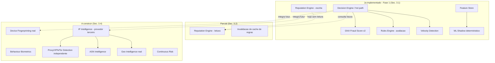
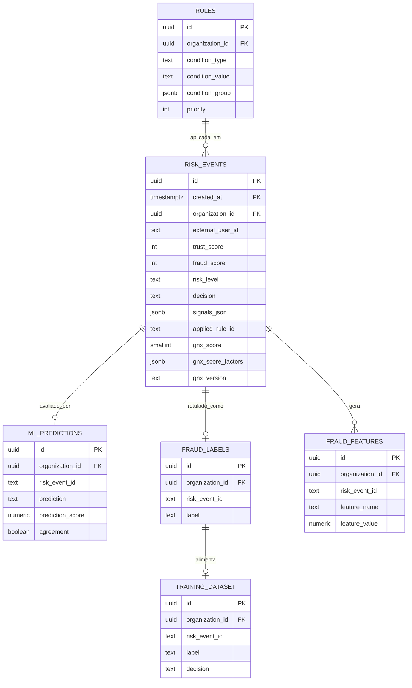
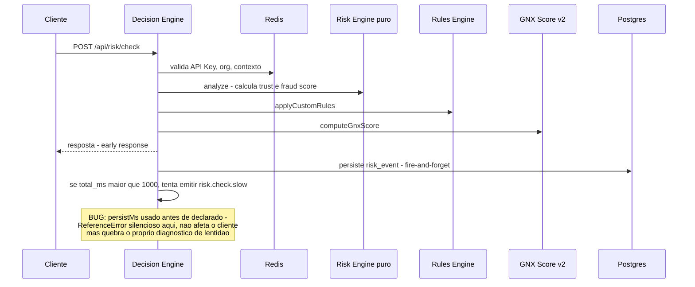
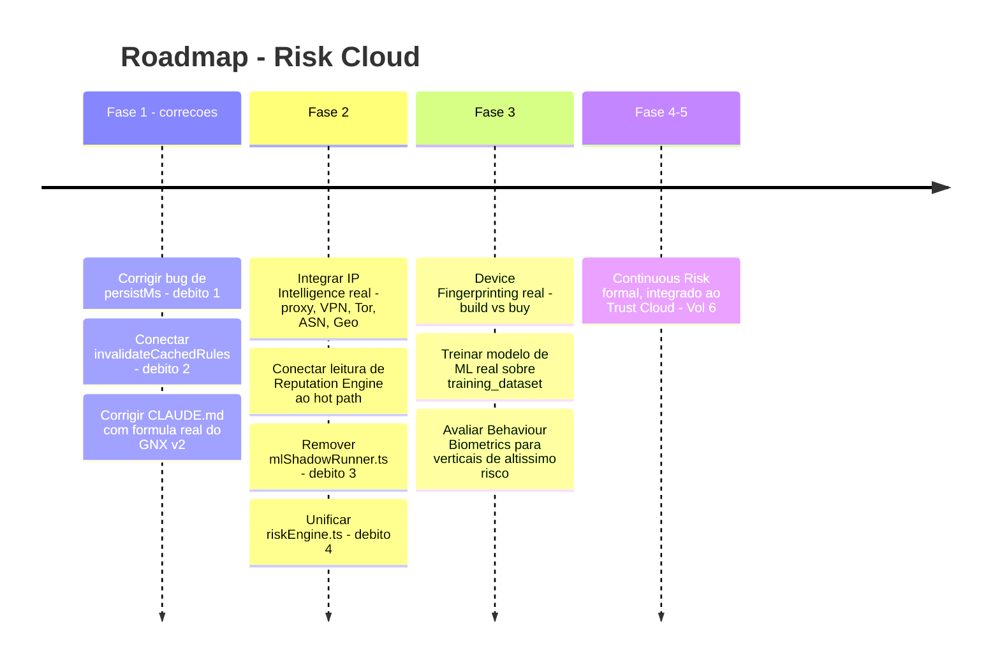

# GENUINUX MASTER PRODUCT SPECIFICATION (MPS)

## Volume 4 — Risk Cloud

**Número do volume:** 4 de 12
**Título:** Risk Cloud
**Status:** Draft v1.0
**Relação com os demais volumes:** Diferente dos Volumes 3, 5 e 6, o Risk Cloud **já existe em produção** — é o `Risk Domain` que o Volume 2 (Seção 6) mapeou como "Implementado". Este volume não projeta uma plataforma hipotética: ele **audita o estado real do repositório** (Seção 3), documenta o que existe, o que diverge da documentação anterior (CLAUDE.md), e só então especifica a arquitetura-alvo, tratando o sistema atual como a Fase 1 já em produção do roadmap do Volume 2. Consome `identity.verification.completed` do Volume 3 como sinal de contexto adicional (ainda não implementado — ver Seção 3.4). É a fonte primária de dados para o Trust Cloud (Volume 6) e o principal caso de uso do Rules Engine referenciado no Volume 3 (Seção 6, roadmap de fluxos configuráveis).

---

## Índice

1. Objetivo do Volume
2. Escopo
3. **Auditoria do Estado Atual** (obrigatória antes de qualquer especificação-alvo)
4. Arquitetura-Alvo do Risk Cloud
5. Mapa de Módulos e Status Real
6. Módulo — Decision Engine (Orquestrador do Hot Path)
7. Módulo — GNX Fraud Score™
8. Módulo — Rules Engine
9. Módulo — Velocity Detection
10. Módulo — Device Intelligence / Device Fingerprinting
11. Módulo — Behaviour Analytics / Behaviour Biometrics
12. Módulo — IP Intelligence / Proxy / VPN / Tor / ASN / Geo Intelligence
13. Módulo — Reputation Engine
14. Módulo — Continuous Risk
15. Módulo — ML Shadow / Feature Store / Training Dataset / Feedback Loop
16. APIs — Contratos do Domínio
17. Banco de Dados (Schema Real, com Correções de Numeração)
18. Eventos de Domínio
19. Fluxos (Diagramas de Sequência — refletindo o hot path real)
20. Casos de Uso
21. Regras de Negócio
22. Requisitos Funcionais
23. Requisitos Não Funcionais
24. Segurança
25. Escalabilidade
26. Observabilidade
27. Débitos Técnicos Consolidados e Plano de Remediação
28. Roadmap Específico
29. Riscos
30. Dependências
31. Decisões Arquiteturais Tomadas (ADRs)
32. Glossário
33. Revisão de Consistência com os Volumes 1, 2 e 3
34. Resumo Executivo
35. Questões em Aberto
36. Próximos Volumes

---

## 1. Objetivo do Volume

Documentar com precisão o que o Risk Cloud **é hoje** em produção, corrigir divergências acumuladas entre a documentação anterior (CLAUDE.md) e o código real, e especificar a arquitetura-alvo dos módulos que a Seção 3 identifica como ausentes ou apenas parcialmente construídos — sem nunca descrever uma capacidade inexistente como se já existisse.

## 2. Escopo

**Dentro do escopo:** GNX Fraud Score™, Rules Engine, Decision Engine, Device Intelligence/Fingerprinting, Behaviour Analytics/Biometrics, Velocity Detection, IP/Proxy/VPN/Tor/ASN/Geo Intelligence, Reputation Engine, Continuous Risk, e a camada de ML Shadow/Feature Store como suporte direto ao Risk Domain. Auditoria completa do estado atual (obrigatória por instrução explícita).

**Fora do escopo:** verificação de identidade (Volume 3); compliance regulatório formal (Volume 5); score de confiança de longo prazo cross-domínio (Volume 6, embora este volume defina a fronteira exata com "Continuous Risk", Seção 14); SDKs e billing (Volume 7); certificações de segurança (Volume 9).

---

## 3. Auditoria do Estado Atual

> Auditoria realizada por inspeção direta do código-fonte (`api/risk/check.ts`, `api/risk/label.ts`, `src/lib/riskEngine.ts`, `api/_lib/*.ts`, `supabase/schema.sql`, todas as migrations em `supabase/migrations/`, `src/pages/dashboard/*.tsx`). Nenhum código foi alterado durante esta etapa. Onde o CLAUDE.md do projeto diverge da implementação real, a divergência é registrada explicitamente — este volume segue o código, não a documentação anterior, como fonte de verdade.

### 3.1 O que está **implementado**

| Componente | Evidência |
|---|---|
| `POST /api/risk/check` (hot path) | Fluxo completo: auth via API Key (hash SHA-256, cache Redis 5min) → cache de org (60s) → rate limit (Upstash sliding window) → limite mensal (Redis-backed) → `fetchContext` → `analyze()` (motor puro) → `applyCustomRules` → `computeGnxScore` → resposta antecipada → persistência fire-and-forget |
| `POST /api/risk/label` | Autenticação dupla (JWT vs. API Key por contagem de pontos no token), upsert em `fraud_labels` com `onConflict` (v23), dispara `buildTrainingDataset()` e `updateEntityReputation()` fire-and-forget |
| Risk Engine puro (`src/lib/riskEngine.ts`) | 17 códigos de sinal em 5 categorias (email, IP, device, velocity, behavioral); `trust_score`/`fraud_score` com decaimento/incremento linear e multiplicadores para casos extremos |
| GNX Fraud Score™ v2 (`api/_lib/gnxScore.ts`) | Modelo de 13 fatores com soma de pesos = 1.00, mais um fator de confiança pós-soma (não ponderado) — ver correção na Seção 7 |
| Rules Engine — avaliação | `applyCustomRules` suporta formato legado (`condition_type`/`condition_value`) e formato atual (`condition_group` com `match: all|any`); 9+ campos de condição, incluindo `metadata.*` dinâmico |
| Cache Redis em camadas | `gnx:key:*`, `gnx:org:*`, `gnx:rules:*`, contadores de velocidade (`gnx:cnt:*`), stats diárias, uso mensal — todos fail-open |
| Particionamento de `risk_events` | Confirmado como estado terminal (RANGE mensal, PK `(id, created_at)`) — nenhuma migration posterior reverte |
| Feature Store (`fraud_features`) | `extractFeatures()` gera **20 features** em 5 grupos (velocity, reputation, behavior, risk, context) — não 17 como o CLAUDE.md afirmava (Seção 3.5) |
| Training Dataset | `buildTrainingDataset()` funcional, upsert com constraint única (v23) |
| ML Shadow Mode (produção) | `predictShadow()` — modelo determinístico de 9 features, sem treinamento, gated por `ML_SHADOW_ENABLED`, grava `agreement` pré-computado em `ml_predictions` |
| Feedback Loop / Analytics agregada | `GET /api/admin/intelligence/summary` — métricas de matriz de confusão, distribuição GNX, tendências de fraude, padrões, prontidão de treinamento — deduplicado por `risk_event_id` |
| Review Queue | `Queue.tsx` — transições de estado completas (`pending→in_review→approved/rejected/escalated`, reabertura), toda ação grava `audit_logs`, realtime via `postgres_changes` |
| Webhooks | Disparo assinado HMAC-SHA256, retry em 3 tentativas via cron dedicado (`api/webhooks/retry-due.ts`, a cada minuto), log completo em `webhook_deliveries` |
| Reputation Engine — escrita | `increment_entity_reputation()` RPC, atômica, chamada fire-and-forget a partir de `label.ts` |

### 3.2 O que está **parcialmente implementado**

| Componente | O que falta |
|---|---|
| **Reputation Engine — leitura** | `getEntityReputation()` existe em `reputationNetwork.ts` mas **não é chamada em nenhum lugar de `fetchContext()`** — o sinal é gravado mas nunca lido de volta no hot path. `REPUTATION_ENRICHMENT_ENABLED`, citado como flag de ativação, existe apenas em um comentário de código, nunca em um `process.env` real |
| **Rules Engine — invalidação de cache** | `invalidateCachedRules(orgId)` está definida em `keyCache.ts` mas é chamada por **zero** outros arquivos. `Rules.tsx` grava direto no Supabase sem passar por camada de API que invalide o cache — mudanças de regra levam até 60s (TTL) para valer, não são instantâneas como um cliente razoavelmente esperaria |
| **IP Intelligence** | O motor lê `metadata.proxy`/`metadata.vpn`/`metadata.tor` como booleanos **declarados pelo próprio cliente que envia a requisição** — não há nenhuma chamada a provedor de enriquecimento de IP. Um comentário no código (`"Hook for proxy/VPN: adicione aqui..."`) confirma que é um gancho não implementado |
| **Geo Intelligence** | Apenas uma lista estática de 6 países de alto risco (RU/KP/IR/NG/PK/BY) — nenhuma geolocalização real de IP |

### 3.3 O que existe apenas como **fundação** (schema/flag sem lógica real por trás)

| Componente | Estado |
|---|---|
| ML Shadow como "modelo" | É uma combinação linear determinística de 9 features com pesos fixos, **não um modelo treinado** — a infraestrutura (feature store, dataset, predictions, agreement tracking) está pronta para receber um modelo real, mas nenhum treinamento ocorreu ainda |

### 3.4 O que **ainda precisa ser construído**

- **Device Fingerprinting real.** `device_id` é hoje uma string opaca fornecida pelo próprio cliente — não existe qualquer lógica de fingerprinting (canvas, WebGL, áudio, enumeração de fontes) em nenhum lugar do repositório.
- **Behaviour Biometrics.** O que existe é heurística simples de User-Agent (detecção de headless/selenium por substring) — não há captura de dinâmica de digitação, movimento de mouse, ou qualquer sinal biométrico comportamental real.
- **Proxy/VPN/Tor Detection independente.** Depende inteiramente do que o cliente declara — zero verificação própria.
- **ASN Intelligence.** Não existe.
- **Consumo do evento `identity.verification.completed`** (Volume 3) como contexto de risco — o Identity Cloud ainda não está implementado, então este consumo também não existe.
- **Continuous Risk** como recálculo contínuo pós-evento (distinto de uma nova chamada a `/risk/check`) — não existe hoje; cada chamada é uma avaliação pontual.

### 3.5 Débitos técnicos identificados

| # | Débito | Severidade |
|---|---|---|
| 1 | **Bug real, não hipotético:** `api/risk/check.ts` usa a variável `persistMs` dentro do bloco de requisição lenta (`total_ms > 1000`) **antes** de sua declaração `const` (18 linhas depois) — viola a *temporal dead zone* do JavaScript. Toda requisição com `total_ms > 1000ms` lança `ReferenceError` dentro desse bloco, que roda **depois** da resposta ao cliente (não afeta o cliente), mas quebra silenciosamente exatamente o diagnóstico feito para capturar requisições lentas — a métrica `risk.check.slow` em `audit_logs` e o alerta Sentry correspondente provavelmente nunca são gravados hoje | **Alta** |
| 2 | `invalidateCachedRules` nunca chamada — mudanças de regra levam até 60s para valer (Seção 3.2) | Média |
| 3 | `api/_lib/mlShadowRunner.ts` é código morto — implementação anterior do shadow mode, referenciada por zero arquivos, grava num schema (`v22_ml_shadow.sql`) incompatível com o pipeline vivo (`v22_ml_predictions.sql`) | Média |
| 4 | `api/_lib/riskEngine.ts` é uma **cópia manual** de `src/lib/riskEngine.ts`, não um re-export — nada garante que as duas cópias permaneçam sincronizadas em edições futuras | Média |
| 5 | Numeração de migration duplicada: dois arquivos `v22` (`v22_ml_predictions.sql` vs. `v22_ml_shadow.sql`, com DDL conflitante para a mesma tabela) e dois arquivos `v24` (`v24_admin_console.sql`, `v24_gnx_score_v2.sql`) | Baixa (funcional, mas fonte de confusão operacional) |
| 6 | `tsconfig.json` só inclui `src` — **todo o diretório `api/` roda sem checagem de tipos em tempo de build** (`npx tsc --noEmit` não cobre as funções serverless) | Alta (provável causa-raiz de incidentes passados de `ReferenceError` documentados no próprio CLAUDE.md) |

### 3.6 Divergências entre CLAUDE.md e a implementação real

| Item | CLAUDE.md afirma | Código real |
|---|---|---|
| Fórmula GNX v2 | Features `trust_score_base`(−0.15), `critical_signals`(0.18), `device_prior_block`(0.10), etc. | Features completamente diferentes: `fraud_score_base`(0.30), `email_reputation`(0.09), `device_reputation`(0.06), etc. — nenhum nome ou peso coincide (Seção 7) |
| Contagem de features do Feature Store | "17 features" | 20 features (5 grupos, recontados na Seção 3.1) |
| Threshold de bloqueio | "`fraud_score ≥ 70` → block" | O corte real é `risk_level === 'critical'`, que só ocorre em `fraud_score ≥ 81` — 70 cai na faixa `high`, que mapeia para `review`, não `block` |
| `api/_lib/riskEngine.ts` | "Re-export do motor de risco" | Cópia manual duplicada, não um `export * from` |
| `api/admin/intelligence/ml/stats.ts` | "Deletado" (única menção a limpeza de código morto) | O endpoint foi deletado, mas a biblioteca da qual dependia (`mlShadowRunner.ts`) permanece órfã no repositório |
| Claims de marketing (`Landing.tsx`) | "300+ sinais", "fingerprinting persistente entre navegadores, detecta emuladores/dispositivos rooteados" | Sinal real: 17 (motor) / 20 (feature store); `device_id` é string opaca sem fingerprinting algum |

**Nota para o usuário (fora do escopo deste volume, mas relevante):** os itens das Seções 3.5 e 3.6 são achados de auditoria, não alterações — nenhum código ou o próprio CLAUDE.md foi modificado nesta etapa, conforme instruído. Recomenda-se tratá-los como itens de correção separados quando o usuário desejar.

---

## 4. Arquitetura-Alvo do Risk Cloud



**Princípio herdado (Volume 2, ADR-004):** os módulos da coluna "A construir" não são adicionados por completude de checklist — cada um só entra no roadmap (Seção 28) quando um gatilho concreto de negócio ou de qualidade de detecção o justificar, seguindo o mesmo princípio anti-especulação já aplicado no Volume 2 e no Volume 3.

## 5. Mapa de Módulos e Status Real

| Módulo | Status | Seção |
|---|---|---|
| Decision Engine | Implementado | 6 |
| GNX Fraud Score™ | Implementado (com correção de documentação) | 7 |
| Rules Engine | Implementado, com débito de cache | 8 |
| Velocity Detection | Implementado | 9 |
| Device Intelligence / Fingerprinting | Fundação apenas (ID opaco) | 10 |
| Behaviour Analytics / Biometrics | Parcial (heurística UA) / Ausente (biometria real) | 11 |
| IP Intelligence / Proxy / VPN / Tor / ASN / Geo | Majoritariamente ausente | 12 |
| Reputation Engine | Escrita implementada, leitura ausente | 13 |
| Continuous Risk | Ausente — fronteira com Trust Cloud definida | 14 |
| ML Shadow / Feature Store / Training Dataset | Implementado (fundação para modelo real futuro) | 15 |

## 6. Módulo — Decision Engine (Orquestrador do Hot Path)

| Campo | Especificação |
|---|---|
| **Objetivo** | Coordenar, dentro do orçamento de latência do Volume 2 (p95 < 200ms), a sequência auth → contexto → motor → regras → score → resposta, e delegar toda persistência não essencial para depois da resposta |
| **Responsabilidades** | Sequenciamento síncrono do hot path; medição por etapa (`step()`); early response; disparo de todos os efeitos colaterais fire-and-forget |
| **Limites** | Não contém lógica de scoring (delegada ao Risk Engine puro, Seção 7) nem de regras (Seção 8) — é estritamente um orquestrador |
| **APIs** | `POST /api/risk/check` (Seção 16) |
| **Banco de dados** | Escreve em `risk_events`, `users_checked` |
| **Eventos** | Publica o equivalente lógico de `risk.event.evaluated` (Volume 2, Seção 8.2) — hoje como fire-and-forget in-process, não como evento formal de barramento |
| **Segurança** | Autenticação por API Key hasheada; nenhuma lógica de autorização duplicada fora do Gateway (Volume 2, Seção 10) |
| **Escalabilidade** | Já otimizado — cache em camadas, RPC única para contexto, resposta antecipada (Volume 2, Seção 16, adotado como padrão de referência a partir *deste* módulo) |
| **Observabilidade** | `step()` por etapa; sink de requisição lenta — **atualmente quebrado pelo débito técnico #1 (Seção 3.5)**, correção obrigatória antes de qualquer expansão do domínio |
| **Roadmap** | Fase 1: corrigir débito #1 (bug de `persistMs`); Fase 2: consumir `identity.verification.completed` do Volume 3 como contexto adicional |

## 7. Módulo — GNX Fraud Score™

**Especificação corrigida com base no código real** (Seção 3.6) — a versão anterior no CLAUDE.md **não** deve ser usada como referência.

| Campo | Especificação |
|---|---|
| **Objetivo** | Produzir um score único de 0–1000, explicável, que consolida o resultado do motor de risco com sinais adicionais de reputação e velocidade, para uso em dashboards e decisões de segunda camada |
| **Fórmula real (v2)** | Soma ponderada de 13 fatores, pesos somando 1.00: `fraud_score_base`(0.30), `user_velocity`(0.07), `ip_velocity`(0.07), `device_velocity`(0.05), `email_reputation`(0.09, invertido), `ip_reputation`(0.06, invertido), `device_reputation`(0.06, binário), `signup_rate`(0.06), `repeated_device`(0.04), `repeated_email`(0.03), `critical_signal`(0.07), `high_signal`(0.06), `medium_signal`(0.04) — seguido de um **fator de confiança pós-soma, não ponderado** (`trust_factor: 1.2`, redutor de até 120 pontos quando `trust_score=100`) |
| **Faixas** | `low` (0–300), `review_zone` (301–700), `high` (701–1000) — via `gnxScoreBand()` |
| **Explicabilidade** | Cada fator é persistido individualmente em `gnx_score_factors` (JSONB) — cumpre ADR-002 do Volume 1 |
| **Banco de dados** | `risk_events.gnx_score` (SMALLINT), `gnx_score_factors` (JSONB), `gnx_version` (TEXT) — colunas adicionadas pela migration `v24_gnx_score_v2.sql`, **não** pela v19 como a documentação anterior implicava |
| **Segurança** | Cálculo síncrono, puro, sem chamada externa — não introduz risco de latência ou dependência |
| **Escalabilidade** | Medido isoladamente via `gnx_ms` no `step()` — hoje sub-milissegundo, não é gargalo |
| **Observabilidade** | Distribuição de bandas exposta em `/api/admin/intelligence/summary` (Analytics) |
| **Roadmap** | Fase 1: **corrigir a documentação (este volume já faz isso)**; Fase 2: avaliar se os pesos devem ser recalibrados com dados reais de `fraud_labels` acumulados, em vez de mantidos como constantes fixas indefinidamente |

## 8. Módulo — Rules Engine

| Campo | Especificação |
|---|---|
| **Objetivo** | Permitir que cada organização sobreponha a decisão do motor de risco com regras próprias, legíveis e editáveis (cumprindo ADR-002 do Volume 1) |
| **Responsabilidades** | Avaliar condições (`fraud_score`, `trust_score`, `risk_level`, `event_type`, `country`, `email_domain`, `ip_user_count_1h`, `ip_signup_count_1h`, `device_account_count`, `metadata.*` dinâmico); aplicar a primeira regra ativa correspondente, ordenada por prioridade |
| **Limites** | Não recalcula o score em si — apenas sobrepõe a decisão final |
| **APIs** | CRUD via Supabase direto a partir de `Rules.tsx` (sem camada de API dedicada hoje — nota de arquitetura, Seção 27) |
| **Banco de dados** | `rules`, cache Redis `gnx:rules:{orgId}` (60s TTL) |
| **Eventos** | Nenhum evento de domínio formal publicado hoje — mudança de regra é uma escrita direta no Postgres |
| **Segurança** | Regras são escopadas por `organization_id` via RLS (Volume 2, Seção 14) |
| **Escalabilidade** | Cache de 60s evita releitura constante do Postgres no hot path |
| **Observabilidade** | Nome/ID da regra aplicada é persistido em `risk_events.applied_rule_id/name` — rastreável por evento |
| **Roadmap** | **Fase 1 (correção imediata, não uma feature nova):** conectar `invalidateCachedRules(orgId)` às mutações de `Rules.tsx` — débito técnico #2 (Seção 3.5), não uma decisão de produto em aberto |

## 9. Módulo — Velocity Detection

| Campo | Especificação |
|---|---|
| **Objetivo** | Detectar picos anômalos de atividade por usuário, IP ou dispositivo em janelas curtas de tempo |
| **Responsabilidades** | Três contadores de janela: `VELOCITY_USER`, `VELOCITY_SIGNUP_IP`, `VELOCITY_DEVICE` — comparação simples contra threshold sobre contexto pré-buscado |
| **Limites** | Sem detecção de padrão temporal mais sofisticado (ex. séries temporais, detecção de anomalia estatística) — é comparação de contagem contra limiar fixo |
| **APIs** | Interno ao motor de risco, não exposto isoladamente |
| **Banco de dados** | Contadores em Redis (`gnx:cnt:u:*`, `gnx:cnt:ip:s:*`, `gnx:cnt:dev:u:*`), reconstruíveis a partir de `risk_events` (Volume 2, ADR-005) |
| **Eventos** | N/A |
| **Segurança** | N/A |
| **Escalabilidade** | Já otimizado — leitura O(1) em Redis via pipeline fixo de 8 slots |
| **Observabilidade** | Contadores expostos via `/api/admin/metrics/cache-stats` |
| **Roadmap** | Fase 2: avaliar detecção de anomalia estatística (não apenas threshold fixo) quando volume de dados justificar |

## 10. Módulo — Device Intelligence / Device Fingerprinting

| Campo | Especificação |
|---|---|
| **Objetivo (alvo)** | Identificar um dispositivo de forma persistente e resistente a manipulação, mesmo sem cookies/storage confiável |
| **Estado real (Seção 3.4)** | `device_id` é uma string opaca fornecida pelo próprio cliente da API — a Genuinux confia no valor enviado, sem verificação própria. Sinais atuais (`DEVICE_ABSENT`, `DEVICE_PRIOR_BLOCK`, `DEVICE_MULTI_ACCOUNT`) operam sobre esse identificador não verificado |
| **Responsabilidades (alvo)** | Gerar fingerprint client-side (via SDK, Volume 7) combinando sinais de canvas/WebGL/áudio/fontes; ou integrar SDK de fornecedor especializado (mesma lógica de decisão build-vs-buy do ADR-008 do Volume 3) |
| **Limites** | Fingerprinting client-side nunca é 100% à prova de manipulação — é um sinal probabilístico, não uma prova |
| **APIs** | Hoje: campo `device_id` no payload de `/api/risk/check`. Alvo: SDK client-side gerando o fingerprint automaticamente (Volume 7) |
| **Banco de dados** | Hoje: `risk_events.device_id` (texto). Alvo: tabela de perfis de dispositivo com histórico de sinais de fingerprint |
| **Eventos** | N/A hoje |
| **Segurança** | Fingerprinting client-side levanta considerações de privacidade (rastreamento entre sessões) — requer avaliação de compliance (Volume 9) antes de implementar |
| **Escalabilidade** | N/A hoje |
| **Observabilidade** | N/A hoje |
| **Roadmap** | Fase 2: avaliar build vs. buy (mesmo framework de decisão do Volume 3, ADR-008) — não implementado neste volume, apenas escopado |

## 11. Módulo — Behaviour Analytics / Behaviour Biometrics

| Campo | Especificação |
|---|---|
| **Objetivo (alvo)** | Detectar comportamento não-humano ou automatizado através de padrões de interação (não apenas metadados declarados) |
| **Estado real — Behaviour Analytics** | Implementado como heurística simples: `UA_ABSENT`, `UA_AUTOMATION` (substring contra lista de 12 termos como "headless", "selenium"), `EVENT_SENSITIVE`, `METADATA_SUSPICIOUS` (lê flags booleanas **declaradas pelo próprio cliente** — `bot`/`proxy`/`tor`/`vpn`/`emulator`), `METADATA_HIGH_VALUE` |
| **Estado real — Behaviour Biometrics** | **Não implementado.** Nenhuma captura de dinâmica de digitação, movimento de mouse, padrão de toque em mobile, ou qualquer sinal biométrico comportamental existe no código |
| **Limites** | A distinção entre "Analytics" (o que existe) e "Biometrics" (o que não existe) deve ser preservada na comunicação de produto — não são o mesmo nível de sofisticação, e tratá-los como equivalentes seria a mesma classe de overclaim já identificada na Seção 3.6 |
| **APIs** | Hoje: campo `metadata` no payload de `/api/risk/check`, interpretado como declaração do cliente, não verificado |
| **Banco de dados** | `risk_events.signals_json` armazena os sinais disparados |
| **Eventos** | N/A |
| **Segurança** | Captura de biometria comportamental real (se implementada no futuro) entraria na mesma categoria de dado sensível já tratada no Volume 3 (Seção 27) |
| **Escalabilidade** | N/A |
| **Observabilidade** | Distribuição de sinais disparados por organização, já visível em Analytics |
| **Roadmap** | Fase 3+: avaliar captura real de biometria comportamental via SDK (Volume 7), condicionada a demanda de clientes de altíssimo risco (iGaming, cripto) — não planejada para Fase 1/2 |

## 12. Módulo — IP Intelligence / Proxy / VPN / Tor / ASN / Geo Intelligence

| Campo | Especificação |
|---|---|
| **Objetivo (alvo)** | Determinar independentemente (sem depender de declaração do cliente) se um IP é datacenter/proxy/VPN/Tor, seu ASN, e sua geolocalização real |
| **Estado real** | `IP_HIGH_RISK_COUNTRY` usa uma lista estática de 6 países (RU/KP/IR/NG/PK/BY) — não é geolocalização de IP, é uma correspondência fixa. `METADATA_SUSPICIOUS` lê `metadata.proxy`/`.vpn`/`.tor` como booleanos **enviados pelo cliente que faz a chamada à API** — ou seja, um cliente malicioso pode simplesmente omitir essas flags para escapar da detecção. O comentário no código confirma que é um gancho não implementado |
| **Responsabilidades (alvo)** | Integração com provedor de IP intelligence terceiro (mesma decisão build-vs-buy do Volume 3) para: detecção de datacenter/proxy/VPN, detecção de Tor exit node, resolução de ASN, geolocalização real |
| **Limites** | Nenhum provedor de IP intelligence é 100% preciso — decisão deve permanecer probabilística, alimentando o score, não bloqueando unicamente por esse sinal |
| **APIs** | Alvo: chamada assíncrona (fora do hot path síncrono, herdando RN-A04 do Volume 2) ou cache agressivo de resultado por IP com TTL longo, para não comprometer o p95 do Decision Engine |
| **Banco de dados** | Alvo: tabela/cache de reputação de IP, análoga a `entity_reputation` |
| **Eventos** | N/A hoje |
| **Segurança** | N/A adicional além do já coberto pela integração assíncrona padrão |
| **Escalabilidade** | Cache com TTL longo (IPs de datacenter/VPN mudam de classificação raramente) — mitiga custo de chamada por requisição |
| **Observabilidade** | Taxa de detecção por provedor, uma vez implementado |
| **Roadmap** | **Este é o gap de maior impacto identificado na auditoria** para a credibilidade do produto (a Landing Page reivindica "detecção de proxy/VPN" que hoje não existe de forma independente) — priorizado como item de Fase 1/2 no roadmap (Seção 28), não Fase 3+ |

## 13. Módulo — Reputation Engine

| Campo | Especificação |
|---|---|
| **Objetivo** | Manter um contador de reputação por entidade (e-mail, IP, dispositivo), atualizado atomicamente a cada label de fraude submetido |
| **Estado real — escrita** | Implementada. `updateEntityReputation()` chamada fire-and-forget a partir de `label.ts`, via RPC atômica `increment_entity_reputation()` |
| **Estado real — leitura** | **Não conectada.** `getEntityReputation()` existe mas não é chamada em `fetchContext()` — o dado é gravado e nunca consultado de volta para influenciar uma decisão futura. A flag `REPUTATION_ENRICHMENT_ENABLED` citada no código como gatilho de ativação não existe como `process.env` real em lugar nenhum |
| **Limites** | `entity_reputation` é global (sem `organization_id`) — decisão de design intencional para permitir reputação cross-organização no futuro (relacionado à visão de Trust Graph de rede do Volume 1, Seção 11.6), mas isso também significa que hoje não há isolamento multi-tenant nessa tabela especificamente (nota de segurança para o Volume 9) |
| **APIs** | Sem endpoint dedicado hoje |
| **Banco de dados** | `entity_reputation` (v19) |
| **Eventos** | N/A |
| **Segurança** | Ausência de `organization_id` é uma decisão deliberada, mas deve ser revisada explicitamente no Volume 9 à luz do RN-A02 do Volume 2 (toda tabela multi-tenant precisa de RLS) — `entity_reputation` é uma exceção consciente, análoga a `feature_importance` (Volume 2, Seção 13) |
| **Escalabilidade** | RPC atômica evita condição de corrida em updates concorrentes |
| **Observabilidade** | Nenhuma hoje — não há painel que mostre reputação agregada |
| **Roadmap** | Fase 1 (correção, não feature nova): implementar de fato a flag `REPUTATION_ENRICHMENT_ENABLED` e conectar `getEntityReputation()` ao `fetchContext()` — a infraestrutura de escrita já existe e está sendo desperdiçada |

## 14. Módulo — Continuous Risk

**Fronteira explícita com o Volume 6 (Trust Cloud) — decisão arquitetural desta seção.**

| Aspecto | Risk Cloud "Continuous Risk" (este volume) | Trust Cloud "Continuous Monitoring" (Volume 6) |
|---|---|---|
| Pergunta que responde | "O risco transacional deste evento específico mudou desde a última avaliação?" | "A confiabilidade geral desta entidade, através de todos os domínios (identidade, risco, compliance), está se mantendo estável?" |
| Escopo de dado | Apenas sinais do Risk Domain | Agregação cross-domínio via Unified Entity Graph |
| Estado real | **Não implementado** — cada chamada a `/api/risk/check` é uma avaliação pontual e independente; não existe recálculo automático de eventos passados quando novo contexto surge | Não implementado (Volume 6 ainda não escrito) |
| Gatilho de implementação | Quando um sinal tardio (ex. um label de fraude submetido dias depois) deveria, em teoria, alterar a leitura de risco de eventos passados relacionados — hoje isso não acontece automaticamente | A definir no Volume 6 |

**Decisão:** este volume não implementa "Continuous Risk" como reprocessamento automático — apenas define a fronteira conceitual para que o Volume 6 não a duplique nem a ignore. A funcionalidade prática mais próxima disponível hoje é o Reputation Engine (Seção 13), que persiste efeito cumulativo, mas não recalcula eventos passados.

## 15. Módulo — ML Shadow / Feature Store / Training Dataset / Feedback Loop

| Campo | Especificação |
|---|---|
| **Objetivo** | Construir, de forma não disruptiva (modo sombra), a fundação de dados necessária para eventualmente treinar um modelo de ML real, sem nunca deixar esse modelo decidir em produção antes de validado |
| **Estado real** | Pipeline completo e implementado: `extractFeatures()` (20 features, 5 grupos) → `persistFeatures()` (`fraud_features`, gated por `FEATURE_STORE_ENABLED`) → `predictShadow()` (combinação linear determinística de 9 features, **não treinada**) → `mlPredictionStore.savePrediction()` (`ml_predictions`, com `agreement` pré-computado) → `buildTrainingDataset()` (`training_dataset`, disparado no submit de label) |
| **Limites** | O "modelo" de shadow mode não é ML no sentido de ter sido treinado com dados — é uma heurística com pesos fixos escolhidos manualmente, que serve para validar a **infraestrutura** de shadow mode, não para gerar previsões superiores ao motor de regras |
| **APIs** | `GET /api/admin/ml/summary`, `/disagreements`, `/features` — implementados |
| **Banco de dados** | `fraud_features`, `training_dataset`, `ml_predictions`, `feature_importance` |
| **Eventos** | N/A formal — chamadas diretas fire-and-forget |
| **Segurança** | N/A adicional |
| **Escalabilidade** | Fire-and-forget, fora do hot path — não compete por latência com o Decision Engine |
| **Observabilidade** | `/dashboard/ml` — cobertura, taxa de concordância, análise de disagreement |
| **Roadmap** | Fase 2: remover o código morto `mlShadowRunner.ts` (débito #3); Fase 3: treinar um modelo real sobre `training_dataset` uma vez que o volume de labels justifique (gatilho: 10.000 labels + 50+ `confirmed_fraud`, já documentado como meta de "Training Readiness" no pipeline existente) |

## 16. APIs — Contratos do Domínio

| Endpoint | Estado | Descrição |
|---|---|---|
| `POST /api/risk/check` | Implementado | Decisão de risco em tempo real |
| `POST /api/risk/label` | Implementado | Submissão de label de fraude (feedback loop) |
| `POST /api/webhooks/test` | Implementado | Disparo de teste de webhook |
| `GET /api/admin/intelligence/summary` | Implementado | Métricas agregadas de feedback loop |
| `GET /api/admin/ml/summary` / `/disagreements` / `/features` | Implementado | Métricas de ML Shadow |
| `GET /api/admin/metrics/per-org` / `/cache-stats` | Implementado | Observabilidade operacional |
| CRUD de `rules` | Implementado, **sem** camada de API dedicada (direto via Supabase client) | Débito técnico — nota de arquitetura (Seção 27) |

## 17. Banco de Dados (Schema Real, com Correções de Numeração)



**Correção recomendada para higiene de migrations (não executada nesta etapa — apenas documentada):** renumerar `v22_ml_shadow.sql` e `v24_gnx_score_v2.sql` para versões subsequentes não conflitantes (ex. `v26`, `v27`) na próxima janela de manutenção de schema, e remover `v22_ml_shadow.sql` completamente se `mlShadowRunner.ts` (débito #3) for removido.

## 18. Eventos de Domínio

| Evento (lógico, hoje fire-and-forget in-process — Volume 2, Seção 8.1) | Publicador | Consumidores atuais |
|---|---|---|
| `risk.event.evaluated` | Decision Engine | ML Shadow, Feature Store, Webhooks do cliente |
| `risk.label.submitted` | Label endpoint | Dataset Builder, Reputation Engine (escrita) |
| `risk.check.slow` | Decision Engine (quebrado — débito #1) | `audit_logs`, Sentry |

## 19. Fluxos (Diagramas de Sequência)

### 19.1 Hot path real (com o débito técnico anotado)



### 19.2 Feedback loop (label → dataset → reputação)

```mermaid
sequenceDiagram
    participant U as Compliance/Risk analyst
    participant LBL as /api/risk/label
    participant FL as fraud_labels
    participant DS as Dataset Builder
    participant REP as Reputation Engine

    U->>LBL: submete label (confirmed_fraud/legitimate/etc)
    LBL->>FL: upsert (organization_id, risk_event_id)
    LBL->>DS: buildTrainingDataset - fire-and-forget
    LBL->>REP: updateEntityReputation - fire-and-forget
    Note over REP: Escrita funciona; leitura de volta ao<br/>hot path NAO esta conectada (Sec. 13)
```

## 20. Casos de Uso

1. **Cliente Growth ajusta uma regra de bloqueio por país** — hoje leva até 60s para valer (débito #2), o que pode ser percebido como "a regra não funcionou" em teste imediato.
2. **Time de risco investiga por que requisições lentas não aparecem no painel de monitoramento** — causa raiz é o débito #1; sem correção, o Go Live Monitor (Volume 2, Seção 15) opera com dado incompleto.
3. **Cliente pergunta como a Genuinux detecta VPN** — resposta honesta hoje: não detecta de forma independente, apenas confia em declaração do próprio chamador — gap a comunicar com transparência, não a esconder.
4. **Auditoria reconstrói uma decisão de score** — possível e correto hoje via `gnx_score_factors`, uma vez que a fórmula documentada esteja correta (Seção 7).

## 21. Regras de Negócio

- **RN-D01:** Nenhuma alteração de regra deve ficar sujeita a atraso de propagação sem que isso seja documentado como comportamento esperado ou corrigido — hoje é um débito, não uma escolha de design.
- **RN-D02:** Sinais declarados pelo próprio cliente da API (`metadata.proxy/vpn/tor/bot`) nunca devem ser comunicados externamente como "detecção" da Genuinux — são entrada do cliente, não verificação própria, até que a Seção 12 seja implementada.
- **RN-D03:** Toda correção de score/threshold documentada neste volume deve ser refletida de volta no CLAUDE.md do projeto na próxima atualização de manutenção (fora do escopo desta etapa).

## 22. Requisitos Funcionais

- **RF-D01:** A plataforma deve invalidar o cache de regras imediatamente após qualquer mutação (create/update/toggle/delete), não depender do TTL.
- **RF-D02:** A plataforma deve gravar corretamente a métrica de requisição lenta sem lançar exceção interna.
- **RF-D03:** A plataforma deve, quando um provedor de IP intelligence for integrado, cachear o resultado por IP para não comprometer a latência do hot path.
- **RF-D04:** A plataforma deve permitir consulta de reputação de entidade (`entity_reputation`) como parte do contexto de decisão, quando a flag de ativação estiver ligada de fato.

## 23. Requisitos Não Funcionais

| Categoria | Requisito | Origem |
|---|---|---|
| Latência | p95 < 200ms mantido mesmo após qualquer nova integração (IP Intelligence, Reputation read) | Volume 1/2 |
| Correção de observabilidade | Zero exceções não tratadas no caminho pós-resposta | Débito #1 |
| Type safety | `api/` deve ganhar checagem de tipo em build, não apenas `src/` | Débito #6 |
| Sincronização de código | Eliminar duplicação entre `src/lib/riskEngine.ts` e `api/_lib/riskEngine.ts` (via import real, não cópia) | Débito #4 |

## 24. Segurança

`entity_reputation` sem `organization_id` (Seção 13) é a única exceção conhecida ao RN-A02 do Volume 2 neste domínio — deve ser formalmente avaliada e justificada (ou corrigida) no Volume 9, não deixada implícita.

## 25. Escalabilidade

O hot path já segue integralmente o padrão de referência do Volume 2 (Seção 16) — este volume não introduz nenhuma mudança de arquitetura de escalabilidade, apenas corrige a instrumentação (débito #1) e propõe extensões assíncronas (IP Intelligence) que não devem entrar no caminho síncrono.

## 26. Observabilidade

Dependente da correção do débito #1 para ser confiável — até lá, qualquer afirmação sobre "requisições lentas monitoradas" deve ser tratada como não verificável em produção.

## 27. Débitos Técnicos Consolidados e Plano de Remediação

| # | Débito | Prioridade de correção sugerida |
|---|---|---|
| 1 | `persistMs` usado antes de declarado — quebra diagnóstico de lentidão | **Crítica** — correção pontual, baixo risco, alto valor de observabilidade |
| 2 | `invalidateCachedRules` nunca chamada | Alta — afeta percepção de confiabilidade do produto |
| 3 | `mlShadowRunner.ts` código morto com schema conflitante | Média — limpeza, sem urgência funcional |
| 4 | `riskEngine.ts` duplicado manualmente | Média — risco de drift silencioso futuro |
| 5 | Numeração de migration duplicada (`v22`, `v24`) | Baixa — apenas higiene |
| 6 | `api/` sem checagem de tipos em build | Alta — causa raiz estrutural de bugs de referência |
| 7 | Reputation Engine com escrita sem leitura conectada | Média — desperdício de infraestrutura já paga |
| 8 | IP Intelligence/Proxy/VPN/ASN ausentes apesar de claims de marketing | Alta (risco de credibilidade, não é bug de código) |

**Nota explícita:** nenhum destes itens foi corrigido nesta etapa, conforme instrução do usuário. Esta tabela é o inventário para decisão de priorização futura.

## 28. Roadmap Específico



## 29. Riscos

| Risco | Impacto | Mitigação |
|---|---|---|
| Claims de marketing (Landing Page) descrevem capacidades não implementadas (IP intelligence, fingerprinting) | Alto — risco de credibilidade e, potencialmente, regulatório (publicidade enganosa) | Priorizar Fase 2 do roadmap ou ajustar comunicação de produto até a capacidade existir |
| Débito #1 mascarar problemas reais de performance em produção | Médio-Alto | Correção crítica priorizada |
| `entity_reputation` sem isolamento por organização | Médio | Avaliação formal no Volume 9 |

## 30. Dependências

- Depende do **Volume 2** para: padrão de hot path (Seção 16), critério de extração de serviço, padrões RLS.
- Depende do **Volume 3** para: consumo futuro de `identity.verification.completed`.
- **Volume 5 (Compliance)** depende deste volume para: sinais de risco como insumo de decisões de compliance.
- **Volume 6 (Trust)** depende deste volume para: a fronteira de "Continuous Risk" definida na Seção 14, e para consumir `fraud_labels`/`entity_reputation` como base do Trust Score.
- **Volume 9 (Security)** depende deste volume para: avaliação de `entity_reputation` sem RLS (Seção 24), e para o gap de type-safety em `api/` (débito #6).

## 31. Decisões Arquiteturais Tomadas (ADRs)

**ADR-012 — Este volume documenta o sistema real antes de propor extensões, e trata divergências de documentação anterior como achados de auditoria, não como fatos**
- Já aplicado integralmente na Seção 3.

**ADR-013 — Fronteira entre "Continuous Risk" (Risk Cloud) e "Continuous Monitoring" (Trust Cloud)**
- Ver Seção 14. Decisão: Risk Cloud nunca reprocessa eventos passados automaticamente; Trust Cloud (Volume 6) é responsável por agregação cross-domínio de longo prazo.

**ADR-014 — IP Intelligence real é priorizada no roadmap à frente de Device Fingerprinting**
- **Contexto:** ambos são gaps completos (Seção 3.4); recurso de engenharia é finito.
- **Decisão:** IP Intelligence entra na Fase 2, Device Fingerprinting na Fase 3.
- **Justificativa:** IP Intelligence tem fornecedores maduros e integração mais simples (API HTTP com cache); Device Fingerprinting exige SDK client-side (dependência do Volume 7) e maior superfície de decisão de privacidade.

## 32. Glossário

| Termo | Definição |
|---|---|
| **Hot path** | Ver Volume 2 |
| **Shadow mode** | Ver Volume 1 |
| **TDZ (Temporal Dead Zone)** | Período entre a entrada de escopo de uma variável `let`/`const` e sua declaração, durante o qual acessá-la lança `ReferenceError` |
| **Fail-open** | Ver Volume 2 |
| **Overclaim de produto** | Comunicação de marketing/documentação que descreve uma capacidade além do que o sistema real implementa |

---

## 33. Revisão de Consistência com os Volumes 1, 2 e 3

### 33.1 Decisões arquiteturais herdadas e aplicadas

| Decisão anterior | Aplicação neste volume |
|---|---|
| ADR-002 (Vol. 1 — explicabilidade) | `gnx_score_factors` confirmado e corrigido (Seção 7) |
| Padrão de hot path de referência (Vol. 2, Seção 16) | Confirmado como já implementado — este volume não o redesenha, apenas corrige sua instrumentação |
| ADR-005 (Vol. 2 — Redis nunca é fonte de verdade) | Confirmado — todos os contadores são reconstruíveis a partir de `risk_events` |
| ADR-008 (Vol. 3 — build vs. buy) | Reaplicado na Seção 10 (Device Fingerprinting) e Seção 12 (IP Intelligence) como o mesmo framework de decisão |

**Nenhuma contradição identificada** — mas este volume **corrige** afirmações factuais do CLAUDE.md que os volumes anteriores não tinham motivo para questionar (eles descreviam arquitetura-alvo, não auditavam implementação).

### 33.2 Riscos herdados e novos

| Risco herdado | Tratamento aqui |
|---|---|
| "Ausência de circuit breaking para integrações externas" (Vol. 2, Seção 26) | Reforçado — qualquer integração futura de IP Intelligence (Seção 12) herda esse requisito não resolvido |

**Riscos novos introduzidos por este volume:** os 8 débitos técnicos da Seção 27, com destaque para o bug real do débito #1 e o risco de credibilidade do débito #8 (claims de marketing vs. capacidade real).

### 33.3 Impactos nos volumes seguintes

- **Volume 5 (Compliance):** deve tratar `fraud_labels` como já compartilhado com o Risk Domain (não recriar) e pode usar a mesma auditoria de código real como padrão de rigor.
- **Volume 6 (Trust):** deve respeitar a fronteira Continuous Risk vs. Continuous Monitoring (ADR-013) e construir sobre `entity_reputation`, resolvendo a decisão de isolamento por organização levantada na Seção 24.
- **Volume 9 (Security):** herda dois itens concretos — `entity_reputation` sem RLS e ausência de type-safety em `api/`.

---

## 34. Resumo Executivo

Diferente do Volume 3 (Identity Cloud), o Volume 4 documenta um sistema **já em produção**. A auditoria (Seção 3) confirma que o núcleo do Risk Cloud — Decision Engine, GNX Fraud Score v2, Rules Engine, Velocity Detection, Feature Store, ML Shadow determinístico, Feedback Loop, Review Queue e Webhooks — está genuinamente implementado e alinhado aos princípios dos Volumes 1 e 2. Ao mesmo tempo, a auditoria encontrou um **bug real em produção** (uso de `persistMs` antes de sua declaração, quebrando o diagnóstico de requisições lentas), duas funcionalidades de escrita sem leitura conectada (invalidação de cache de regras, leitura de reputação de entidade), código morto (`mlShadowRunner.ts`), e — mais relevante para a credibilidade do produto — um conjunto de capacidades anunciadas em marketing (detecção de proxy/VPN, device fingerprinting) que **não existem** na implementação atual, que hoje confia inteiramente em declarações do próprio cliente da API. Nenhuma correção de código foi feita nesta etapa, por instrução explícita — este volume entrega o inventário preciso e um roadmap de remediação priorizado (Seção 28), com a integração de IP Intelligence real posicionada à frente de Device Fingerprinting por menor complexidade de integração.

## 35. Questões em Aberto

1. **Quando corrigir o débito #1 (bug de `persistMs`)?** — Recomendado como correção imediata e isolada, fora do escopo de "produzir documentação" desta etapa, mas deve ser decidido pelo usuário como próximo passo prático.
2. **Atualizar o CLAUDE.md do projeto com as correções da Seção 3.6?** — Não feito nesta etapa (instrução era "não alterar código"; CLAUDE.md é documentação, mas a atualização não foi solicitada explicitamente).
3. **Ajustar a comunicação de marketing da Landing Page** até que IP Intelligence/Fingerprinting existam de fato, ou acelerar a Fase 2 do roadmap para fechar o gap primeiro? — Decisão de negócio, não técnica.
4. **Fornecedor de IP Intelligence** — mesma classe de decisão do Volume 3 (fornecedor específico não escolhido aqui).
5. **`entity_reputation` deve ganhar `organization_id` ou permanecer intencionalmente global?** — depende da visão de Trust Graph de rede do Volume 1 (Seção 11.6); a decidir formalmente no Volume 6/9.

## 36. Próximos Volumes

| Vol. | Título | Depende deste volume via |
|---|---|---|
| 5 | Compliance Cloud | Reaproveitamento de `fraud_labels`; padrão de auditoria de código real |
| 6 | Trust Cloud | Fronteira Continuous Risk vs. Continuous Monitoring (ADR-013); `entity_reputation` como base |
| 9 | Security Architecture | `entity_reputation` sem RLS; ausência de type-safety em `api/` |

**Próximo volume a produzir: Volume 5 — Compliance Cloud**, quando solicitado.
