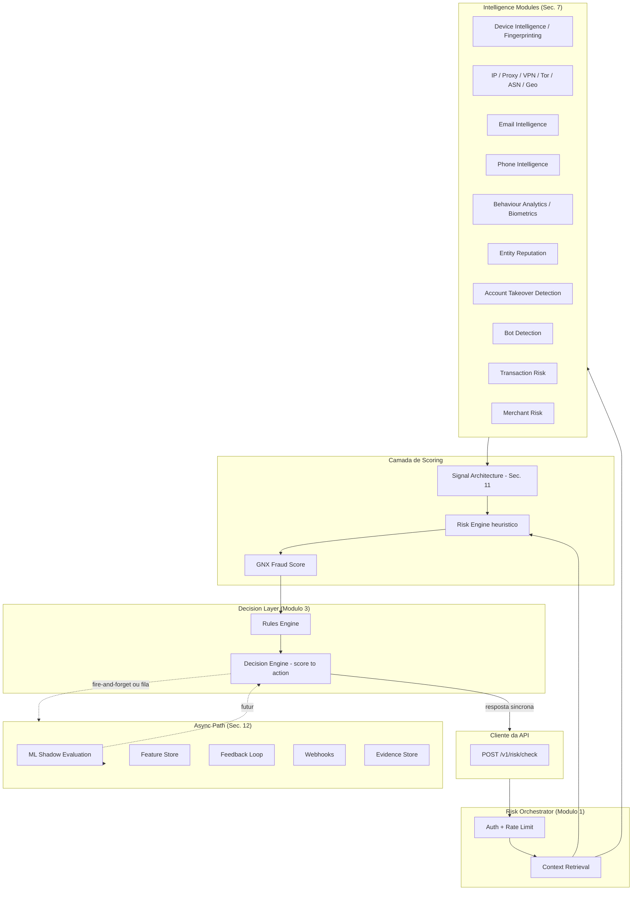
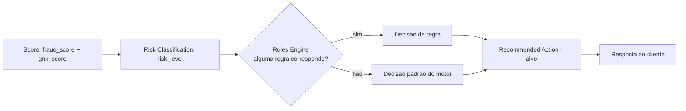
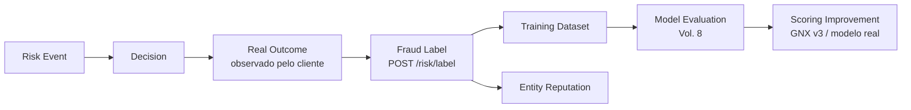

# GENUINUX MASTER PRODUCT SPECIFICATION (MPS)

## Volume 4 — Risk Cloud

**Número do volume:** 4 de 12
**Título:** Risk Cloud
**Status:** Draft v2.0 (expandido — supersede o rascunho v1.0 produzido a partir de um prompt truncado)
**Relação com os demais volumes:** Diferente dos Volumes 3, 5 e 6, o Risk Cloud **já existe em produção** — é o `Risk Domain` que o Volume 2 (Seção 6) mapeou como "Implementado". Este volume audita o estado real do repositório (Seção 3) antes de especificar qualquer arquitetura-alvo, trata o sistema atual como a Fase 1 já em produção do roadmap do Volume 2, resolve o `Continuous Risk` como fronteira explícita com o Volume 6, define o contrato de sinais que o Volume 3 (Identity Cloud) e o futuro Volume 5 (Compliance Cloud) irão consumir/produzir, e estabelece o contrato de integração de ML que o Volume 8 irá especializar.

---

## Índice

1. Objetivo do Volume
2. Escopo
3. Auditoria do Estado Atual — Matriz de Capacidades
4. Bounded Context — Fronteiras do Risk Cloud
5. Arquitetura-Alvo do Risk Cloud
6. Mapa de Módulos (26 módulos, status real)
7. Especificação dos 26 Módulos
8. GNX Fraud Score™ — Especificação Profunda
9. Decision Engine — Especificação Profunda
10. Rules Engine — Especificação Profunda
11. Signal Architecture — Taxonomia de Sinais
12. Hot Path e Async Path
13. Performance e SLOs
14. Multi-Tenancy
15. Modelo de Dados Completo
16. APIs — Contratos Completos
17. Eventos de Domínio — Matriz Completa
18. Feedback Loop — Pipeline Completo
19. ML Integration — Contrato com o Volume 8
20. Segurança — Threat Model
21. Observabilidade
22. Casos de Uso
23. Regras de Negócio
24. Requisitos Funcionais
25. Requisitos Não Funcionais
26. Riscos
27. Dependências
28. Decisões Arquiteturais Tomadas (ADRs 012–024)
29. Roadmap (Fase 1–4)
30. Glossário
31. Revisão de Consistência com os Volumes 1, 2 e 3
32. Resumo Executivo
33. Questões em Aberto
34. Próximos Volumes

---

## 1. Objetivo do Volume

Projetar o Risk Cloud como o motor central de inteligência de risco e decisão da Genuinux, capaz de analisar eventos, usuários, contas, dispositivos, IPs, transações e entidades para produzir: risk score, GNX Fraud Score™, trust signals, reasons, decision, recommended action, evidence, explainability e continuous reputation updates — suportando decisões em tempo real de baixa latência (hot path) e análises assíncronas de maior profundidade (async path). Diferente de um volume greenfield, este objetivo é perseguido **documentando primeiro o que já existe**, para que a especificação-alvo seja uma extensão honesta, não uma reinvenção que ignore produção.

## 2. Escopo

**Dentro do escopo:** todos os 26 módulos listados na Seção 6; GNX Fraud Score™ em profundidade; Decision Engine com separação explícita de score/classificação/decisão/ação; Rules Engine com DSL conceitual; taxonomia de sinais; hot path e async path; SLOs por fase; multi-tenancy e ameaças cross-tenant; modelo de dados completo (existente + extensões seguras + tabelas que não devem ser criadas); APIs versionadas (`/v1/...`) como contrato-alvo, reconciliadas com o endpoint real não versionado hoje em produção; eventos de domínio; feedback loop; contrato de integração de ML; threat model de segurança; observabilidade.

**Fora do escopo:** implementação de código, alteração de migrations, modificação da arquitetura atual, invenção de funcionalidades como concluídas quando não estão; especificação completa de Identity/Compliance/Trust (Volumes 3/5/6); especificação de modelo de ML real (Volume 8, este volume apenas define o contrato de fronteira); SDKs e billing (Volume 7); certificações formais de segurança (Volume 9).

---

## 3. Auditoria do Estado Atual — Matriz de Capacidades

> Auditoria por inspeção direta do código-fonte (`api/risk/check.ts`, `api/risk/label.ts`, `src/lib/riskEngine.ts`, `api/_lib/*.ts`, `supabase/schema.sql`, todas as migrations, `src/pages/dashboard/*.tsx`). Nenhum código foi alterado. Classificação: **Production** (real, em uso, correto) · **Implemented but incomplete** (real, mas com lacuna material) · **Foundation only** (schema/flag existe, lógica real não) · **Planned** (não existe, escopado para o futuro) · **Deprecated** (código morto) · **Technical debt** (implementado incorretamente, exige correção).

| Capability | Current status | Evidence in code | Target state | Gap | Priority |
|---|---|---|---|---|---|
| Hot-path decision (`POST /api/risk/check`) | **Production** | Sequência completa auth→cache→context→engine→rules→GNX→resposta, `check.ts` | Idêntico, com contrato versionado `/v1/risk/check` (Seção 16) | Versionamento de API ausente | Média |
| Label submission (`POST /api/risk/label`) | **Production** | Auth dupla JWT/API Key, upsert com `onConflict` (v23) | Idêntico + endpoint `/v1/risk/label` | Versionamento | Baixa |
| Risk Engine heurístico (email/IP/device/velocity/behavioral) | **Production** | `src/lib/riskEngine.ts`, 17 códigos de sinal, 5 categorias | Mantido como camada determinística sob um GNX v3 mais rico | Nenhum gap funcional imediato | — |
| GNX Fraud Score™ v2 | **Production** | `api/_lib/gnxScore.ts`, 13 fatores, soma de pesos = 1.00 | GNX v3 com fatores de reputação lida (Seção 8) | Reputation Engine não conectado à leitura | Alta |
| Rules Engine — avaliação | **Production** | `applyCustomRules`, 9+ campos de condição, formato legado + `condition_group` | DSL versionada com simulação/dry-run (Seção 10) | Sem versionamento, sem simulação | Média |
| Rules Engine — invalidação de cache | **Technical debt** | `invalidateCachedRules` definida, chamada por zero arquivos | Invalidação síncrona em toda mutação de `Rules.tsx` | Cache stale por até 60s | **Alta** |
| Redis caching (key/org/rules/contadores) | **Production** | `keyCache.ts`, `fraudCounters.ts`, todos fail-open | Mantido | Nenhum | — |
| Velocity Engine (contadores) | **Production** | 3 contadores de janela, Redis O(1) | Detecção de anomalia estatística, não apenas threshold fixo | Sem modelo estatístico | Baixa |
| Particionamento `risk_events` | **Production** | RANGE mensal, PK `(id, created_at)`, estado terminal confirmado | Mantido | Nenhum | — |
| Feature Store (`fraud_features`) | **Production** | 20 features, 5 grupos, gated por `FEATURE_STORE_ENABLED` | Mantido, expandir grupo "external intelligence" quando IP/Device Intelligence existirem | Depende de módulos ainda não construídos | Média |
| Training Dataset | **Production** | `buildTrainingDataset()`, UNIQUE constraint (v23) | Mantido | Nenhum | — |
| ML Shadow (modelo determinístico) | **Implemented but incomplete** | `predictShadow()` — combinação linear de 9 features com pesos fixos, sem treinamento | Modelo real treinado (Volume 8) | Não é ML treinado, é heurística rotulada como "shadow ML" | Média |
| `mlShadowRunner.ts` | **Deprecated** | Órfão, zero referências, schema `v22_ml_shadow.sql` conflitante | Remoção | Código morto ocupando superfície de manutenção | Baixa |
| Feedback Loop / Analytics agregada | **Production** | `/api/admin/intelligence/summary`, deduplicado por `risk_event_id` | Mantido | Nenhum | — |
| Manual Review Queue | **Production** | `Queue.tsx`, transições completas, `audit_logs` por ação, realtime | Mantido | Nenhum | — |
| Webhooks (dispatch + retry) | **Production** | HMAC-SHA256, 3 tentativas via cron, `webhook_deliveries` | Mantido | Nenhum | — |
| Entity Reputation — escrita | **Production** | `increment_entity_reputation()` RPC atômica | Mantido | Nenhum | — |
| Entity Reputation — leitura | **Foundation only** | `getEntityReputation()` existe, nunca chamada em `fetchContext()`; `REPUTATION_ENRICHMENT_ENABLED` só em comentário | Leitura conectada ao hot path | Infraestrutura paga e não utilizada | **Alta** |
| IP Intelligence (proxy/VPN/Tor independente) | **Planned** | Apenas `metadata.proxy/vpn/tor` declarado pelo próprio cliente da API | Provedor terceiro real, assíncrono/cacheado | Zero verificação própria | **Alta** |
| ASN Intelligence | **Planned** | Inexistente | Resolução de ASN via provedor de IP Intelligence | Ausente | Média |
| Geo Intelligence | **Foundation only** | Lista estática de 6 países (`IP_HIGH_RISK_COUNTRY`) | Geolocalização real de IP | Sem geo real, apenas denylist fixo | Média |
| Device Fingerprinting | **Planned** | `device_id` é string opaca fornecida pelo cliente, sem verificação | Fingerprint client-side via SDK (Volume 7) | Zero fingerprinting | Média |
| Behavioural Biometrics | **Planned** | Inexistente — apenas heurística de UA (`UA_AUTOMATION`) | Captura de dinâmica de digitação/mouse (SDK) | Ausente | Baixa |
| Email Intelligence | **Implemented but incomplete** | `EMAIL_DISPOSABLE` — lista estática de 30 domínios | Provedor de blocklist ao vivo | Lista estática desatualiza com o tempo | Baixa |
| Phone Intelligence | **Planned** | Inexistente no Risk Domain (Phone Verification pertence ao Identity Cloud, Volume 3) | Consumir sinal de `identity.phone.verified` como contexto | Sem integração cross-domínio ainda | Baixa |
| Transaction Risk (curva por valor) | **Implemented but incomplete** | `METADATA_HIGH_VALUE` + `event_type` em regras — sem modelo de risco por faixa de valor | Curva de risco parametrizável por vertical | Tratamento binário, não gradual | Média |
| Account Takeover Detection | **Foundation only** | Composto informalmente de `DEVICE_PRIOR_BLOCK` + velocity, sem lógica dedicada de ATO | Módulo dedicado combinando novo-dispositivo + mudança de geo + velocity de login | Sem sinal ATO explícito | Média |
| Bot Detection | **Implemented but incomplete** | `UA_AUTOMATION` — substring contra 12 termos | Desafio comportamental / detecção de automação mais robusta | Trivialmente evadível (alterar UA) | Média |
| Merchant Risk | **Planned** | Sem conceito de "merchant" no schema atual (apenas `organizations` como tenant) | Sub-entidade de risco para marketplaces com múltiplos vendedores | Ausente — relevante para ICP marketplace (Vol. 1) | Baixa |
| Continuous Risk Score | **Planned** | Cada chamada é avaliação pontual, sem recálculo automático | Ver fronteira formal com Trust Cloud (ADR-013) | Ausente por design, não por lacuna | — |
| Risk Explainability | **Production** | `gnx_score_factors`, `signals_json`, `applied_rule_name` | Mantido | Nenhum | — |
| Risk Evidence Store | **Foundation only** | `signals_json` serve informalmente como evidência; sem tabela dedicada | `risk_evidence` dedicada quando provedores externos existirem (Seção 15) | Sem necessidade real ainda (gate, não lacuna urgente) | Baixa |
| Sentry integration | **Production** (parcialmente comprometida) | `captureException`/`captureMessage` importados corretamente | Mantido | Bloco de requisição lenta quebrado pelo bug de `persistMs` (abaixo) | **Alta** |
| Audit logs | **Production** | Escrita em ações administrativas e decisões de review | Mantido | Nenhum | — |
| Rate limiting | **Production** | Upstash sliding window por API Key | Mantido | Nenhum | — |
| API key authentication | **Production** | SHA-256 hash, cache 5min | Mantido | Nenhum | — |
| Organization isolation (RLS) | **Production** | `current_org_id()`/`current_user_role()` SECURITY DEFINER | Mantido, exceto `entity_reputation` (ver abaixo) | `entity_reputation` sem `organization_id` — exceção deliberada, a validar no Volume 9 | Média |
| Type-safety em `api/` | **Technical debt** | `tsconfig.json` só inclui `src/` — `api/` sem checagem de tipos em build | Cobertura de `tsc --noEmit` estendida a `api/` | Causa-raiz estrutural de bugs de referência (ex. o próprio bug abaixo) | **Alta** |
| `riskEngine.ts` — duplicação | **Technical debt** | Cópia manual entre `src/lib/` e `api/_lib/`, não re-export | Import único compartilhado | Risco de drift silencioso | Média |
| Bug `persistMs` (TDZ) | **Technical debt** | `check.ts` usa `persistMs` 18 linhas antes de sua declaração `const`, dentro do bloco `total_ms > 1000` | Correção pontual (mover a declaração antes do uso) | `ReferenceError` silencioso quebra o diagnóstico de requisições lentas | **Crítica** |

---

## 4. Bounded Context — Fronteiras do Risk Cloud

O Risk Cloud é o `Risk Domain` do Volume 2 (Seção 6). Este volume formaliza suas fronteiras de dado e responsabilidade em relação a todos os demais domínios/planos da plataforma:

| Fronteira com | O que o Risk Cloud **possui** | O que o Risk Cloud apenas **consome** |
|---|---|---|
| **Identity Cloud** (Vol. 3) | Nada — Risk nunca decide identidade | Consome `identity.verification.completed` como sinal de contexto adicional (ainda não conectado — Seção 3, gap) |
| **Compliance Cloud** (Vol. 5, a especificar) | `fraud_labels` (ownership do Risk Domain, usado por Compliance apenas como leitura para casos) | Consumirá, no futuro, sinais de sanções/PEP como contexto de risco adicional — fronteira a formalizar no Volume 5 |
| **Trust Cloud** (Vol. 6, a especificar) | `entity_reputation` (ownership do Risk Domain — ver nota de exceção de RLS, Seção 14) | Trust Cloud consumirá `entity_reputation` e `fraud_labels` como insumo do Trust Score; Risk Cloud não consome nada do Trust Cloud de volta (evita ciclo) |
| **Developer Platform** (Vol. 7) | Nada | Consome API Keys, rate limits e organizações — nunca escreve nessas tabelas |
| **Billing** (Vol. 11) | Nada | Consome `monthly_events` counter (Redis) para faturamento por uso — leitura apenas |
| **Admin Platform** (Vol. 10) | Nada | Admin Platform lê `risk_events`, `audit_logs`, métricas agregadas — nunca escreve em tabelas do Risk Domain |
| **Shared Kernel — Unified Entity Graph** (Vol. 2, Seção 7) | O Risk Domain é o principal **produtor histórico** do Entity Graph hoje (é o único domínio maduro) — `users_checked` e `entity_reputation` são, na prática, a implementação atual da camada de "entidade agregada" do Entity Graph | — |
| **Shared Kernel — Event Bus** (Vol. 2, Seção 8) | Publica os eventos lógicos da Seção 17 (hoje fire-and-forget in-process, não um barramento físico) | — |

**Regra de fronteira (herdada de RN-A01, Volume 2, reafirmada aqui):** nenhum outro domínio escreve diretamente em `risk_events`, `fraud_labels`, `entity_reputation`, `fraud_features`, `training_dataset`, `ml_predictions` ou `rules`. Toda leitura cross-domínio passa pelos eventos da Seção 17 ou por RPCs de leitura explícitas — nunca por acesso direto à tabela de outro domínio.

## 5. Arquitetura-Alvo do Risk Cloud



## 6. Mapa de Módulos (26 módulos, status real)

| # | Módulo | Status |
|---|---|---|
| 1 | Risk Orchestrator | Production |
| 2 | GNX Fraud Score™ | Production |
| 3 | Decision Engine | Implemented but incomplete (falta separação formal score/classificação/decisão/ação) |
| 4 | Rules Engine | Production, com débito de cache |
| 5 | Velocity Engine | Production |
| 6 | Device Intelligence | Foundation only |
| 7 | Device Fingerprinting | Planned |
| 8 | IP Intelligence | Planned |
| 9 | Proxy/VPN/Tor Detection | Planned |
| 10 | ASN Intelligence | Planned |
| 11 | Geo Intelligence | Foundation only |
| 12 | Email Intelligence | Implemented but incomplete |
| 13 | Phone Intelligence | Planned |
| 14 | Behaviour Analytics | Implemented but incomplete |
| 15 | Behavioural Biometrics | Planned |
| 16 | Entity Reputation | Escrita: Production / Leitura: Foundation only |
| 17 | Transaction Risk | Implemented but incomplete |
| 18 | Account Takeover Detection | Foundation only |
| 19 | Bot Detection | Implemented but incomplete |
| 20 | Merchant Risk | Planned |
| 21 | Continuous Risk Score | Planned (fronteira definida) |
| 22 | Risk Explainability | Production |
| 23 | Risk Evidence Store | Foundation only |
| 24 | Manual Review Queue | Production |
| 25 | Feedback Loop | Production |
| 26 | ML Shadow Evaluation | Implemented but incomplete |

## 7. Especificação dos 26 Módulos

> Cada módulo segue o formato: Objetivo · Responsabilidades · Limites · Entradas · Saídas · APIs · Modelo de dados · Eventos · Segurança · Escalabilidade · Observabilidade · Roadmap · Estado atual.

### 7.1 Risk Orchestrator

| Campo | Especificação |
|---|---|
| Objetivo | Coordenar a sequência síncrona completa do hot path dentro do orçamento de latência (Volume 2, Seção 16) |
| Responsabilidades | Autenticação, rate limit, resolução de contexto, invocação ordenada de Risk Engine → Rules Engine → Decision Engine → GNX Score, resposta antecipada, disparo de efeitos colaterais |
| Limites | Não contém lógica de scoring nem de regras — estritamente orquestração |
| Entradas | Payload de evento (`external_user_id`, `event_type`, `email`, `ip_address`, `device_id`, `metadata`) |
| Saídas | `trust_score`, `fraud_score`, `risk_level`, `decision`, `signals`, `gnx_score` |
| APIs | `POST /v1/risk/check` (Seção 16) |
| Modelo de dados | Escreve `risk_events`, `users_checked` |
| Eventos | Publica `risk.check.requested`, `risk.decision.created` (Seção 17) |
| Segurança | Autenticação por API Key hasheada |
| Escalabilidade | Já otimizado (cache em camadas, RPC única, resposta antecipada) |
| Observabilidade | `step()` por etapa — sink de lentidão **quebrado pelo bug de `persistMs`**, correção prioritária |
| Estado atual | **Production**, com um débito técnico crítico |

### 7.2 GNX Fraud Score™

Ver especificação profunda na Seção 8. Estado atual: **Production**, fórmula real documentada e corrigida em relação ao CLAUDE.md anterior.

### 7.3 Decision Engine

Ver especificação profunda na Seção 9. Estado atual: **Implemented but incomplete** — hoje score e decisão estão parcialmente fundidos (o `risk_level` do motor já implica quase toda a decisão, sem uma camada de "recommended action" distinta como `challenge`/`monitor`).

### 7.4 Rules Engine

Ver especificação profunda na Seção 10. Estado atual: **Production** para avaliação, **Technical debt** para invalidação de cache.

### 7.5 Velocity Engine

| Campo | Especificação |
|---|---|
| Objetivo | Detectar picos anômalos de atividade por usuário, IP ou dispositivo |
| Responsabilidades | 3 contadores de janela (`VELOCITY_USER`, `VELOCITY_SIGNUP_IP`, `VELOCITY_DEVICE`) |
| Limites | Comparação de contagem contra threshold fixo — sem detecção estatística de anomalia |
| Entradas | `external_user_id`, `ip_address`, `device_id`, timestamp |
| Saídas | Sinais `VELOCITY_*` com `fraud_impact`/`trust_impact` |
| APIs | Interno ao Risk Engine |
| Modelo de dados | Contadores Redis, reconstruíveis de `risk_events` (ADR-005, Vol. 2) |
| Eventos | N/A |
| Segurança | N/A |
| Escalabilidade | Já otimizado — O(1) via pipeline Redis |
| Observabilidade | `/api/admin/metrics/cache-stats` |
| Estado atual | **Production** |

### 7.6 Device Intelligence

| Campo | Especificação |
|---|---|
| Objetivo | Avaliar risco associado a um dispositivo identificado |
| Responsabilidades | `DEVICE_ABSENT`, `DEVICE_PRIOR_BLOCK`, `DEVICE_MULTI_ACCOUNT` sobre `device_id` |
| Limites | `device_id` é opaco e fornecido pelo cliente — sem verificação própria de identidade do dispositivo |
| Entradas | `device_id` (string livre) |
| Saídas | Sinais `DEVICE_*` |
| APIs | Interno |
| Modelo de dados | `risk_events.device_id` (texto) |
| Eventos | N/A |
| Segurança | N/A |
| Escalabilidade | Trivial |
| Observabilidade | Distribuição de sinais em Analytics |
| Estado atual | **Foundation only** — funcional sobre um identificador não verificado |

### 7.7 Device Fingerprinting

| Campo | Especificação |
|---|---|
| Objetivo (alvo) | Gerar um identificador de dispositivo resistente a manipulação, sem depender de declaração do cliente |
| Responsabilidades (alvo) | Fingerprint client-side (canvas/WebGL/áudio/fontes) via SDK (Volume 7), ou integração de fornecedor especializado |
| Limites | Nunca 100% à prova de manipulação — sinal probabilístico |
| Entradas (alvo) | Sinais brutos de browser/app coletados pelo SDK |
| Saídas (alvo) | Fingerprint hash + score de confiança |
| APIs (alvo) | Componente client-side do SDK, não endpoint servidor |
| Modelo de dados (alvo) | `device_profiles` (nova tabela, Fase 3 — Seção 15) |
| Eventos | N/A hoje |
| Segurança | Fingerprinting levanta questões de privacidade/rastreamento — avaliação de compliance necessária antes de implementar (Volume 9) |
| Escalabilidade | N/A hoje |
| Observabilidade | N/A hoje |
| Estado atual | **Planned** — build vs. buy a decidir (mesmo framework do ADR-008, Volume 3) |

### 7.8 IP Intelligence

| Campo | Especificação |
|---|---|
| Objetivo (alvo) | Determinar de forma independente se um IP é datacenter/proxy/VPN, seu ASN e geolocalização real |
| Responsabilidades (alvo) | Integração assíncrona/cacheada com provedor terceiro |
| Limites | Nenhum provedor é 100% preciso — sinal probabilístico, nunca bloqueio único |
| Entradas | `ip_address` |
| Saídas (alvo) | Classificação de IP + confiança + ASN + geo |
| APIs (alvo) | Chamada assíncrona fora do hot path síncrono (RN-A04, Vol. 2), com cache TTL longo |
| Modelo de dados (alvo) | `network_profiles` (nova tabela, análoga a `entity_reputation`, Fase 3) |
| Eventos | N/A hoje |
| Segurança | N/A adicional |
| Escalabilidade | Cache de TTL longo (classificação de IP muda raramente) |
| Observabilidade | Taxa de detecção por provedor, uma vez implementado |
| Estado atual | **Planned** — maior gap de credibilidade de produto identificado na auditoria (Seção 3) |

### 7.9 Proxy/VPN/Tor Detection

| Campo | Especificação |
|---|---|
| Objetivo | Sub-capacidade de IP Intelligence (7.8) especificamente para anonimização de rede |
| Estado real | Hoje **inteiramente dependente de declaração do próprio cliente** (`metadata.proxy/vpn/tor`) — um agente malicioso pode simplesmente omitir essas flags |
| Limites | Não é uma capacidade separada de IP Intelligence no alvo — é uma das saídas do mesmo provedor |
| Roadmap | Entra junto com a Seção 7.8 na Fase 2/3 |
| Estado atual | **Planned** |

### 7.10 ASN Intelligence

| Campo | Especificação |
|---|---|
| Objetivo | Identificar o Autonomous System (provedor de rede) de um IP, sinal relevante para detecção de datacenter/hosting suspeito |
| Estado real | Inexistente |
| Roadmap | Parte do mesmo provedor de IP Intelligence (7.8), Fase 2/3 |
| Estado atual | **Planned** |

### 7.11 Geo Intelligence

| Campo | Especificação |
|---|---|
| Objetivo (alvo) | Geolocalização real de IP, não apenas denylist de país |
| Estado real | `IP_HIGH_RISK_COUNTRY` — lista estática de 6 países (RU/KP/IR/NG/PK/BY), sem geolocalização de fato |
| Roadmap | Parte da integração de IP Intelligence (7.8) |
| Estado atual | **Foundation only** |

### 7.12 Email Intelligence

| Campo | Especificação |
|---|---|
| Objetivo | Avaliar risco associado a um endereço de e-mail |
| Responsabilidades | `EMAIL_ABSENT`, `EMAIL_DISPOSABLE`, `EMAIL_DUPLICATE` |
| Limites | Lista de domínios descartáveis é **estática** (30 entradas) — não reflete novos provedores descartáveis criados após o lançamento |
| Entradas | `email` |
| Saídas | Sinais `EMAIL_*` |
| APIs | Interno |
| Modelo de dados | `risk_events.signals_json` |
| Eventos | N/A |
| Segurança | N/A |
| Escalabilidade | Trivial |
| Observabilidade | Taxa de disparo por sinal |
| Estado atual | **Implemented but incomplete** — funcional, mas a lista estática é um débito de manutenção contínua, não pontual |

### 7.13 Phone Intelligence

| Campo | Especificação |
|---|---|
| Objetivo | Avaliar risco associado a um número de telefone |
| Estado real | **Não existe no Risk Domain hoje.** Verificação de posse de telefone pertence ao Identity Cloud (Volume 3, Módulo Phone Verification) — o Risk Domain não recebe nem processa esse sinal |
| Roadmap | Consumir `identity.phone.verified` (Volume 3) como contexto assim que o Identity Cloud existir |
| Estado atual | **Planned** — depende de um volume externo (Volume 3), não de trabalho isolado do Risk Domain |

### 7.14 Behaviour Analytics

| Campo | Especificação |
|---|---|
| Objetivo | Detectar padrões de interação não-humanos via metadados de requisição |
| Responsabilidades | `UA_ABSENT`, `UA_AUTOMATION` (substring contra 12 termos), `EVENT_SENSITIVE`, `METADATA_SUSPICIOUS`, `METADATA_HIGH_VALUE` |
| Limites | `METADATA_SUSPICIOUS` lê flags **declaradas pelo cliente**, não verificadas de forma independente |
| Entradas | User-Agent, `metadata` |
| Saídas | Sinais comportamentais |
| APIs | Interno |
| Modelo de dados | `risk_events.signals_json` |
| Eventos | N/A |
| Segurança | N/A |
| Escalabilidade | Trivial |
| Observabilidade | Distribuição de sinais por organização |
| Estado atual | **Implemented but incomplete** |

### 7.15 Behavioural Biometrics

| Campo | Especificação |
|---|---|
| Objetivo (alvo) | Captura de dinâmica de digitação, movimento de mouse, padrão de toque, para diferenciar humano de bot com alta confiança |
| Estado real | **Não implementado** — nenhuma captura desse tipo existe |
| Limites | Requer SDK client-side (Volume 7); dado sensível, mesma categoria de tratamento do Volume 3 (Seção 27) |
| Roadmap | Fase 3+, condicionado a demanda de clientes de altíssimo risco (iGaming, cripto) |
| Estado atual | **Planned** |

### 7.16 Entity Reputation

| Campo | Especificação |
|---|---|
| Objetivo | Contador de reputação por entidade (e-mail, IP, dispositivo), atualizado a cada label |
| Responsabilidades — escrita | `updateEntityReputation()` via RPC atômica `increment_entity_reputation()`, fire-and-forget de `label.ts` |
| Responsabilidades — leitura | `getEntityReputation()` existe, **não conectada** ao `fetchContext()` do hot path |
| Limites | `entity_reputation` é global, sem `organization_id` — exceção deliberada de RLS a validar no Volume 9 |
| Entradas | `entity_type`, `entity_value`, `label` |
| Saídas | Contador de reputação por entidade |
| APIs | Sem endpoint dedicado hoje |
| Modelo de dados | `entity_reputation` (v19) |
| Eventos | Publicaria `risk.reputation.updated` (Seção 17) — hoje sem evento formal |
| Segurança | Ver limite acima |
| Escalabilidade | RPC atômica evita condição de corrida |
| Observabilidade | Nenhuma hoje |
| Estado atual | Escrita: **Production**. Leitura: **Foundation only** — maior desperdício de infraestrutura já paga identificado na auditoria |

### 7.17 Transaction Risk

| Campo | Especificação |
|---|---|
| Objetivo (alvo) | Avaliar risco de uma transação com base em valor, tipo e padrão histórico, com curva de risco parametrizável |
| Estado real | `METADATA_HIGH_VALUE` (binário) + `event_type` como campo de condição em regras — sem modelo de curva por faixa de valor |
| Limites | Tratamento hoje é tudo-ou-nada, não gradual |
| Roadmap | Fase 2/3 — parametrização por organização/vertical (ex. thresholds de valor diferentes para iGaming vs. SaaS) |
| Estado atual | **Implemented but incomplete** |

### 7.18 Account Takeover Detection

| Campo | Especificação |
|---|---|
| Objetivo (alvo) | Detectar login suspeito em conta existente (dispositivo novo + mudança de geo + velocity anômala) |
| Estado real | Sinais individuais existem (`DEVICE_PRIOR_BLOCK`, velocity), mas **sem lógica dedicada** que combine "é um login, não um signup" + "dispositivo nunca visto" + "geo distante do padrão histórico" em um sinal ATO específico |
| Roadmap | Fase 2 — módulo dedicado sobre `event_type='login'`, reaproveitando sinais já existentes |
| Estado atual | **Foundation only** |

### 7.19 Bot Detection

| Campo | Especificação |
|---|---|
| Objetivo | Identificar tráfego automatizado/não-humano |
| Estado real | `UA_AUTOMATION` — substring contra 12 termos (headless, selenium, curl, etc.) — trivialmente evadível alterando o User-Agent |
| Roadmap | Fase 3 — evoluir para desafio comportamental ou fingerprinting (depende de 7.7/7.15) |
| Estado atual | **Implemented but incomplete** |

### 7.20 Merchant Risk

| Campo | Especificação |
|---|---|
| Objetivo (alvo) | Avaliar risco de sub-entidades vendedoras dentro de uma organização cliente do tipo marketplace |
| Estado real | Não existe conceito de "merchant" no schema — `organizations` é o único nível de tenant |
| Relevância | Direto para o ICP marketplace do Volume 1 (Seção 7) |
| Roadmap | Fase 3+ — depende de demanda real de cliente marketplace, não construído especulativamente (ADR-004, Vol. 2) |
| Estado atual | **Planned** |

### 7.21 Continuous Risk Score

Ver fronteira formal com o Trust Cloud (Volume 6) já definida no rascunho anterior deste volume — mantida como **ADR-013** (Seção 28). Estado atual: **Planned**, por design, não por lacuna de engenharia.

### 7.22 Risk Explainability

| Campo | Especificação |
|---|---|
| Objetivo | Garantir que toda decisão automatizada seja reconstruível (ADR-002, Vol. 1) |
| Responsabilidades | Persistir `gnx_score_factors`, `signals_json`, `applied_rule_id/name` por evento |
| Estado atual | **Production** |

### 7.23 Risk Evidence Store

| Campo | Especificação |
|---|---|
| Objetivo (alvo) | Armazenar evidência bruta (payloads de provedores externos, respostas de IP Intelligence, imagens de referência) associada a uma decisão, distinta do resumo em `signals_json` |
| Estado real | `signals_json` cobre informalmente o caso de uso atual (sinais internos); não há necessidade real de uma tabela dedicada **até** que provedores externos (7.8) comecem a retornar payloads maiores que valha a pena reter para auditoria |
| Roadmap | Nova tabela `risk_evidence` apenas na Fase 3, como consequência direta de 7.8 — não antes (evita especulação, ADR-004 Vol. 2) |
| Estado atual | **Foundation only** |

### 7.24 Manual Review Queue

| Campo | Especificação |
|---|---|
| Objetivo | Permitir revisão humana de decisões incertas |
| Responsabilidades | Transições `pending→in_review→approved/rejected/escalated`, reabertura, toda ação audita |
| Estado atual | **Production** |

### 7.25 Feedback Loop

Ver especificação profunda na Seção 18. Estado atual: **Production**.

### 7.26 ML Shadow Evaluation

Ver especificação profunda na Seção 19. Estado atual: **Implemented but incomplete** — infraestrutura real, modelo ainda heurístico não treinado.

---

## 8. GNX Fraud Score™ — Especificação Profunda

| Aspecto | Especificação |
|---|---|
| **Intervalo** | 0–1000 |
| **Interpretação** | Quanto maior, maior o risco — inverso de um score de confiança |
| **Faixas (bands)** | `low` (0–300) · `review_zone` (301–700) · `high` (701–1000) |
| **Versão atual** | `v2`, persistida em `risk_events.gnx_version` |
| **Fatores (v2, real, verificado em código)** | Soma ponderada de 13 fatores (peso total = 1.00): `fraud_score_base`(0.30), `user_velocity`(0.07), `ip_velocity`(0.07), `device_velocity`(0.05), `email_reputation`(0.09, invertido), `ip_reputation`(0.06, invertido), `device_reputation`(0.06, binário), `signup_rate`(0.06), `repeated_device`(0.04), `repeated_email`(0.03), `critical_signal`(0.07), `high_signal`(0.06), `medium_signal`(0.04) — seguido de um fator de confiança **pós-soma, não ponderado** (`trust_factor: 1.2`, redutor de até 120 pontos) |
| **Reason codes** | Hoje implícitos via `gnx_score_factors` (JSONB por fator) — não existe uma lista canônica de códigos de razão legíveis por humanos (ex. `HIGH_IP_VELOCITY`) separada dos nomes internos de fatores; **gap identificado para GNX v3** |
| **Confidence** | Não existe hoje um campo de confiança separado do score em si — o score é determinístico, não probabilístico com intervalo de confiança |
| **Missing data behaviour** | Fatores ausentes (ex. sem contexto de IP) — comportamento real precisa ser verificado fator a fator no código; **não documentado explicitamente no código-fonte** — tratado aqui como gap de especificação, não fato confirmado |
| **Cold-start behaviour** | Para uma entidade nova (primeiro evento), a maioria dos fatores de reputação/velocity parte de zero/neutro — resulta em score inicial dominado por `fraud_score_base` do motor heurístico, não pelos fatores de histórico |
| **Calibration** | Pesos são **constantes fixas**, escolhidas manualmente — nunca recalibradas com dados reais de `fraud_labels` até hoje |
| **Explicabilidade** | `gnx_score_factors` (JSONB) grava a contribuição de cada fator — cumpre ADR-002 (Vol. 1) |
| **Tenant customisation** | **Não existe hoje** — pesos são globais, iguais para todas as organizações |
| **Version migration** | Nenhuma migração de versão ocorreu ainda em produção — `gnx_version='v2'` é a única versão viva; a v1 mencionada em código morto não está em uso |
| **Rollback** | Não existe mecanismo de rollback de versão de score hoje |
| **Shadow scoring** | Existe para o *modelo de ML* (Seção 19), não para o próprio GNX Score — não há hoje um "GNX v3 em shadow" rodando ao lado do v2 |
| **Champion/challenger** | Não implementado para o GNX Score em si |
| **Auditabilidade** | Garantida por `gnx_score_factors` + `gnx_version` persistidos por evento |

### 8.1 Arquitetura-alvo GNX v3 (sem detalhar algoritmo proprietário)

Sem revelar pesos ou fórmula final (protegendo propriedade intelectual, conforme instrução), a arquitetura-alvo do GNX v3 deve resolver, nesta ordem de prioridade:

1. **Reason codes canônicos** — lista fixa e versionada de códigos de razão legíveis, desacoplados dos nomes internos de fatores (permite que a interface do cliente mude o texto exibido sem alterar o motor).
2. **Calibração orientada a dados** — pesos recalculados periodicamente a partir de `training_dataset`, com o processo de calibração documentado e versionado (não mais constantes fixas indefinidamente).
3. **Customização por tenant** — permitir que uma organização ajuste a sensibilidade relativa de certos fatores (ex. um cliente de baixo risco pode reduzir o peso de `signup_rate`) dentro de limites seguros definidos pela Genuinux, sem permitir que o cliente desative explicabilidade.
4. **Versionamento formal com tabela dedicada** (`risk_score_versions`, Seção 15) — permitindo rollback controlado entre v2 e v3, e execução em shadow mode antes de promoção (reaproveitando o padrão já validado em produção para ML Shadow, Seção 19).
5. **Confidence explícito** — separar "score" de "confiança no score", especialmente relevante em cenários de cold-start (Seção 8, linha "Cold-start behaviour").

---

## 9. Decision Engine — Especificação Profunda

**Estado real:** hoje, score e decisão estão parcialmente fundidos. O `risk_level` (`low/medium/high/critical`) já embute a maior parte da lógica de decisão; o campo `decision` final é `allow/review/block`, mapeado quase diretamente das bandas de `risk_level`, com o Rules Engine podendo sobrepor.

**Separação-alvo (não implementada hoje, especificada aqui):**

| Camada | Pergunta que responde | Estado real |
|---|---|---|
| **Score** | "Qual a probabilidade de fraude, numericamente?" | `fraud_score` (0–100) + `gnx_score` (0–1000) — real |
| **Risk classification** | "Em que banda de risco isso cai?" | `risk_level` — real |
| **Decision** | "O que fazemos com este evento?" | `decision` (`allow/review/block`) — real, mas com apenas 3 estados |
| **Recommended action** | "Que ação operacional específica o sistema do cliente deve tomar?" | **Não existe hoje** — é inferido implicitamente do `decision` |

**Modelo-alvo de decisões (5 estados, não os 3 atuais):** `allow` · `review` · `challenge` (ex. exigir MFA/verificação adicional, sem bloquear nem enfileirar para humano) · `deny` (equivalente ao atual `block`) · `monitor` (aprovar mas marcar para observação de padrão, sem fricção ao usuário).

**Componentes a definir para a arquitetura-alvo:**
- **Thresholds:** hoje fixos no código (`riskEngine.ts`); alvo: configuráveis por organização via `risk_policies` (Seção 15), com valores padrão seguros.
- **Policies:** conjunto de thresholds + comportamento de fail-open/fail-closed por organização (Seção 20, ADR-022).
- **Tenant overrides:** Rules Engine já cumpre parcialmente esse papel hoje — a separação de "policy" (limites/parâmetros) vs. "rule" (condição arbitrária) deve ficar explícita no GNX v3/Decision Engine v2.
- **Rule precedence e conflitos:** primeira regra ativa correspondente, ordenada por prioridade — já implementado (Seção 10); conflito entre duas regras de mesma prioridade não é resolvido explicitamente hoje (gap).
- **Default behaviour:** decisão do motor heurístico quando nenhuma regra corresponde — já implementado.
- **Fail-open vs. fail-closed:** ver ADR-022 (Seção 28) — hoje o sistema é implicitamente fail-open em caches (Redis indisponível não bloqueia), mas o comportamento de fail-open/closed para a **decisão final** quando um componente crítico falha (ex. banco de dados indisponível) não está formalmente definido.
- **Confidence thresholds:** não existe hoje (ver Seção 8).
- **Human override:** existe via Review Queue (Módulo 7.24) — já audita.
- **Decision versioning:** não existe hoje um histórico de "esta decisão foi tomada pela política vX" — gap a fechar com `risk_policies` versionada.



---

## 10. Rules Engine — Especificação Profunda

**Estado real confirmado:** `applyCustomRules` suporta formato legado (`condition_type`/`condition_value` como string `"operator:value"`) e formato atual (`condition_group`: `{match: 'all'|'any', conditions: [{field, operator, value}]}`). Campos suportados: `fraud_score`, `trust_score`, `risk_level`, `event_type`, `country`, `email_domain`, `ip_user_count_1h`, `ip_signup_count_1h`, `device_account_count`, mais `metadata.*` dinâmico. Regras cacheadas em Redis (60s TTL), **sem invalidação ativa** (débito técnico, Seção 3).

**DSL conceitual-alvo** (sem sintaxe de implementação):

```
REGRA <nome> [prioridade: N] [status: ativa|pausada]
  QUANDO <grupo-de-condições>
  ENTÃO <ação: allow|review|challenge|deny|monitor>

grupo-de-condições := (condição [E|OU condição]*) | grupo-de-condições aninhado
condição := campo operador valor
operador := igual | diferente | maior_que | menor_que | contém | está_em
```

**Elementos requeridos pela arquitetura-alvo, não implementados hoje:**

| Elemento | Estado real | Estado-alvo |
|---|---|---|
| Regras globais vs. por organização | Só por organização hoje | Regras globais (Genuinux) como piso de segurança, sobrepostas por regras de organização |
| Regras por `event_type` | Já suportado como campo de condição | Mantido |
| Versionamento de regras | **Não existe** — UPDATE sobrescreve sem histórico | `risk_rule_versions` (Seção 15) |
| Nested groups | `condition_group` já suporta `match: all|any`, mas aninhamento profundo (grupo dentro de grupo) não confirmado no código | A verificar/estender |
| Simulação / dry-run | **Não existe** — uma regra nova só é testável em produção real | Endpoint `POST /v1/risk/simulate` (Seção 16) rodando a regra contra eventos históricos sem efeito |
| Publishing com aprovação | **Não existe** — qualquer membro com permissão de escrita ativa uma regra imediatamente | Fluxo de rascunho → aprovação → publicação, com `POST /v1/rules/{id}/publish` |
| Rollback | **Não existe** | Reverter para versão anterior de `risk_rule_versions` |
| Resolução de conflito entre regras de mesma prioridade | **Não definida** | A especificar — candidato: ordem de criação como desempate |
| Monitoramento de performance de regra | **Não existe** — não há métrica de "quantas vezes esta regra disparou e qual foi o resultado real (via `fraud_labels`)" | Painel de performance por regra, cruzando `applied_rule_id` com `fraud_labels` |

**Interação Rules Engine × ML (sem duplicar responsabilidade):** o Rules Engine expressa **política explícita e auditável** ("se X, então Y") — decisões que a organização quer controlar diretamente. O ML (GNX Score, e futuramente um modelo treinado, Seção 19) expressa **padrões estatísticos aprendidos**, não regras legíveis linha a linha. A ordem de aplicação (regras depois do score, nunca antes) preserva o princípio de explicabilidade do Volume 1 (ADR-002): a decisão final é sempre rastreável a uma regra nomeada ou a fatores de score persistidos — nunca a uma "caixa preta" de ML sobrepondo silenciosamente uma regra.

---

## 11. Signal Architecture — Taxonomia de Sinais

**Estado real:** sinais hoje são objetos simples dentro de `signals_json`, sem um schema formal compartilhado entre módulos (cada categoria do motor gera seu próprio formato ad-hoc).

**Taxonomia-alvo, aplicável a partir da Fase 2 sem quebrar o formato atual (extensão aditiva):**

| Categoria | Exemplos hoje | Exemplos-alvo (não implementados) |
|---|---|---|
| identity | — | Sinais de `identity.verification.completed` (Vol. 3) |
| device | `DEVICE_ABSENT`, `DEVICE_PRIOR_BLOCK` | Fingerprint real (7.7) |
| network | `IP_ABSENT`, `IP_HIGH_RISK_COUNTRY` | Proxy/VPN/ASN reais (7.8–7.10) |
| behavioural | `UA_AUTOMATION`, `METADATA_SUSPICIOUS` | Biometria comportamental (7.15) |
| velocity | `VELOCITY_USER`, `VELOCITY_SIGNUP_IP` | Detecção de anomalia estatística |
| transaction | `METADATA_HIGH_VALUE` | Curva de risco por valor (7.17) |
| account | `DEVICE_MULTI_ACCOUNT` | ATO dedicado (7.18) |
| reputation | (implícito via `entity_reputation`, não emitido como sinal formal) | Sinal formal de reputação lida (7.16) |
| merchant | — | Merchant Risk (7.20) |
| historical | (implícito via `users_checked`) | Perfil histórico explícito |
| compliance-derived | — | Sinais do Volume 5 (sanções/PEP) |
| external intelligence | — | Sinais de provedores de IP/device (7.8, 7.7) |

**Schema-alvo por sinal individual** (aditivo — extensão segura de `signals_json`, não migração destrutiva):

```json
{
  "signal_id": "IP_HIGH_RISK_COUNTRY",
  "namespace": "network",
  "version": 1,
  "value": true,
  "confidence": 1.0,
  "source": "internal_static_list",
  "observed_at": "2026-07-28T12:00:00Z",
  "expires_at": null,
  "evidence_ref": null,
  "privacy_classification": "low",
  "explainability_label": "IP de pais classificado como alto risco"
}
```

**Normalização de sinais de fornecedores externos:** quando IP Intelligence/Device Fingerprinting (7.7–7.10) forem integrados, cada fornecedor deve mapear sua saída nativa para este schema comum antes de entrar no motor de score — nenhum sinal de fornecedor externo deve influenciar o `fraud_score`/`gnx_score` em formato proprietário não normalizado. Esta é uma regra de arquitetura (RN-D04, Seção 23), não apenas uma preferência.

---

## 12. Hot Path e Async Path

### 12.1 Hot Path (síncrono, real)

Autenticação → rate limit → organization context → context/feature retrieval → rules → scoring → decision → resposta → **persistência crítica apenas** (o essencial para que o evento exista de forma consultável: `risk_events` insert, `users_checked` upsert — hoje, na prática, esses dois `await` ocorrem **depois** do `res.json()`, mas antes de qualquer outro efeito colateral, o que os torna "quase síncronos" do ponto de vista de garantia, mesmo não bloqueando a resposta ao cliente).

### 12.2 Async Path (fire-and-forget hoje, real)

Enrichment (AI summary), reputation update (escrita), ML shadow, analytics (stats), dataset builder, notifications, webhooks, graph updates (não existem hoje), deep investigations (não existem hoje).

### 12.3 O que pode permanecer fire-and-forget vs. o que exige fila durável

Reaplicando o risco já registrado no Volume 2 (Seção 26: "perda silenciosa de efeito colateral em fire-and-forget"):

| Efeito colateral | Pode permanecer fire-and-forget? | Justificativa |
|---|---|---|
| `incrementMonthlyUsage`, `incrementOrgStats` | **Sim** | Perda ocasional é auto-corrigível na próxima leitura agregada; baixo impacto |
| `writeFraudCounters` (velocity) | **Sim** | Contadores são reconstruíveis de `risk_events` (ADR-005, Vol. 2) |
| `persistFeatures` (feature store) | **Sim, por ora** | Perda pontual não compromete o dataset agregado em escala — mas deve migrar para fila se o Feature Store se tornar insumo direto de decisão em tempo real |
| `runShadowPrediction` (ML shadow) | **Sim** | É observacional por definição — nunca decide, perda não tem efeito em produção |
| **`upsertUserChecked` + `insertRiskEvent`** | **Não deveria ser fire-and-forget puro** — hoje são `await`ados juntos antes de qualquer outro efeito, mas ainda depois da resposta ao cliente. Perda aqui significa que **o evento de risco em si desaparece** — o pior caso possível para um produto de auditoria de risco | **Exige fila durável já na Fase 2** — é o candidato nº1 para a fila do Volume 2 (Seção 8.2) |
| Webhook dispatch | **Não deveria ser fire-and-forget sem retry** — já mitigado hoje por `webhook_deliveries` + cron de retry (3 tentativas) | Já resolvido — é o exemplo de referência de como um efeito colateral crítico foi corrigido sem uma fila formal, usando uma tabela de estado + cron |
| `review_queue` insert (quando `decision==='review'`) | **Não deveria ser fire-and-forget puro** — perda significa que um evento marcado para revisão humana nunca chega à fila | Candidato à mesma fila durável da persistência principal |

**Decisão (ADR-017, Seção 28):** a Fase 2 do roadmap do Volume 2 (fila leve para efeitos colaterais) deve, no Risk Cloud especificamente, priorizar `insertRiskEvent` e `review_queue insert` como os dois efeitos colaterais que migram primeiro para garantia de entrega — não os demais, que permanecem fire-and-forget puro por justificativa própria acima.

---

## 13. Performance e SLOs

| Caminho | p50 (Fase 1, atual) | p95 (Fase 1, atual) | Meta p95 (Fase 2) | Meta p95 (Enterprise/Multi-region) |
|---|---|---|---|---|
| `/api/risk/check` (hot path completo) | ~565ms via RPC Postgres / ~80ms via Redis counters (`REDIS_COUNTERS_ENABLED`) | ~620ms (RPC) / meta <150ms (Redis) | <150ms | <80ms |
| Cold start (Vercel) | Não medido isoladamente em SLO público | — | Detectado e logado (`coldStart` flag), não eliminado | Reduzido via arquitetura de serviço long-running (Fase 3+ de extração, Vol. 2) |
| Webhook delivery (1ª tentativa) | Imediata, fire-and-forget | — | <2s | <2s |
| Webhook delivery (com retry) | Até 5 min (3 tentativas: imediata, +1min, +5min) | — | Mantido | Mantido |
| ML Shadow prediction | Fora do caminho crítico, sem SLO de latência hoje | — | <500ms best-effort | N/A (assíncrono por natureza) |
| Reputation update (escrita) | Fire-and-forget, sem SLO | — | <200ms best-effort | N/A |
| Disponibilidade do endpoint | Não medida formalmente com error budget | — | 99.9% | 99.99% para componentes críticos (herdado do Volume 2, Seção 17) |

**Error budget (proposto, não medido hoje):** 99.9% de disponibilidade mensal do hot path implica ~43 minutos de indisponibilidade tolerável por mês na Fase 2 — este orçamento deve ser formalmente rastreado a partir do momento em que o Go Live Monitor (Volume 2, Seção 15) tiver o bug de `persistMs` corrigido, já que esse bug hoje compromete a própria capacidade de medir requisições lentas.

**Distinção p50/p95/p99:** hoje o sistema mede e expõe apenas p50/p95 agregados no painel de Performance (Volume 2, Seção 15) — p99 não é destacado separadamente em nenhum painel hoje, embora os dados brutos existam em `org_daily_stats`. Recomenda-se expor p99 explicitamente a partir da Fase 2, dado que caudas longas (p99) são onde bugs como o de `persistMs` se manifestam primeiro.

---

## 14. Multi-Tenancy

| Camada | Mecanismo real | Threat scenario mitigado |
|---|---|---|
| Organization isolation (banco) | RLS via `current_org_id()`, `SECURITY DEFINER` | Query sem `WHERE organization_id` vazaria dados entre tenants — RLS torna isso estruturalmente impossível (Volume 2, Seção 14) |
| API key scoping | Chave hasheada, resolvida para `organization_id` único | Uma chave de uma organização não pode, por design, autenticar como outra |
| Cache key scoping (Redis) | Todo namespace inclui `{orgId}` (`gnx:org:{orgId}`, `gnx:rules:{orgId}`) | Cache poisoning cross-tenant — chave errada nunca colide com outra organização |
| Rate limit scoping | Por API Key (== por organização) | Uma organização não pode esgotar o orçamento de outra |
| Rules isolation | `rules.organization_id` + RLS | Regra de uma organização nunca avalia evento de outra |
| Model isolation | GNX Score usa pesos globais (Seção 8) — **não há isolamento de modelo por tenant hoje** | N/A — risco aceito conscientemente (thresholds globais, Seção 9) |
| Custom thresholds | Não existem hoje (Seção 9) | N/A |
| Analytics isolation | `/api/admin/intelligence/summary` autenticado por JWT, RLS escopa automaticamente | Vazamento de métrica agregada entre organizações |
| Auditabilidade | `audit_logs.organization_id` | Rastreamento de quem fez o quê, por organização |
| **Exceção conhecida** | `entity_reputation` **sem** `organization_id` (Seção 7.16) | Decisão deliberada para permitir reputação cross-org no futuro (Trust Graph de rede, Vol. 1 Seção 11.6) — mas hoje significa que a reputação de uma entidade (ex. um e-mail) é, em teoria, visível/influenciável por qualquer organização que submeta labels para ele. **Requer avaliação formal de ameaça no Volume 9** antes de conectar a leitura (Seção 3) |

**Cenário de ameaça cross-tenant a documentar formalmente no Volume 9:** uma organização mal-intencionada poderia submeter labels falsos para um e-mail/IP/dispositivo pertencente a um usuário legítimo de **outra** organização, poluindo a reputação global antes que a leitura de `entity_reputation` seja conectada ao hot path (Seção 20, "forged labels" no threat model).

---

## 15. Modelo de Dados Completo

### 15.1 Tabelas existentes (não recriar, apenas estender de forma aditiva)

`risk_events`, `fraud_labels`, `entity_reputation`, `fraud_features`, `training_dataset`, `ml_predictions`, `feature_importance`, `rules`, `review_queue`, `webhook_deliveries`, `audit_logs`, `users_checked`, `org_daily_stats`.

### 15.2 Novas tabelas propostas (justificadas, não especulativas)

| Tabela | Justificativa | Fase |
|---|---|---|
| `risk_rule_versions` | Versionamento/rollback de regras — requisito explícito (Seção 10), inexistente hoje | Fase 2 |
| `risk_policies` | Thresholds e comportamento fail-open/closed configuráveis por organização — hoje hardcoded (Seção 9) | Fase 2 |
| `risk_score_versions` | Versionamento/rollback do próprio GNX Score (Seção 8.1) | Fase 3 (junto com GNX v3) |
| `network_profiles` | Cache de reputação de IP, análogo a `entity_reputation`, uma vez que IP Intelligence real exista (7.8) | Fase 3 |
| `device_profiles` | Perfis de dispositivo com histórico de fingerprint, uma vez que 7.7 exista | Fase 3 |
| `risk_evidence` | Armazenamento de payload bruto de provedores externos — só quando 7.8/7.7 existirem (7.23) | Fase 3 |
| `behavioural_profiles` | Apenas se Behavioural Biometrics (7.15) for priorizado — condicional, não comprometido | Fase 3+ (condicional) |

### 15.3 Tabelas que **não devem** ser criadas (decisão explícita, não omissão)

| Tabela hipotética | Por que não criar |
|---|---|
| `risk_decisions` (separada de `risk_events`) | `risk_events.decision` já cobre o caso de uso — fragmentar em uma tabela paralela violaria o princípio anti-especulação (ADR-004, Vol. 2) sem ganho real, já que decisão e evento têm cardinalidade 1:1 |
| `risk_signals` (normalizada, uma linha por sinal) | `signals_json` (JSONB) já serve bem para o volume atual; normalizar prematuramente adicionaria complexidade de JOIN sem gatilho de uso real (mesmo princípio do ADR-007, Vol. 2, sobre não adotar grafo nativo antes do gatilho) — reavaliar apenas se análise cross-sinal em escala exigir |
| `velocity_snapshots` | Violaria diretamente o ADR-005 do Volume 2 ("Redis é sempre reconstruível, nunca fonte de verdade") — contadores de velocidade já são, por design, efêmeros e reconstruíveis de `risk_events` |
| `decision_overrides` (separada) | `review_queue` + `audit_logs` já cobrem override humano com trilha completa — nova tabela seria redundante |

### 15.4 Retenção e particionamento

`risk_events` já particionado (Volume 2/4, confirmado). Novas tabelas de alto volume (`risk_rule_versions`, `network_profiles`) devem herdar o mesmo padrão de particionamento por tempo **apenas se** o volume projetado justificar — `risk_policies` e `risk_score_versions`, por serem tabelas de baixa cardinalidade (uma linha por versão de política/score, não por evento), **não** devem ser particionadas — aplicar particionamento a uma tabela de baixo volume seria complexidade sem benefício, o mesmo erro que o ADR-004 do Volume 2 previne.

---

## 16. APIs — Contratos Completos

> **Nota de reconciliação:** o endpoint real em produção hoje é `POST /api/risk/check` (sem prefixo de versão). A tabela abaixo especifica o contrato-alvo **versionado** (`/v1/...`), que é uma decisão de Developer Platform (Volume 7) — este volume define o contrato funcional; o Volume 7 define a estratégia de versionamento/roteamento em si. Nenhum destes endpoints `/v1/...` existe hoje exceto onde marcado "já implementado".

| Endpoint alvo | Estado real | Idempotência | Descrição |
|---|---|---|---|
| `POST /v1/risk/check` | **Já implementado** como `/api/risk/check` (sem versionamento) | Não idempotente por design — cada chamada é uma nova avaliação | Decisão de risco em tempo real |
| `POST /v1/risk/label` | **Já implementado** como `/api/risk/label` | **Idempotente** — upsert por `(organization_id, risk_event_id)` (v23) | Submissão de label de fraude |
| `GET /v1/risk/events/{id}` | **Não implementado** — hoje consultado via Supabase client direto no dashboard, sem endpoint de API dedicado | N/A (leitura) | Consulta de evento individual |
| `GET /v1/risk/decisions/{id}` | **Não implementado** — decisão está embutida no evento, sem endpoint separado | N/A | Consulta de decisão (se separada de evento no futuro, Seção 9) |
| `POST /v1/risk/simulate` | **Não implementado** | Idempotente (não teria efeito colateral por definição) | Dry-run de regra contra eventos históricos (Seção 10) |
| `POST /v1/rules` | **Parcial** — hoje é escrita direta via Supabase client em `Rules.tsx`, sem endpoint de API | Não | Criação de regra |
| `POST /v1/rules/{id}/publish` | **Não implementado** — não existe conceito de rascunho/publicação hoje | Idempotente | Publicar versão de regra (Seção 10) |
| `POST /v1/reviews/{id}/decision` | **Parcial** — hoje é escrita direta via Supabase client em `Queue.tsx` | Não | Decisão de revisão manual |
| `GET /v1/entities/{id}/risk` | **Não implementado** | N/A | Score de risco agregado por entidade |
| `GET /v1/entities/{id}/reputation` | **Não implementado** — dado existe (`entity_reputation`), mas sem endpoint de leitura pública | N/A | Consulta de reputação de entidade |

**Elementos de contrato a padronizar na migração para `/v1/`:**

| Elemento | Estado real | Estado-alvo |
|---|---|---|
| Request ID | Não gerado explicitamente por requisição (existe `crypto.randomUUID()` para o `event_id`, que cumpre parcialmente esse papel) | `X-Request-Id` dedicado, distinto do `event_id` de negócio |
| Correlation ID | Não existe | Para rastrear uma cadeia de chamadas (ex. `risk/check` → webhook → retry) |
| Erros | Ad-hoc por endpoint, sem formato de erro padronizado documentado neste volume | Formato de erro consistente (`{error: {code, message, request_id}}`) — a formalizar no Volume 7 |
| Retry semantics | Definido apenas para webhooks (3 tentativas) | Documentar explicitamente quais endpoints são seguros para retry automático pelo cliente (idempotentes) vs. não |
| Partial responses | Não aplicável hoje (respostas são sempre completas ou erro) | N/A por ora |
| Explainability fields | `signals`, `reasons`, `gnx_score_factors` já presentes na resposta de `/risk/check` | Mantido e estendido para os novos endpoints de leitura |

---

## 17. Eventos de Domínio — Matriz Completa

| Evento | Producer | Consumers | Schema (essencial) | Ordering | Idempotency key | Retry | Retention | PII |
|---|---|---|---|---|---|---|---|---|
| `risk.check.requested` | Risk Orchestrator | Admin Domain (observabilidade) — **hoje não emitido como evento formal**, apenas implícito no início do handler | `{request_id, organization_id, event_type}` | N/A | `request_id` | N/A (síncrono) | Não persistido isoladamente | Baixo |
| `risk.signals.collected` | Risk Engine | Decision Engine, Feature Store | `{event_id, signals[]}` | Após `risk.check.requested` | `event_id` | N/A | Persistido via `signals_json` | Médio (pode conter IP/device) |
| `risk.score.calculated` | GNX Score module | Decision Engine, Analytics | `{event_id, gnx_score, gnx_score_factors}` | Após sinais | `event_id` | N/A | `risk_events` | Baixo |
| `risk.decision.created` | Decision Engine | Webhooks, ML Shadow, Review Queue | `{event_id, decision, applied_rule_id}` | Após score | `event_id` | N/A (síncrono) | `risk_events` | Baixo |
| `risk.decision.overridden` | Manual Review Queue | Audit, Analytics | `{event_id, reviewer_id, new_decision}` | Após `risk.decision.created`, assíncrono | `event_id + reviewer_action_id` | N/A | `audit_logs` | Médio (identifica revisor) |
| `risk.review.required` | Decision Engine | Manual Review Queue | `{event_id, reason}` | Após decisão = `review` | `event_id` | **Deveria ser fila durável** (Seção 12.3) — hoje fire-and-forget | `review_queue` | Baixo |
| `risk.label.received` | Feedback Loop | Dataset Builder, Reputation Engine | `{risk_event_id, label}` | Independente, pode ser tardio | `(organization_id, risk_event_id)` | Idempotente via upsert (v23) | `fraud_labels` | Baixo |
| `risk.reputation.updated` | Entity Reputation (escrita) | **Ninguém hoje** (leitura não conectada, Seção 7.16) | `{entity_type, entity_value, delta}` | Após label | `(entity_type, entity_value, label_id)` | N/A | `entity_reputation` | Alto (e-mail/IP são PII) |
| `risk.rule.matched` | Rules Engine | Analytics, Rule Performance Monitor (não existe ainda) | `{event_id, rule_id}` | Durante decisão | `event_id` | N/A | `risk_events.applied_rule_id` | Baixo |
| `risk.rule.published` | Rules Engine (alvo) | Cache invalidation (deveria existir, Seção 3) | `{rule_id, version}` | N/A | `rule_id + version` | N/A | `risk_rule_versions` (alvo) | Baixo |
| `risk.ml.shadow.completed` | ML Shadow Evaluation | Analytics, ML Dashboard | `{event_id, prediction, agreement}` | Assíncrono, após decisão | `event_id + model_version` | N/A | `ml_predictions` | Baixo |
| `risk.model.promoted` | ML Platform (alvo, Vol. 8) | Todos os consumidores de score | `{model_version, promoted_at}` | N/A | `model_version` | N/A | Não existe hoje | Baixo |
| `risk.entity.high_risk_detected` | Entity Reputation / Continuous Risk (alvo) | Trust Domain (Vol. 6) | `{entity_type, entity_value, severity}` | Assíncrono | `entity_type + entity_value + detected_at` | N/A | Não existe hoje | Alto |

**Nota honesta:** a maioria destes eventos **não são publicados como eventos formais hoje** — são efeitos implícitos de chamadas de função in-process (consistente com o Volume 2, Seção 8.1: não existe Event Bus físico ainda). Esta matriz é o contrato-alvo que orienta a migração para a fila da Fase 2 (Volume 2, Seção 8.2), não uma descrição do estado atual.

---

## 18. Feedback Loop — Pipeline Completo



| Aspecto | Estado real |
|---|---|
| **Label taxonomy** | 4 valores fixos: `confirmed_fraud`, `suspected_fraud`, `false_positive`, `legitimate` |
| **Duplicate prevention** | UNIQUE `(organization_id, risk_event_id)` em `fraud_labels` e `training_dataset` (migration v23) — **corrige um bug real anterior** de coverage > 100% |
| **Label correction** | Upsert com `onConflict` — relabeling atualiza em vez de duplicar |
| **Label provenance** | `created_by` em `fraud_labels` — rastreia quem submeteu |
| **Label confidence** | **Não existe** — todo label é tratado com confiança binária/implícita 100% |
| **Delayed outcomes** | Suportado — label pode ser submetido a qualquer momento após o evento original, sem prazo |
| **Organisation-specific labels** | Sim, por padrão — `fraud_labels.organization_id` |
| **Global learning** | **Não existe hoje** — nenhum modelo é treinado cross-organização; `entity_reputation` é o único mecanismo global, e sua leitura não está conectada (Seção 7.16) |
| **Privacy** | Labels contêm `risk_event_id`, não PII diretamente — mas `entity_reputation` (alimentada por labels) referencia e-mail/IP diretamente |
| **Poisoning attacks** | **Ameaça real não mitigada hoje** — nada impede uma organização de submeter labels sistematicamente incorretos para manipular `entity_reputation` global (ver Seção 14, cenário cross-tenant) — mitigação a definir no Volume 9 antes de conectar a leitura |
| **Analytics coverage** | `label_coverage_rate` calculado em `/api/admin/intelligence/summary`, deduplicado corretamente |
| **Training eligibility** | Gatilho documentado no pipeline existente: 10.000 labels + 50+ `confirmed_fraud` para "Training Readiness" |

---

## 19. ML Integration — Contrato com o Volume 8

Este volume define a **fronteira de contrato**, não a especificação do modelo em si (objeto do Volume 8, ainda não escrito).

| Elemento do contrato | Estado real | Responsabilidade |
|---|---|---|
| Model serving contract | `predictShadow()` é chamado in-process, síncrono na função — não há um serviço de model serving separado | Volume 8 deve decidir se um modelo real continua in-process (para latência) ou migra para serviço dedicado |
| Feature freshness | Features vêm do mesmo contexto já buscado para o Risk Engine — sem staleness adicional | Mantido no contrato-alvo |
| Fallback | **Não definido explicitamente** — se `predictShadow()` falhar, o que acontece? Hoje está dentro do bloco fire-and-forget, então uma falha não afeta a decisão real (shadow mode nunca decide) — mas não há log estruturado de fallback documentado | Volume 8 deve formalizar |
| Timeout | Não aplicável hoje (cálculo local síncrono, sem I/O de rede) | Se um modelo real exigir inferência remota, timeout deve ser definido e nunca bloquear o hot path (RN-A04, Vol. 2) |
| Shadow mode | **Real e implementado** — é o padrão validado que qualquer modelo futuro deve seguir antes de decidir em produção | Reaproveitado integralmente pelo Volume 8 |
| Champion/challenger | **Não implementado** — hoje só existe "shadow vs. produção", não "modelo A vs. modelo B" | Volume 8 deve especificar |
| Model version | `ml_predictions.model_version` (INTEGER) já existe no schema real | Reaproveitado |
| Prediction storage | `ml_predictions` com `agreement` pré-computado — já implementado | Reaproveitado |
| Confidence | `predictShadow()` já retorna `confidence` (distância da fronteira de decisão) | Reaproveitado como padrão |
| Explainability | **Não implementado para o modelo shadow** — ao contrário do GNX Score, o shadow model não persiste "fatores" individuais, apenas o score final | Gap a fechar no Volume 8 |
| Drift signals | **Não existe** — nenhuma monitoração de drift de distribuição de features ao longo do tempo | Volume 8 deve especificar |
| Feature mismatch | **Não existe validação** — se o Feature Store mudar de shape, nada detecta incompatibilidade com o modelo em produção | Volume 8 deve especificar contrato de schema de features |
| Model rollback | **Não existe** (mesmo gap do GNX Score, Seção 8.1) | Volume 8 deve reaproveitar o padrão de `risk_score_versions` proposto na Seção 15 |

---

## 20. Segurança — Threat Model

| Ameaça | Vetor real/potencial | Mitigação hoje | Mitigação-alvo / fase |
|---|---|---|---|
| API abuse | Chamadas excessivas a `/risk/check` | Rate limiting por API Key (Upstash) | Mantido |
| Replay | Reenvio do mesmo payload para manipular contadores | **Não mitigado explicitamente** — não há nonce/timestamp de expiração no payload | Fase 2 — avaliar necessidade real antes de adicionar complexidade |
| Credential leakage | Vazamento de API Key | Hash SHA-256, nunca texto plano após criação | Mantido |
| Signal tampering | Cliente malicioso declara `metadata.proxy=false` falsamente | **Vulnerabilidade real e conhecida hoje** (Seção 3, 7.9) — o sistema confia na declaração | Fase 2/3 — IP Intelligence independente remove a dependência de declaração |
| Forged labels | Organização submete labels falsos para manipular `entity_reputation` global | **Não mitigado** (Seção 18, "poisoning attacks") | Fase 3 — antes de conectar leitura de `entity_reputation`, exige mecanismo de confiança/peso por organização |
| Rule manipulation | Membro malicioso de uma organização cria regra que sempre aprova fraude | RLS impede que afete outras organizações; dentro da própria organização, é um risco de controle de acesso interno (RBAC, Vol. 9) | Volume 9 — aprovação de regras (Seção 10) mitigaria |
| Cache poisoning | Escrita maliciosa em uma chave Redis de outra organização | Namespace de cache inclui `organization_id` — mitigado estruturalmente (Seção 14) | Mantido |
| Cross-tenant access | Acesso a dado de outra organização via bug de aplicação | RLS torna estruturalmente difícil, mas não impossível se uma query usar `service_role` incorretamente | Volume 9 — auditoria de todo uso de `service_role` |
| Model extraction | Um atacante infere os pesos do GNX Score testando muitas combinações de entrada | **Risco real, não mitigado** — pesos são fixos e determinísticos, permitindo engenharia reversa por tentativa e erro | Fase 3+ — GNX v3 com calibração dinâmica dificulta extração; rate limiting já limita a taxa de tentativas |
| Adversarial behaviour | Fraudador ajusta comportamento para ficar just abaixo dos thresholds | Inerente a qualquer sistema de threshold fixo | Mitigado parcialmente por thresholds não documentados publicamente + evolução periódica dos pesos |
| Event flooding | Volume anômalo de eventos para esgotar recursos/custos do cliente | Rate limiting + limite mensal (Redis-backed) | Mantido |
| Audit log tampering | Modificação de `audit_logs` para esconder uma ação | Sem proteção de imutabilidade formal (ex. write-once) confirmada no código | Volume 9 — avaliar `audit_logs` como append-only com proteção adicional |
| Insider risk | Funcionário da Genuinux com acesso a `service_role` | Fora do escopo de mitigação técnica deste volume | Volume 9 — controles organizacionais |

---

## 21. Observabilidade

| Métrica | Estado real |
|---|---|
| Request volume | `org_daily_stats`, Redis stats diárias |
| Latência (p50/p95) | Painel de Performance (Volume 2, Seção 15) |
| Error rate | Via Sentry (`captureException`) |
| Decision distribution | `/api/admin/intelligence/summary` |
| Score distribution | GNX bands em Analytics |
| Rule match rate | `applied_rule_id` por evento, sem painel dedicado de performance por regra (gap, Seção 10) |
| Provider latency | N/A (nenhum provedor externo síncrono existe hoje) |
| Missing signal rate | Não medido explicitamente |
| Redis hit rate | Não exposto como métrica dedicada, apenas inferível do TTL/cache-stats |
| Fallback rate | Não medido (não há fallback formal definido, Seção 19) |
| Label coverage | `/api/admin/intelligence/summary` — real e correto |
| ML disagreement | `/dashboard/ml` — real |
| Drift | Não medido (Seção 19) |
| Review rate | `review_queue` counts |
| Deny/block rate | `risk_events.decision` aggregation |
| False positive estimates | Via `false_positive_rate` no feedback loop (Seção 18) |
| Sentry integration | Real, mas com o bloco de requisição lenta comprometido pelo bug (Seção 3) |
| Go Live Monitor integration | Real (Volume 2, Seção 15) — mesma ressalva acima |

---

## 22. Casos de Uso

1. Cliente ajusta uma regra de bloqueio por país — hoje leva até 60s para valer (débito).
2. Time de risco investiga por que requisições lentas não aparecem no painel — causa raiz é o bug de `persistMs`.
3. Cliente pergunta como a Genuinux detecta VPN — resposta honesta: hoje não detecta de forma independente.
4. Auditoria reconstrói uma decisão de score via `gnx_score_factors`.
5. Organização mal-intencionada tenta poluir `entity_reputation` de um concorrente — ameaça real, mitigação pendente (Seção 20).
6. Cliente marketplace pergunta se pode avaliar risco por vendedor individual — resposta honesta: Merchant Risk (7.20) ainda não existe.

## 23. Regras de Negócio

- **RN-D01:** Nenhuma alteração de regra deve ficar sujeita a atraso de propagação sem correção — hoje é débito, não design.
- **RN-D02:** Sinais declarados pelo próprio cliente da API nunca são comunicados externamente como "detecção" da Genuinux até que a verificação independente exista (Seção 7.9).
- **RN-D03:** Correções de score/threshold documentadas neste volume devem ser refletidas no CLAUDE.md na próxima manutenção (fora do escopo desta etapa).
- **RN-D04:** Nenhum sinal de fornecedor externo entra no motor de score sem passar pela normalização da Seção 11.

## 24. Requisitos Funcionais

- **RF-D01:** Invalidar cache de regras imediatamente após qualquer mutação.
- **RF-D02:** Gravar corretamente a métrica de requisição lenta sem exceção interna.
- **RF-D03:** Cachear resultado de IP Intelligence por IP com TTL longo, quando implementado.
- **RF-D04:** Permitir consulta de reputação de entidade como parte do contexto de decisão, quando a flag de ativação estiver ligada de fato.
- **RF-D05:** Suportar simulação/dry-run de regra sem efeito colateral (Seção 10).
- **RF-D06:** Versionar regras e permitir rollback (Seção 15).

## 25. Requisitos Não Funcionais

| Categoria | Requisito |
|---|---|
| Latência | p95 < 200ms mantido mesmo após novas integrações |
| Correção de observabilidade | Zero exceções não tratadas no caminho pós-resposta |
| Type safety | `api/` deve ganhar checagem de tipo em build |
| Sincronização de código | Eliminar duplicação de `riskEngine.ts` |
| Durabilidade de eventos críticos | `insertRiskEvent` e `review_queue insert` migram para fila durável na Fase 2 (Seção 12.3) |

## 26. Riscos

| Risco | Impacto | Mitigação |
|---|---|---|
| Claims de marketing além da capacidade real (IP intelligence, fingerprinting) | Alto — credibilidade/regulatório | Priorizar Fase 2/3 ou ajustar comunicação |
| Bug de `persistMs` mascarar problemas reais de performance | Médio-Alto | Correção crítica priorizada |
| `entity_reputation` sem isolamento por organização + risco de poisoning | Alto | Avaliação formal no Volume 9 antes de conectar leitura |
| Perda de evento crítico em fire-and-forget (`insertRiskEvent`) | Alto | Fila durável priorizada (ADR-017) |
| Extração de modelo via engenharia reversa de thresholds fixos | Médio | GNX v3 com calibração dinâmica |

## 27. Dependências

- Depende do **Volume 2** para: padrão de hot path, critério de extração de serviço, fila durável (Fase 2).
- Depende do **Volume 3** para: consumo futuro de `identity.verification.completed` e `identity.phone.verified`.
- **Volume 5 (Compliance)** depende deste volume para: `fraud_labels` compartilhado, sinais de risco como insumo.
- **Volume 6 (Trust)** depende deste volume para: fronteira Continuous Risk (ADR-013), `entity_reputation` como base.
- **Volume 8 (Data & ML)** depende deste volume para: o contrato de integração da Seção 19.
- **Volume 9 (Security)** depende deste volume para: `entity_reputation` sem RLS, poisoning attacks, type-safety de `api/`, todo o threat model da Seção 20.

## 28. Decisões Arquiteturais Tomadas (ADRs 012–024)

**ADR-012** — Auditoria de código real antes de especificação-alvo (mantida do rascunho anterior).
**ADR-013** — Fronteira Continuous Risk (Risk Cloud) vs. Continuous Monitoring (Trust Cloud) (mantida).
**ADR-014** — IP Intelligence priorizada antes de Device Fingerprinting no roadmap (mantida).

**ADR-015 — Separação formal entre Score, Classification, Decision e Recommended Action**
- Contexto: hoje esses conceitos estão parcialmente fundidos (Seção 9).
- Decisão: a arquitetura-alvo do Decision Engine trata as quatro camadas como estágios distintos e independentemente versionáveis.
- Justificativa: permite evoluir o modelo de decisão (5 estados) sem reescrever o motor de score.

**ADR-016 — Rules Engine e ML nunca se sobrepõem silenciosamente: regras são sempre a camada final e nomeada**
- Contexto: um modelo de ML poderia, em tese, decidir por cima das regras.
- Decisão: regras sempre são avaliadas depois do score e podem sobrepor a decisão; um modelo de ML nunca sobrepõe uma regra explícita sem essa sobreposição ser ela mesma auditável como uma "regra".
- Justificativa: preserva ADR-002 do Volume 1 (explicabilidade) mesmo quando modelos de ML mais sofisticados existirem.

**ADR-017 — Fila durável prioriza `insertRiskEvent` e `review_queue insert` antes de qualquer outro efeito colateral**
- Ver Seção 12.3. Resolve, para o Risk Cloud especificamente, o risco genérico já registrado no Volume 2 (Seção 26).

**ADR-018 — Schema de sinal normalizado (Seção 11) é aditivo, não substitui `signals_json`**
- Contexto: poderia migrar `signals_json` para uma tabela normalizada imediatamente.
- Decisão: manter `signals_json` como está; aplicar o schema normalizado apenas a novos sinais de fornecedores externos, quando existirem.
- Justificativa: evita migração destrutiva sem gatilho de uso real (mesmo princípio do ADR-004, Vol. 2).

**ADR-019 — `risk_evidence` só é criada quando houver payload externo real para armazenar**
- Ver Seção 7.23. Decisão explícita de **não** criar a tabela agora.

**ADR-020 — Versionamento de score via `risk_score_versions`, reaproveitado para modelos de ML (Volume 8)**
- Contexto: GNX Score e modelo de ML (futuro) têm o mesmo problema de versionamento/rollback.
- Decisão: uma única tabela de versionamento de score, compartilhada conceitualmente entre GNX Score e ML, em vez de duas tabelas paralelas.
- Justificativa: evita duplicação de padrão entre este volume e o Volume 8.

**ADR-021 — Customização de tenant é limitada a thresholds e regras, nunca aos pesos internos do GNX Score**
- Contexto: permitir que um cliente ajuste o algoritmo proprietário da Genuinux comprometeria a defensibilidade do produto (Vol. 1, diferencial estratégico).
- Decisão: `risk_policies` (Seção 15) permite ajustar thresholds de decisão, não os pesos de fatores do GNX Score em si.
- Justificativa: preserva o GNX Score como propriedade intelectual central (Vol. 1) enquanto ainda oferece flexibilidade de negócio ao cliente.

**ADR-022 — Comportamento fail-open para caches/enriquecimento (mantido), fail-closed para autenticação e RLS (mantido), comportamento indefinido para falha de banco de dados na escrita de `risk_events` deve ser fail-closed**
- Contexto: o Volume 2 já define fail-open para cache; este volume precisa decidir o comportamento quando a **escrita crítica** falha.
- Decisão: se `insertRiskEvent` falhar de forma síncrona detectável, o sistema deve preferir falhar de forma visível (fail-closed, retornando erro ao cliente) a silenciosamente "aprovar" um evento que nunca foi registrado — nunca comprometer a integridade do registro de auditoria em nome de disponibilidade.
- Justificativa: para um produto de risco/fraude, um evento não registrado é pior que uma indisponibilidade momentânea visível.

**ADR-023 — Human override (Review Queue) sempre grava em `audit_logs` e nunca é silencioso**
- Já implementado, formalizado aqui como decisão permanente, não apenas comportamento atual.

**ADR-024 — Aprendizado cross-tenant (leitura de `entity_reputation`) só é ativado após mecanismo de confiança por organização existir**
- Contexto: conectar a leitura de `entity_reputation` hoje (Seção 3, gap de alta prioridade) sem mitigar poisoning attacks (Seção 18/20) introduziria uma vulnerabilidade nova.
- Decisão: a conexão de leitura (fechamento do gap de maior prioridade da Seção 3) é **bloqueada** até que exista um mecanismo mínimo de ponderação de confiança por organização (ex. organizações novas contribuem com peso menor para a reputação global até estabelecerem histórico).
- Justificativa: fechar um gap de infraestrutura não deve abrir um gap de segurança maior — sequenciamento correto é mitigar Seção 20 antes de ADR-024 ser revertida.

## 29. Roadmap (Fase 1–4)

### Fase 1 — Stabilise Current Risk Cloud

| Aspecto | Especificação |
|---|---|
| Escopo | Corrigir bug de `persistMs`; conectar `invalidateCachedRules`; corrigir CLAUDE.md com a fórmula real do GNX v2; remover `mlShadowRunner.ts`; unificar `riskEngine.ts` |
| Dependências | Nenhuma — correções isoladas |
| Entry criteria | Aprovação deste volume |
| Exit criteria | Zero exceções no bloco de requisição lenta; regras propagam em <5s; documentação consistente com código |
| Operational readiness | Nenhuma mudança de infraestrutura |
| Security requirements | Nenhum novo |
| Commercial value | Alto — confiabilidade percebida do produto |
| Technical risk | Baixo — correções pontuais e isoladas |

### Fase 2 — Durable Event Architecture

| Aspecto | Especificação |
|---|---|
| Escopo | Fila durável para `insertRiskEvent`/`review_queue` (ADR-017); `risk_rule_versions`, `risk_policies`; simulação de regras; conectar leitura de `entity_reputation` **somente após** mitigação de poisoning (ADR-024) |
| Dependências | Volume 2, Seção 8.2 (broker de eventos da Fase 2 da plataforma) |
| Entry criteria | Fase 1 completa |
| Exit criteria | Zero perda de evento crítico mensurável; regras versionadas e simuláveis |
| Operational readiness | Requer escolha de broker/fila (mesma decisão do Volume 2, Questão em Aberto) |
| Security requirements | Mecanismo de confiança por organização para reputação (ADR-024) |
| Commercial value | Médio-Alto — habilita features de confiança do cliente em regras |
| Technical risk | Médio — primeira introdução de infraestrutura de fila real |

### Fase 3 — Advanced Signals and ML

| Aspecto | Especificação |
|---|---|
| Escopo | IP Intelligence real (7.8–7.11); Device Fingerprinting (7.7); ATO dedicado (7.18); Transaction Risk parametrizável (7.17); GNX v3; modelo de ML real treinado (Volume 8) |
| Dependências | Volume 3 (framework build-vs-buy), Volume 8 (modelo real) |
| Entry criteria | Fase 2 completa; 10k labels + 50+ confirmed_fraud (gatilho de treinamento já documentado) |
| Exit criteria | Sinais de rede/dispositivo verificados de forma independente, não apenas declarados |
| Operational readiness | Contrato com fornecedor de IP Intelligence |
| Security requirements | Avaliação de privacidade para fingerprinting (Volume 9) |
| Commercial value | **Alto** — fecha o maior gap de credibilidade identificado na auditoria |
| Technical risk | Médio-Alto — dependência de fornecedor externo, novo caminho assíncrono |

### Fase 4 — Global Enterprise Risk Cloud

| Aspecto | Especificação |
|---|---|
| Escopo | Merchant Risk (7.20); Continuous Risk Score integrado ao Trust Cloud; customização de tenant além de thresholds (dentro dos limites do ADR-021); multi-região |
| Dependências | Volume 6 (Trust Cloud), Volume 9 (certificações) |
| Entry criteria | ICP Enterprise (Volume 1) ativamente sendo vendido |
| Exit criteria | SLAs contratuais por tenant cumpridos |
| Operational readiness | Infraestrutura multi-região (Volume 2, Fase 5) |
| Security requirements | Certificações formais (Volume 9) |
| Commercial value | Alto para o segmento Enterprise, irrelevante para o ICP primário atual |
| Technical risk | Alto — maior escopo de mudança arquitetural do roadmap |

## 30. Glossário

Ver glossários dos Volumes 1–3 para termos transversais. Termos específicos deste volume:

| Termo | Definição |
|---|---|
| **Recommended action** | Camada de decisão distinta do `decision` binário, que orienta uma ação operacional específica (ex. `challenge` vs. `deny`) |
| **Signal namespace** | Categoria de um sinal na taxonomia da Seção 11 (device, network, behavioural, etc.) |
| **Poisoning attack** | Submissão deliberada de labels/dados incorretos para manipular um sistema de aprendizado ou reputação |
| **Champion/Challenger** | Padrão onde um modelo em produção (champion) é comparado a um candidato (challenger) antes de promoção |
| **Error budget** | Quantidade tolerável de indisponibilidade dentro de um SLO, antes de violar o compromisso de disponibilidade |

---

## 31. Revisão de Consistência com os Volumes 1, 2 e 3

### 31.1 Contradições encontradas e reconciliadas

**Nenhuma contradição de decisão arquitetural** foi encontrada entre este volume e os Volumes 1–3. O que este volume reconciliou foram **divergências factuais entre a documentação anterior (CLAUDE.md) e o código real** (Seção 3) — não contradições entre volumes da MPS, que são internamente consistentes entre si.

### 31.2 Decisões reconciliadas

| Decisão anterior | Como este volume a preserva/estende |
|---|---|
| ADR-001/002/003 (Vol. 1) | Explicabilidade (ADR-002) formalmente estendida via ADR-016; latência (ADR-003) preservada nos SLOs da Seção 13 |
| ADR-004/005/006/007 (Vol. 2) | Anti-especulação (ADR-004) aplicada rigorosamente na Seção 15.3 (tabelas que não devem ser criadas); Redis reconstruível (ADR-005) reafirmado na Seção 15.3 |
| ADR-008 (Vol. 3, build vs. buy) | Reaplicado idêntico nas Seções 7.7 e 7.8 |
| RN-A01/A02/A04 (Vol. 2) | Fronteiras de domínio (Seção 4), RLS (Seção 14), integração assíncrona (Seção 12) — todos confirmados sem exceção nova, exceto `entity_reputation` já conhecida |

### 31.3 Dependências

Listadas integralmente na Seção 27.

### 31.4 Riscos herdados

| Risco herdado | Tratamento neste volume |
|---|---|
| "Ausência de circuit breaking para integrações externas" (Vol. 2, Seção 26) | Reforçado — qualquer integração futura de IP Intelligence herda esse requisito não resolvido |
| "Complexidade de manter 4 domínios unificados" (Vol. 1, Seção 19) | Não amplificado — este volume manteve o Risk Domain estritamente dentro de sua fronteira (Seção 4) |

### 31.5 Riscos novos

Consolidados na Seção 26 — destaque para o bug de `persistMs`, o gap de credibilidade de IP Intelligence/fingerprinting, e o risco de poisoning attack em `entity_reputation`.

### 31.6 Questões em aberto herdadas — status

| Questão herdada | Status após este volume |
|---|---|
| Vol. 3, "fornecedor de IP Intelligence não escolhido" (implícito) | Ainda aberta — este volume aprofunda o *quê* (Seção 7.8) mas não o *quem* |
| Vol. 2, "escolha do broker de eventos" | Ainda aberta — Seção 12.3/29 (Fase 2) reforça a urgência para o Risk Cloud especificamente |

### 31.7 Impactos nos Volumes 5, 6, 7, 8, 9, 10

- **Volume 5 (Compliance):** herda `fraud_labels` como propriedade do Risk Domain (leitura apenas); deve respeitar a mesma disciplina de auditoria de código real.
- **Volume 6 (Trust):** herda a fronteira Continuous Risk vs. Continuous Monitoring (ADR-013) e `entity_reputation` como base, condicionada ao ADR-024 (mecanismo de confiança antes de aprendizado cross-tenant).
- **Volume 7 (Developer Platform):** herda o contrato de API versionado (`/v1/...`) da Seção 16 como especificação a implementar; herda o formato de erro/request-id a padronizar.
- **Volume 8 (Data & ML):** herda o contrato de integração completo da Seção 19, incluindo os gaps explícitos de explainability, drift e feature mismatch do modelo shadow atual.
- **Volume 9 (Security):** herda o threat model completo da Seção 20, a exceção de RLS de `entity_reputation` (Seção 14), e o débito de type-safety em `api/`.
- **Volume 10 (Administration):** herda a lista de métricas de observabilidade da Seção 21 como requisito de painel.

---

## 32. Resumo Executivo

O Volume 4 (v2.0) expande integralmente o rascunho anterior para cobrir os 23 blocos exigidos: uma matriz de capacidades com 39 linhas classificando cada componente do Risk Cloud como Production/Implemented but incomplete/Foundation only/Planned/Deprecated/Technical debt; a definição do Risk Cloud como bounded context com fronteiras explícitas para os seis planos/domínios da plataforma; os 26 módulos requeridos, cada um com objetivo, responsabilidades, limites, entradas, saídas, APIs, modelo de dados, eventos, segurança, escalabilidade, observabilidade e estado real; uma especificação profunda do GNX Fraud Score™ com a fórmula real corrigida (13 fatores, peso total 1.00, mais um fator de confiança pós-soma) e uma arquitetura-alvo para GNX v3 sem expor detalhes proprietários; a separação formal (ainda não implementada) entre score, classificação, decisão e ação recomendada; uma taxonomia de sinais normalizada; a distinção rigorosa entre o que pode permanecer fire-and-forget e o que exige fila durável — com `insertRiskEvent` e `review_queue insert` identificados como os dois efeitos colaterais mais críticos a migrar; SLOs por fase; um modelo de multi-tenancy com um cenário de ameaça cross-tenant real (poisoning de `entity_reputation`) explicitamente não mitigado hoje; um modelo de dados completo que distingue tabelas existentes, extensões seguras e — igualmente importante — quatro tabelas que **não devem** ser criadas; contratos de API versionados reconciliados com a realidade não versionada de produção; uma matriz de 13 eventos de domínio; o pipeline de feedback loop completo; o contrato de fronteira com o futuro Volume 8; um threat model de 13 categorias de ameaça; observabilidade expandida; 13 novos ADRs (012–024); e um roadmap em 4 fases com critérios de entrada/saída explícitos. Nenhum código, migration ou arquitetura foi alterado nesta etapa.

## 33. Questões em Aberto

1. Quando corrigir o bug crítico de `persistMs` (Fase 1, recomendado imediato, fora do escopo de documentação)?
2. Fornecedor específico de IP Intelligence — não escolhido.
3. Escolha do broker de eventos para a fila durável da Fase 2 — herdada do Volume 2, reforçada aqui.
4. Mecanismo exato de ponderação de confiança por organização para desbloquear o ADR-024 — desenhado conceitualmente, não especificado em detalhe de algoritmo.
5. Ajustar comunicação de marketing da Landing Page até que IP Intelligence/Fingerprinting existam de fato — decisão de negócio.
6. `entity_reputation` deve ganhar `organization_id` ou permanecer intencionalmente global? — decisão formal ainda pendente para o Volume 6/9.

## 34. Próximos Volumes

| Vol. | Título | Depende deste volume via |
|---|---|---|
| 5 | Compliance Cloud | `fraud_labels` compartilhado; padrão de auditoria real |
| 6 | Trust Cloud | ADR-013 (fronteira Continuous Risk); `entity_reputation` + ADR-024 |
| 7 | Developer Platform | Contrato de API `/v1/...` (Seção 16) |
| 8 | Data & Machine Learning | Contrato de integração completo (Seção 19) |
| 9 | Security Architecture | Threat model completo (Seção 20); exceção de RLS; type-safety |
| 10 | Administration Platform | Métricas de observabilidade (Seção 21) |

**Próximo volume a produzir: Volume 5 — Compliance Cloud**, quando solicitado.
