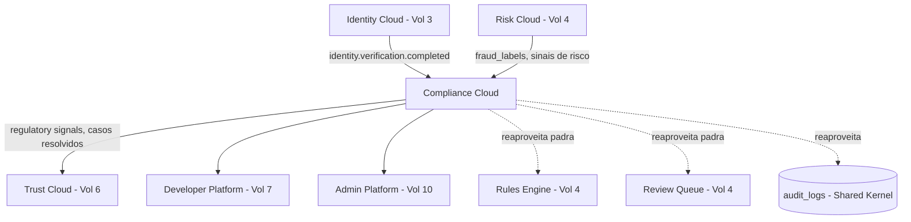
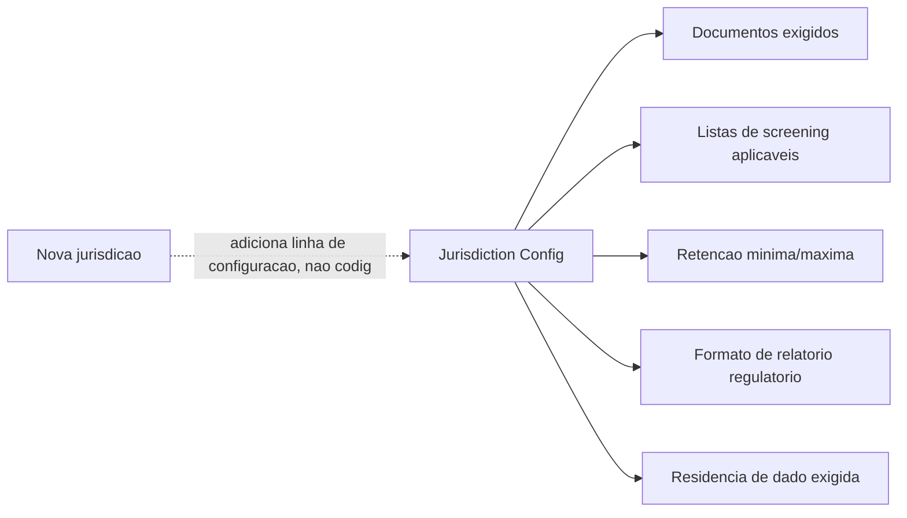
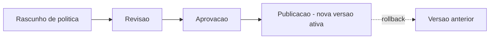
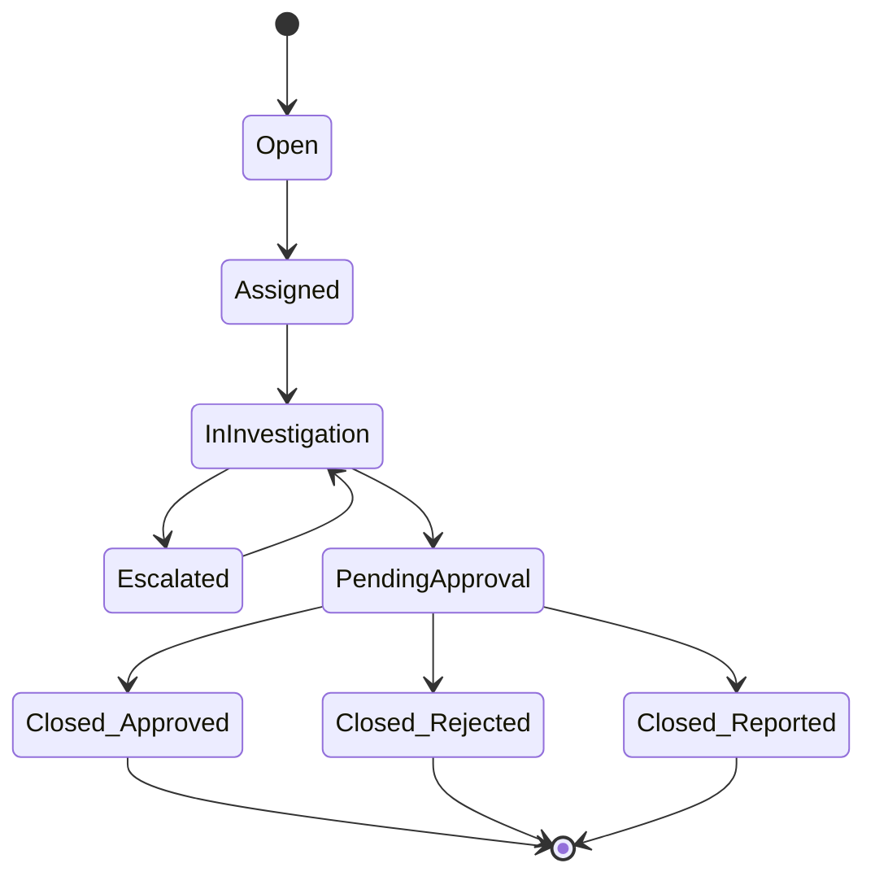
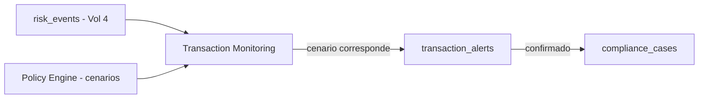
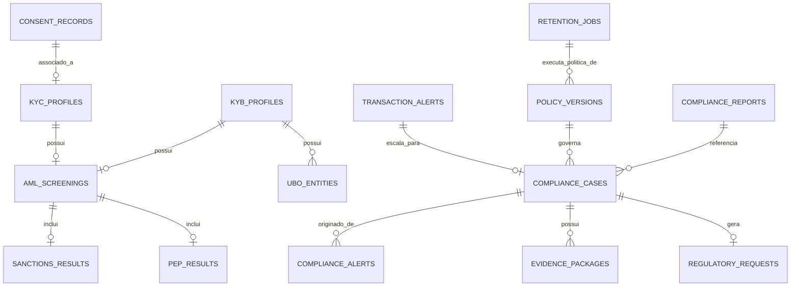

# GENUINUX MASTER PRODUCT SPECIFICATION (MPS)

## Volume 5 — Compliance Cloud

**Número do volume:** 5 de 12
**Título:** Compliance Cloud
**Status:** Draft v1.0
**Relação com os demais volumes:** O Compliance Cloud é o `Compliance Domain` do Volume 2 (Seção 6), até agora **não implementado** além de `fraud_labels` (que pertence ao Risk Domain, Volume 4, e serve ao feedback loop de ML — não a compliance regulatório). Este volume projeta o Compliance Cloud não como um módulo de AML isolado, mas como um **Compliance Operating System**: uma camada de configuração jurisdicional que se adapta a mercado e regulação via dados de política, não via ramificação de código. Consome `identity.verification.completed` (Volume 3) e sinais de risco/reputação (Volume 4); reaproveita arquiteturalmente os padrões de Rules Engine e Review Queue já validados em produção no Risk Cloud; e é o principal produtor de sinais que o Trust Cloud (Volume 6) consumirá para reputação de longo prazo.

---

## Índice

1. Objetivo do Volume
2. Escopo
3. Auditoria do Estado Atual — Matriz de Capacidades
4. Bounded Context — Fronteiras do Compliance Cloud
5. Jurisdições — Arquitetura de Abstração
6. Frameworks Regulatórios — Arquitetura de Suporte
7. Mapa de Módulos (25 módulos, status real)
8. Especificação dos 25 Módulos
9. Policy Engine — Especificação Profunda
10. Case Management — Especificação Profunda
11. Transaction Monitoring — Especificação Profunda
12. Watchlists — Taxonomia e Responsabilidades
13. Modelo de Dados Completo
14. APIs — Contratos Completos
15. Eventos de Domínio — Matriz Completa
16. Segurança — Threat Model de Compliance
17. Observabilidade
18. Casos de Uso
19. Regras de Negócio
20. Requisitos Funcionais
21. Requisitos Não Funcionais
22. Riscos
23. Dependências
24. Decisões Arquiteturais Tomadas (ADRs 025–034)
25. Roadmap (Fase 1–4)
26. Glossário
27. Technical Debt Register — Atualização
28. Revisão de Consistência com os Volumes 1, 2, 3 e 4
29. Resumo Executivo
30. Questões em Aberto
31. Próximos Volumes

---

## 1. Objetivo do Volume

Projetar um **Compliance Operating System** — não um módulo de AML isolado — capaz de atender diferentes mercados, regulamentações e modelos de negócio sem depender de um país específico, através de uma arquitetura modular onde jurisdição e framework regulatório são **configuração de dados**, não ramificação de código.

## 2. Escopo

**Dentro do escopo:** os 25 módulos listados na Seção 7; Policy Engine; Case Management; Transaction Monitoring; taxonomia completa de Watchlists; modelo de dados de 16 entidades; APIs versionadas; eventos de domínio; threat model específico de compliance; observabilidade; roadmap em 4 fases; atualização do Technical Debt Register.

**Fora do escopo:** implementação de código, alteração de arquitetura existente, criação de migrations; regras regulatórias específicas por país (ex. o texto exato de uma regra FATF) — apenas a arquitetura que as suporta; certificações formais de segurança (Volume 9, embora referenciadas aqui como gate de negócio); especificação de Identity/Risk/Trust em si (Volumes 3/4/6).

---

## 3. Auditoria do Estado Atual — Matriz de Capacidades

> Auditoria por inspeção direta do repositório (`grep` sobre `src/`, `api/`, `supabase/` para KYC/KYB/sanctions/PEP/adverse media/UBO/consent/retention/compliance case). Nenhuma capacidade de Compliance Cloud existe além do que está listado abaixo. Nenhum código foi alterado.

| Capability | Current Status | Evidence in Code | Target State | Gap | Priority |
|---|---|---|---|---|---|
| KYC | **Planned** | Inexistente | Módulo completo (Seção 8) | Total | P1 |
| KYB | **Planned** | Inexistente | Módulo completo | Total | P2 |
| AML Screening | **Planned** | Inexistente | Módulo completo | Total | P0 (gate para verticais reguladas do Vol. 1) |
| Sanctions Screening | **Planned** | Inexistente | Módulo completo | Total | P0 |
| PEP Screening | **Planned** | Inexistente | Módulo completo | Total | P1 |
| Adverse Media | **Planned** | Inexistente | Módulo completo | Total | P2 |
| UBO | **Planned** | Inexistente | Módulo completo | Total | P2 |
| Customer Due Diligence (CDD) | **Planned** | Inexistente | Módulo completo | Total | P1 |
| Enhanced Due Diligence (EDD) | **Planned** | Inexistente | Módulo completo | Total | P2 |
| Transaction Monitoring | **Planned** (mas Risk Cloud já fornece sinais reutilizáveis — Volume 4, Velocity Engine/Transaction Risk) | `risk_events`, `VELOCITY_*`, `METADATA_HIGH_VALUE` (Vol. 4) | Módulo dedicado consumindo esses sinais como insumo, não os duplicando | Camada de regras regulatórias sobre dado já existente | P1 |
| Ongoing Monitoring | **Planned** | Inexistente | Módulo completo | Total | P2 |
| Risk-based Monitoring | **Planned** | Inexistente | Módulo completo | Total | P2 |
| Policy Engine | **Planned** (mas o padrão do Rules Engine do Risk Cloud é diretamente reaproveitável — Volume 4, Seção 10) | `rules`, `applyCustomRules` (Vol. 4) | Policy Engine generalizado (Seção 9) | Generalização do padrão, não construção do zero | P1 |
| Compliance Rules | **Planned** | Inexistente (distinto de `rules` do Risk Cloud) | Sub-produto do Policy Engine | Total | P1 |
| Case Management | **Planned** (mas o padrão do Review Queue é diretamente reaproveitável — Volume 4, Módulo 7.24) | `review_queue`, `Queue.tsx` (Vol. 4) | Case Management generalizado (Seção 10) | Generalização do padrão, não construção do zero | P1 |
| Investigation Workspace | **Planned** | Inexistente | Módulo completo | Total | P2 |
| SAR Workflow | **Planned** | Inexistente | Módulo completo, com requisito legal de confidencialidade (Seção 16) | Total | P1 |
| Evidence Management | **Planned** | Inexistente (distinto do Risk Evidence Store gated do Vol. 4, TD-0040) | Módulo completo (Seção 8) | Total | P1 |
| Audit Trails | **Production** (Shared Kernel já existente) | `audit_logs`, usado platform-wide desde o Volume 2 | Extensão de `event_type` para eventos de compliance, sem nova tabela | Nenhum — reaproveitamento direto | — |
| Compliance Reports | **Planned** | Inexistente | Módulo completo | Total | P2 |
| Compliance APIs | **Planned** | Inexistente | `/v1/compliance/*` (Seção 14) | Total | P1 |
| Regulatory Integrations | **Planned** | Inexistente | Integrações assíncronas com fornecedores de dados (Seção 12) | Total, decisão de fornecedor pendente | P1 |
| Document Vault | **Planned** (mas o design-alvo de Object Storage do Identity Cloud, Vol. 3 ADR-010, é o padrão reaproveitável) | Inexistente em produção | Reaproveitar o mesmo padrão de Object Storage + hash de referência | Total | P1 |
| Consent Management | **Planned** (mas RN-C06 do Identity Cloud, Vol. 3, já antecipa o requisito) | Inexistente | Módulo completo, com o Identity Wallet (Vol. 3) como primeiro consumidor | Total | P2 |
| Retention Policies | **Foundation only** (padrão existe para `risk_events` via cron de manutenção, Vol. 2 Seção 11; não existe para dado de compliance) | `purge_old_risk_events()`, `aggregate_daily_stats()` (Vol. 2) | Compliance define a *política*; cada domínio executa a *purga* sobre seus próprios dados (Seção 13) | Mecanismo de definição de política central ausente | P1 |

**Componentes do Risk Cloud diretamente reutilizáveis (arquiteturalmente, não como dado compartilhado):**

| Padrão do Risk Cloud | Reaproveitado por | Como |
|---|---|---|
| Rules Engine (`condition_group`, cache Redis por org, RLS) | Policy Engine (Seção 9) | Mesmo padrão de condição/ação, generalizado para política regulatória |
| Review Queue (máquina de estados, `audit_logs`, realtime) | Case Management (Seção 10) | Mesmo padrão de fila de trabalho, generalizado para casos de investigação |
| `audit_logs` (Shared Kernel) | Audit Trails | Reaproveitamento direto, sem nova tabela |
| Padrão de integração assíncrona (RN-A04, Vol. 2) | Sanctions/PEP/Adverse Media/AML Screening | Mesmo padrão do IP Intelligence do Risk Cloud (Vol. 4, Seção 7.8) — chamada a fornecedor externo nunca no hot path |
| Object Storage + hash de referência (ADR-010, Vol. 3) | Document Vault | Mesmo padrão de armazenamento de documento sensível |

---

## 4. Bounded Context — Fronteiras do Compliance Cloud

| Fronteira com | O que o Compliance Cloud **possui** | O que apenas **consome** |
|---|---|---|
| **Identity Cloud** (Vol. 3) | Nada | Consome `identity.verification.completed` como insumo de CDD/KYC — nunca reexecuta verificação de identidade |
| **Risk Cloud** (Vol. 4) | Nada | Consome `fraud_labels` (leitura), sinais de velocity/transaction risk como insumo de Transaction Monitoring — nunca escreve em `risk_events` |
| **Trust Cloud** (Vol. 6, a especificar) | `regulatory_requests`, `consent_records` (ownership do Compliance Domain) | Trust Cloud consumirá o resultado de screenings/casos como insumo de Trust Score — Compliance não consome nada do Trust Cloud de volta |
| **Developer Platform** (Vol. 7) | Nada | Consome API Keys, organizações — nunca escreve |
| **Admin Platform** (Vol. 10) | Nada | Lê casos/relatórios agregados para saúde operacional — nunca escreve |
| **Shared Kernel — Unified Entity Graph** (Vol. 2, Seção 7) | Contribui `kyc_profiles`/`kyb_profiles`/`ubo_entities` como novas camadas de entidade agregada | Consome a camada de eventos já existente (Identity, Risk) |
| **Shared Kernel — Event Bus** (Vol. 2, Seção 8) | Publica os eventos da Seção 15 | — |
| **Shared Kernel — Audit Trails** | **Reaproveita `audit_logs` diretamente — não cria `audit_records` separado** (ver ADR-025, Seção 24) | — |

**Regra de fronteira (herdada de RN-A01, Volume 2):** nenhum outro domínio escreve diretamente em `compliance_cases`, `aml_screenings`, `sanctions_results`, `pep_results`, `ubo_entities`, `kyc_profiles`, `kyb_profiles`, `policy_versions`, `evidence_packages`, `consent_records`. Toda leitura cross-domínio passa por eventos (Seção 15) ou por leitura explícita via RLS — nunca escrita direta.

---

## 5. Jurisdições — Arquitetura de Abstração

**Princípio central:** uma jurisdição é uma **linha de configuração**, não um caminho de código. Adicionar uma jurisdição nova nunca deve exigir alteração de arquitetura — apenas o preenchimento de uma nova configuração de política (Seção 9).

| Jurisdição | Regulador(es) primário(s) | Particularidade arquitetural relevante |
|---|---|---|
| **União Europeia** | AMLA (a partir de 2025), autoridades nacionais | Múltiplos países sob um framework comum (EU AML Package) — política pode ser definida uma vez e herdada por país-membro |
| **Reino Unido** | HM Treasury (HMT), FCA | Lista de sanções própria (pós-Brexit), distinta da UE |
| **Estados Unidos** | FinCEN, OFAC | Sanções (OFAC) e reporting (FinCEN, ex. SARs) são sistemas regulatórios separados dentro do mesmo país — a arquitetura deve permitir dois "sub-perfis" regulatórios por jurisdição |
| **Brasil** | COAF, BACEN | LGPD já é tratado transversalmente na plataforma (Volume 1); AML é adição nova |
| **Canadá** | FINTRAC | Regime de reporting próprio |
| **Austrália** | AUSTRAC | Regime de reporting próprio |

**Modelo de extensão (arquitetura-alvo, Seção 9):**

Uma nova jurisdição (ex. México, Singapura) é adicionada preenchendo os cinco campos acima em `policy_versions` (Seção 13) — nunca exige deploy de novo código. Isso cumpre diretamente o requisito do usuário: "definir como novas jurisdições poderão ser adicionadas sem alterar arquitetura."

---

## 6. Frameworks Regulatórios — Arquitetura de Suporte

**Nenhuma regra específica é implementada neste volume** — apenas a arquitetura que permite que cada framework seja *representado* como configuração.

| Framework | Natureza | Como a arquitetura o representa |
|---|---|---|
| **FATF** | Padrão internacional (não uma lei em si) | Template de política de referência ("recomendações FATF") que jurisdições podem herdar como ponto de partida, não uma implementação obrigatória |
| **EU AML Package** | Framework regional (UE) | Um `jurisdiction_group` cobrindo múltiplos países-membro com política base compartilhada |
| **FinCEN** | Regulador de reporting (EUA) | Formato de relatório regulatório (SAR) associado à jurisdição EUA |
| **OFAC** | Lista de sanções (EUA) | Fonte de dados de Sanctions Screening (Seção 12) — fornecedor de watchlist, não lógica própria |
| **HMT** | Lista de sanções (Reino Unido) | Mesma natureza de OFAC, fonte de dados distinta |
| **UN Sanctions** | Lista de sanções global | Fonte de dados de Sanctions Screening, aplicável a todas as jurisdições por padrão |
| **GDPR** | Privacidade (UE) | Política de retenção/consentimento associada à jurisdição UE — em tensão direta com retenção obrigatória de AML (ver Seção 16, risco crítico) |
| **LGPD** | Privacidade (Brasil) | Mesma natureza do GDPR, já parcialmente tratada de forma transversal desde o Volume 1 |
| **SOC 2 / ISO 27001 / PCI DSS** | Certificações de segurança, não regulação de compliance de cliente | Gate de negócio para o ICP Enterprise (Volume 1, Seção 19) — fora do escopo técnico deste volume, mas referenciado como pré-condição comercial |

**Decisão de arquitetura central desta seção:** o Policy Engine (Seção 9) nunca codifica "a regra 10 do FATF" ou "o artigo X do GDPR" como lógica de programa — ele expõe um schema uniforme de política (documentos exigidos, tiers de risco, frequência de monitoramento, retenção) cujos **valores** variam por jurisdição/framework, mas cujo **schema** é único. Isso é o que torna a Genuinux um "Compliance Operating System" e não "um produto de AML americano com alguns campos configuráveis".

---

## 7. Mapa de Módulos (25 módulos, status real)

| # | Módulo | Status |
|---|---|---|
| 1 | KYC | Planned |
| 2 | KYB | Planned |
| 3 | AML Screening | Planned |
| 4 | Sanctions Screening | Planned |
| 5 | PEP Screening | Planned |
| 6 | Adverse Media | Planned |
| 7 | UBO | Planned |
| 8 | Customer Due Diligence (CDD) | Planned |
| 9 | Enhanced Due Diligence (EDD) | Planned |
| 10 | Transaction Monitoring | Planned (sinais reutilizáveis do Risk Cloud) |
| 11 | Ongoing Monitoring | Planned |
| 12 | Risk-based Monitoring | Planned |
| 13 | Policy Engine | Planned (padrão reutilizável) |
| 14 | Compliance Rules | Planned |
| 15 | Case Management | Planned (padrão reutilizável) |
| 16 | Investigation Workspace | Planned |
| 17 | SAR Workflow | Planned |
| 18 | Evidence Management | Planned |
| 19 | Audit Trails | **Production** (Shared Kernel) |
| 20 | Compliance Reports | Planned |
| 21 | Compliance APIs | Planned |
| 22 | Regulatory Integrations | Planned |
| 23 | Document Vault | Planned (padrão reutilizável) |
| 24 | Consent Management | Planned |
| 25 | Retention Policies | Foundation only |

---

## 8. Especificação dos 25 Módulos

> Formato: Objetivo · Responsabilidades · Limites · Entradas · Saídas · APIs · Modelo de dados · Eventos · Segurança · Escalabilidade · Observabilidade · Roadmap · Estado atual.

### 8.1 KYC (Know Your Customer)

| Campo | Especificação |
|---|---|
| Objetivo | Verificar a identidade de uma pessoa física para fins de conformidade regulatória (distinto da verificação de identidade em si, que é do Identity Cloud) |
| Responsabilidades | Consolidar `identity.verification.completed` (Vol. 3) + resultado de screenings (Seção 8.3–8.6) em um perfil de conformidade único |
| Limites | Não executa verificação de documento/biometria — apenas consome o resultado do Identity Cloud |
| Entradas | `identity.verification.completed`, política jurisdicional aplicável |
| Saídas | `kyc_profiles` com status de conformidade |
| APIs | `POST /v1/compliance/check` (Seção 14) |
| Modelo de dados | `kyc_profiles` (Seção 13) |
| Eventos | Consome `identity.verification.completed`; publica evento interno de conclusão de KYC |
| Segurança | PII de identidade já protegida pelo Volume 3 (Seção 27) — este módulo adiciona apenas o veredito de conformidade, não novo dado sensível |
| Escalabilidade | Assíncrono, herda o padrão do Identity Cloud (Vol. 3, Seção 4) |
| Observabilidade | Taxa de conclusão de KYC por jurisdição |
| Roadmap | Fase 2 |
| Estado atual | **Planned** |

### 8.2 KYB (Know Your Business)

| Campo | Especificação |
|---|---|
| Objetivo | Verificar a identidade e legitimidade de uma pessoa jurídica |
| Responsabilidades | Coletar/validar dados de registro empresarial, consolidar com UBO (8.7) |
| Limites | Depende de fontes de dados de registro empresarial por jurisdição — não construído do zero, análogo à decisão build-vs-buy do Volume 3 (ADR-008) |
| Entradas | Dados de registro empresarial, documentos societários |
| Saídas | `kyb_profiles` |
| APIs | `POST /v1/compliance/check` (tipo `business`) |
| Modelo de dados | `kyb_profiles` |
| Eventos | Publica evento interno de conclusão de KYB |
| Segurança | Dados societários são PII de representantes legais — mesma categoria de tratamento do Volume 3 |
| Escalabilidade | Assíncrono |
| Observabilidade | Taxa de conclusão por jurisdição |
| Roadmap | Fase 3 (menor prioridade que KYC — ICP primário do Volume 1 é majoritariamente B2C/B2B2C) |
| Estado atual | **Planned** |

### 8.3 AML Screening

| Campo | Especificação |
|---|---|
| Objetivo | Avaliar risco de lavagem de dinheiro associado a uma pessoa/entidade, agregando os resultados de Sanctions/PEP/Adverse Media |
| Responsabilidades | Orquestrar os três screenings (8.4–8.6), consolidar em um veredito único |
| Limites | Não é uma quarta fonte de dado — é a camada de orquestração sobre as três outras |
| Entradas | Identidade verificada (KYC/KYB), política jurisdicional |
| Saídas | `aml_screenings` |
| APIs | `POST /v1/compliance/screening` |
| Modelo de dados | `aml_screenings` |
| Eventos | `aml.screening.completed` |
| Segurança | Resultado de screening é dado altamente sensível — acesso restrito por RBAC (Seção 16) |
| Escalabilidade | Assíncrono, fora do hot path do Risk Cloud (RN-A04, Vol. 2) |
| Observabilidade | Latência de screening, taxa de hit (Seção 17) |
| Roadmap | Fase 1 (integração de fornecedor) |
| Estado atual | **Planned** |

### 8.4 Sanctions Screening

| Campo | Especificação |
|---|---|
| Objetivo | Verificar se uma pessoa/entidade consta em listas de sanções internacionais (OFAC, HMT, UN) |
| Responsabilidades | Consultar fornecedor de dados de sanções, normalizar resultado |
| Limites | **Distinto do Identity Watchlist do Volume 3** (Seção 12 — ver taxonomia completa) — este módulo responde "esta pessoa está legalmente sancionada", não "este documento é genuíno" |
| Entradas | Nome, documento, nacionalidade |
| Saídas | `sanctions_results` |
| APIs | Interno ao AML Screening (8.3) |
| Modelo de dados | `sanctions_results` |
| Eventos | `sanctions.hit.detected` |
| Segurança | Falso negativo aqui tem consequência legal direta (violação de sanção) — fornecedor deve ter SLA de atualização de lista documentado |
| Escalabilidade | Cache de resultado com TTL curto (listas de sanções mudam) — diferente do TTL longo de IP Intelligence (Vol. 4) |
| Observabilidade | Taxa de hit, latência de fornecedor |
| Roadmap | Fase 1 |
| Estado atual | **Planned** |

### 8.5 PEP Screening

| Campo | Especificação |
|---|---|
| Objetivo | Identificar Pessoas Expostas Politicamente |
| Responsabilidades | Consultar fornecedor de dados de PEP |
| Limites | PEP não é, por si só, motivo de bloqueio — é um gatilho para Enhanced Due Diligence (8.9) |
| Entradas | Nome, nacionalidade, cargo declarado |
| Saídas | `pep_results` |
| APIs | Interno ao AML Screening |
| Modelo de dados | `pep_results` |
| Eventos | `pep.hit.detected` |
| Segurança | Mesma categoria de sensibilidade de Sanctions |
| Escalabilidade | Mesmo padrão de cache com TTL curto |
| Observabilidade | Taxa de hit |
| Roadmap | Fase 1 |
| Estado atual | **Planned** |

### 8.6 Adverse Media

| Campo | Especificação |
|---|---|
| Objetivo | Identificar menções negativas de mídia associadas a uma pessoa/entidade (crime financeiro, corrupção, terrorismo) |
| Responsabilidades | Consultar fornecedor de dados de mídia adversa, aplicar filtro de relevância (evitar falsos positivos por homônimos) |
| Limites | Resultado é probabilístico e requer revisão humana com mais frequência que Sanctions/PEP (maior taxa de falso positivo esperada) |
| Entradas | Nome, contexto |
| Saídas | Registro dentro de `aml_screenings` |
| APIs | Interno ao AML Screening |
| Modelo de dados | Parte de `aml_screenings` (não uma tabela própria — volume de dado não justifica, ver Seção 13.3) |
| Eventos | Parte de `aml.screening.completed` |
| Segurança | Mesma categoria de sensibilidade |
| Escalabilidade | Maior latência esperada que Sanctions/PEP (busca textual, não lookup exato) |
| Observabilidade | Taxa de falso positivo (crítica para este módulo especificamente) |
| Roadmap | Fase 2 (menor prioridade que Sanctions/PEP — maior custo de fornecedor, maior ruído) |
| Estado atual | **Planned** |

### 8.7 UBO (Ultimate Beneficial Owner)

| Campo | Especificação |
|---|---|
| Objetivo | Identificar a(s) pessoa(s) física(s) que efetivamente controla(m) uma entidade jurídica |
| Responsabilidades | Resolver cadeia de propriedade societária até a(s) pessoa(s) física(s) final(is) |
| Limites | Depende de dados de registro empresarial (mesma dependência de KYB, 8.2) — profundidade de resolução varia por jurisdição |
| Entradas | Estrutura societária declarada |
| Saídas | `ubo_entities` |
| APIs | Parte do fluxo de KYB |
| Modelo de dados | `ubo_entities` |
| Eventos | Publica evento interno quando UBO é resolvido |
| Segurança | UBOs são PII de pessoas físicas — mesmo tratamento do Volume 3 |
| Escalabilidade | Pode exigir múltiplas consultas recursivas (cadeia de propriedade) — candidato a processamento assíncrono de maior latência |
| Observabilidade | Profundidade média de resolução, taxa de UBO não resolvido |
| Roadmap | Fase 3 (junto com KYB) |
| Estado atual | **Planned** |

### 8.8 Customer Due Diligence (CDD)

| Campo | Especificação |
|---|---|
| Objetivo | Nível padrão de verificação e avaliação de risco aplicado a todo cliente |
| Responsabilidades | Consolidar KYC/KYB + AML Screening + classificação de risco inicial |
| Limites | Nível "padrão" — não aprofunda como EDD (8.9) |
| Entradas | Resultado de KYC/KYB, AML Screening |
| Saídas | Classificação de risco do cliente, associada ao perfil |
| APIs | `POST /v1/compliance/check` |
| Modelo de dados | Parte de `kyc_profiles`/`kyb_profiles` |
| Eventos | Parte do fluxo de conclusão de KYC/KYB |
| Segurança | N/A adicional |
| Escalabilidade | N/A adicional |
| Observabilidade | Distribuição de classificação de risco de clientes |
| Roadmap | Fase 2 |
| Estado atual | **Planned** |

### 8.9 Enhanced Due Diligence (EDD)

| Campo | Especificação |
|---|---|
| Objetivo | Nível aprofundado de verificação para clientes de alto risco (PEP, adverse media hit, jurisdição de alto risco) |
| Responsabilidades | Coleta de documentação adicional, revisão manual obrigatória, aprovação por segundo nível |
| Limites | Ativado apenas por gatilho de risco — não é padrão para todo cliente |
| Entradas | Resultado de CDD + gatilho (PEP/adverse media/jurisdição de risco) |
| Saídas | Caso de investigação (Seção 10) |
| APIs | Cria um `compliance_case` automaticamente |
| Modelo de dados | `compliance_cases` |
| Eventos | `compliance.case.created` |
| Segurança | Requer trilha de aprovação de segundo nível — RBAC mais restrito que CDD |
| Escalabilidade | Fluxo humano, não uma otimização de latência |
| Observabilidade | Tempo médio de conclusão de EDD |
| Roadmap | Fase 2 |
| Estado atual | **Planned** |

### 8.10 Transaction Monitoring

Ver especificação profunda na Seção 11. Estado atual: **Planned** — mas os sinais de Velocity Engine e Transaction Risk do Risk Cloud (Volume 4, Módulos 7.5 e 7.17) são diretamente reutilizáveis como insumo, evitando duplicação de lógica de detecção.

### 8.11 Ongoing Monitoring

| Campo | Especificação |
|---|---|
| Objetivo | Reavaliar periodicamente o perfil de risco de um cliente já aprovado, não apenas no onboarding |
| Responsabilidades | Re-executar screenings (Sanctions/PEP/Adverse Media) em intervalos definidos pela política jurisdicional; reagir a mudanças (ex. cliente se torna PEP após aprovação) |
| Limites | Distinto de Transaction Monitoring (8.10) — este módulo reavalia a **pessoa**, não a **transação** |
| Entradas | `kyc_profiles`/`kyb_profiles` existentes, política de frequência |
| Saídas | Novo registro em `aml_screenings`/`sanctions_results`/`pep_results` se houver mudança |
| APIs | Processamento agendado, sem endpoint de API dedicado |
| Modelo de dados | Mesmas tabelas de screening, novo registro por reavaliação |
| Eventos | Reemite `sanctions.hit.detected`/`pep.hit.detected` se aplicável |
| Segurança | N/A adicional |
| Escalabilidade | Processamento em lote, fora do hot path — candidato a job agendado análogo ao cron de manutenção do Volume 2 |
| Observabilidade | Taxa de mudança de status detectada por reavaliação |
| Roadmap | Fase 3 |
| Estado atual | **Planned** |

### 8.12 Risk-based Monitoring

| Campo | Especificação |
|---|---|
| Objetivo | Ajustar a frequência/profundidade do Ongoing Monitoring (8.11) conforme o nível de risco do cliente |
| Responsabilidades | Clientes de alto risco são reavaliados com mais frequência que clientes de baixo risco |
| Limites | Camada de parametrização sobre o Ongoing Monitoring, não um módulo de dado próprio |
| Entradas | Classificação de risco (CDD/EDD) |
| Saídas | Frequência de reavaliação aplicada |
| APIs | Configurado via Policy Engine (Seção 9) |
| Modelo de dados | Parte de `policy_versions` |
| Eventos | N/A |
| Segurança | N/A |
| Escalabilidade | N/A |
| Observabilidade | Distribuição de frequência de reavaliação por tier de risco |
| Roadmap | Fase 3 |
| Estado atual | **Planned** |

### 8.13 Policy Engine

Ver especificação profunda na Seção 9. Estado atual: **Planned**, com o padrão do Rules Engine (Volume 4) diretamente reaproveitável.

### 8.14 Compliance Rules

| Campo | Especificação |
|---|---|
| Objetivo | Regras específicas de compliance (distintas das regras de risco transacional do Volume 4) — ex. "todo cliente da jurisdição X exige EDD se o valor da conta exceder Y" |
| Responsabilidades | Avaliar condições regulatórias e disparar ações (exigir documento adicional, criar caso, bloquear onboarding) |
| Limites | Não avalia risco de fraude transacional (isso é Risk Cloud) — avalia conformidade regulatória |
| Entradas | Perfil de cliente, jurisdição, resultado de screening |
| Saídas | Ação de compliance (gatilho de EDD, exigência de documento, etc.) |
| APIs | Parte do Policy Engine |
| Modelo de dados | Parte de `policy_versions` |
| Eventos | `policy.updated` quando uma regra muda |
| Segurança | Mesma disciplina de aprovação/versionamento do Policy Engine |
| Escalabilidade | Mesmo padrão de cache do Rules Engine (Vol. 4) |
| Observabilidade | Taxa de disparo de regra de compliance |
| Roadmap | Fase 2 |
| Estado atual | **Planned** |

### 8.15 Case Management

Ver especificação profunda na Seção 10. Estado atual: **Planned**, com o padrão do Review Queue (Volume 4) diretamente reaproveitável.

### 8.16 Investigation Workspace

| Campo | Especificação |
|---|---|
| Objetivo | Ambiente de trabalho para o analista investigar um caso em profundidade |
| Responsabilidades | Consolidar timeline, evidências, anexos, comentários, resultado de screenings em uma única superfície |
| Limites | É a interface/experiência sobre `compliance_cases` — não introduz dado novo além do que Case Management (Seção 10) já modela |
| Entradas | `compliance_cases`, `evidence_packages` |
| Saídas | Decisão de investigação (fechamento, escalonamento, SAR) |
| APIs | `GET /v1/compliance/cases/{id}` |
| Modelo de dados | Nenhuma tabela própria — projeção sobre `compliance_cases` |
| Eventos | Consome eventos de caso, não publica novos |
| Segurança | Acesso restrito por atribuição de caso (anti-tipping-off, Seção 16) |
| Escalabilidade | Interface, não hot path |
| Observabilidade | Tempo médio de investigação |
| Roadmap | Fase 2 |
| Estado atual | **Planned** |

### 8.17 SAR Workflow

| Campo | Especificação |
|---|---|
| Objetivo | Fluxo de submissão de Suspicious Activity Report (ou equivalente por jurisdição — ex. COAF no Brasil) à autoridade regulatória |
| Responsabilidades | Consolidar evidência do caso, gerar relatório no formato exigido pela jurisdição, registrar submissão |
| Limites | **Requisito legal de confidencialidade (anti-tipping-off)** — o próprio sujeito da SAR nunca pode ser notificado, nem indiretamente, de que uma SAR foi arquivada (Seção 16) |
| Entradas | `compliance_cases` fechado com decisão "reportar" |
| Saídas | `regulatory_requests` |
| APIs | `POST /v1/compliance/reports` (tipo SAR) |
| Modelo de dados | `regulatory_requests` |
| Eventos | Evento interno de submissão — **nunca visível ao cliente final da organização nem exposto via webhook padrão** (distinção de segurança deliberada) |
| Segurança | Acesso restrito a papéis específicos de compliance officer; trilha de auditoria obrigatória e imutável (reaproveitando `audit_logs`) |
| Escalabilidade | Volume baixo, sem requisito de latência |
| Observabilidade | Tempo até submissão, taxa de SAR por volume de casos |
| Roadmap | Fase 2/3 (depende de formato por jurisdição) |
| Estado atual | **Planned** |

### 8.18 Evidence Management

| Campo | Especificação |
|---|---|
| Objetivo | Armazenar e organizar evidências (documentos, capturas de tela, exportações de dados, resultados de screening) associadas a um caso |
| Responsabilidades | Versionamento de evidência, cadeia de custódia, hash de integridade |
| Limites | **Distinto do Risk Evidence Store gated do Volume 4 (TD-0040)** — aqui a necessidade é real e imediata (obrigação legal de reter evidência de investigação), não condicional |
| Entradas | Anexos de caso, resultados de screening |
| Saídas | `evidence_packages` |
| APIs | Parte do Case Management |
| Modelo de dados | `evidence_packages` |
| Eventos | `evidence.attached` |
| Segurança | Hash de integridade (evita adulteração), Object Storage criptografado (mesmo padrão do Volume 3) |
| Escalabilidade | Cresce com o volume de casos, não com o volume de eventos transacionais — ordem de magnitude menor que `risk_events` |
| Observabilidade | Volume de evidência por caso |
| Roadmap | Fase 2 |
| Estado atual | **Planned** |

### 8.19 Audit Trails

| Campo | Especificação |
|---|---|
| Objetivo | Trilha de auditoria de toda ação de compliance |
| Responsabilidades | Registrar quem fez o quê, quando, em qual caso/perfil |
| Limites | **Reaproveita `audit_logs` diretamente — não cria uma tabela nova `audit_records`** (ADR-025, Seção 24) |
| Entradas | Toda ação administrativa/de investigação |
| Saídas | Registro imutável |
| APIs | Consultado via Admin Platform (Vol. 10) |
| Modelo de dados | `audit_logs` (existente, estendido com novos `event_type`) |
| Eventos | N/A (é o destino de eventos, não uma fonte) |
| Segurança | Ver débito TD-0028 (imutabilidade de `audit_logs` não confirmada — Volume 9) |
| Escalabilidade | Já resolvido pela arquitetura existente |
| Observabilidade | N/A adicional |
| Roadmap | Nenhum — já disponível |
| Estado atual | **Production** |

### 8.20 Compliance Reports

| Campo | Especificação |
|---|---|
| Objetivo | Gerar relatórios de conformidade para clientes (auditoria interna) e para reguladores (SAR e equivalentes) |
| Responsabilidades | Renderizar o mesmo dado canônico (`compliance_cases`, `aml_screenings`) em formatos distintos por audiência/jurisdição |
| Limites | **Formato de relatório é uma preocupação de renderização, não de modelo de dado** (ADR-034, Seção 24) — evita N schemas para N jurisdições |
| Entradas | `compliance_cases`, `aml_screenings`, `policy_versions` |
| Saídas | `compliance_reports` |
| APIs | `GET /v1/compliance/reports` |
| Modelo de dados | `compliance_reports` |
| Eventos | `report.generated` |
| Segurança | Acesso restrito por papel (relatório regulatório ≠ relatório de auditoria interna do cliente) |
| Escalabilidade | Geração sob demanda ou agendada, fora do hot path |
| Observabilidade | Tempo de geração de relatório |
| Roadmap | Fase 3 |
| Estado atual | **Planned** |

### 8.21 Compliance APIs

Ver especificação profunda na Seção 14. Estado atual: **Planned**.

### 8.22 Regulatory Integrations

| Campo | Especificação |
|---|---|
| Objetivo | Integrações assíncronas com fornecedores de dados regulatórios (sanções, PEP, adverse media, registro empresarial) |
| Responsabilidades | Normalizar resposta de cada fornecedor para o schema interno (`sanctions_results`, `pep_results`) |
| Limites | Nunca síncrono no hot path — mesma regra do Volume 2 (RN-A04) e do Volume 4 (IP Intelligence) |
| Entradas | Consulta de screening |
| Saídas | Resultado normalizado |
| APIs | Interno |
| Modelo de dados | Alimenta `sanctions_results`/`pep_results`/`aml_screenings` |
| Eventos | N/A direto — dispara os eventos dos módulos consumidores |
| Segurança | Contrato de fornecedor deve garantir SLA de atualização de lista (Seção 8.4) |
| Escalabilidade | Cache com TTL curto para dados de sanções (mudam com frequência, ao contrário de IP intelligence) |
| Observabilidade | Latência e disponibilidade por fornecedor |
| Roadmap | Fase 1 — primeira prioridade do Compliance Cloud, análogo à priorização de IP Intelligence no Risk Cloud (Vol. 4, ADR-014) |
| Estado atual | **Planned** — decisão de fornecedor pendente (mesma classe de questão em aberto do Volume 1, Q2) |

### 8.23 Document Vault

| Campo | Especificação |
|---|---|
| Objetivo | Armazenamento seguro de documentos de compliance (contratos, comprovantes, documentação societária) |
| Responsabilidades | Reaproveitar o padrão de Object Storage + hash de referência já desenhado no Volume 3 (ADR-010) |
| Limites | Não duplica o Object Storage do Identity Cloud — é a mesma infraestrutura, com um namespace/domínio diferente |
| Entradas | Upload de documento |
| Saídas | Referência criptografada |
| APIs | Parte do Case Management/KYB |
| Modelo de dados | Referências em `evidence_packages`/`kyb_profiles` |
| Eventos | N/A direto |
| Segurança | Mesmo padrão de criptografia em repouso do Volume 3 |
| Escalabilidade | Mesma arquitetura de Object Storage do Identity Cloud |
| Observabilidade | Volume de documentos armazenados |
| Roadmap | Fase 2 |
| Estado atual | **Planned** |

### 8.24 Consent Management

| Campo | Especificação |
|---|---|
| Objetivo | Registrar e gerenciar consentimento de titular de dado para processamento (GDPR/LGPD) e para reuso de identidade (Identity Wallet, Vol. 3) |
| Responsabilidades | Capturar, versionar e permitir revogação de consentimento |
| Limites | É o mecanismo geral de consentimento da plataforma — o Identity Wallet (Volume 3, RN-C06) é o primeiro **consumidor** deste módulo, não o dono dele |
| Entradas | Ação de consentimento do titular |
| Saídas | `consent_records` |
| APIs | Parte da Developer Platform / Compliance APIs |
| Modelo de dados | `consent_records` |
| Eventos | `consent.granted`, `consent.revoked` |
| Segurança | Consentimento revogado deve ser propagado a todo domínio consumidor — mecanismo de propagação a definir (Questão em Aberto, Seção 30) |
| Escalabilidade | Volume moderado, não transacional |
| Observabilidade | Taxa de revogação |
| Roadmap | Fase 2 |
| Estado atual | **Planned** |

### 8.25 Retention Policies

| Campo | Especificação |
|---|---|
| Objetivo | Definir, por jurisdição e tipo de dado, o período mínimo e máximo de retenção |
| Responsabilidades | Compliance Cloud **define a política**; cada domínio (Risk, Identity) **executa a purga** sobre seus próprios dados, consumindo a política via leitura, nunca via escrita direta entre domínios (RN-A01, Vol. 2) |
| Limites | Não executa purga diretamente em tabelas de outro domínio — apenas publica a política |
| Entradas | Configuração de jurisdição (Seção 5) |
| Saídas | `retention_jobs` (registro de execução, não a execução em si) |
| APIs | Parte do Policy Engine |
| Modelo de dados | `retention_jobs` |
| Eventos | `retention.purge.requested` (consumido por cada domínio) |
| Segurança | **Tensão legal não resolvida com GDPR "direito ao esquecimento"** (Seção 16, risco crítico) |
| Escalabilidade | Reaproveita o padrão de cron de manutenção já existente (Volume 2, Seção 11) |
| Observabilidade | Execução de purga por domínio, taxa de conformidade |
| Roadmap | Fase 2 (política); execução por domínio segue o roadmap de cada domínio |
| Estado atual | **Foundation only** |

---

## 9. Policy Engine — Especificação Profunda

**Reaproveitamento arquitetural explícito:** o Policy Engine generaliza o padrão já validado em produção do Rules Engine (Volume 4, Seção 10) — condições estruturadas, cache por organização, avaliação determinística — para o domínio de política regulatória.

**Configurável por organização:**

| Dimensão | Exemplo |
|---|---|
| Jurisdição | UE, Reino Unido, EUA, Brasil, Canadá, Austrália (Seção 5) |
| Nível de risco | Baixo/médio/alto/crítico, com thresholds próprios |
| Documentos exigidos | Por jurisdição e por tier de risco |
| Regras de aprovação | Quem pode aprovar CDD vs. EDD |
| Níveis de revisão | Single-review vs. dual-control (segunda aprovação obrigatória) |
| Retenção | Mínimo/máximo por tipo de dado e jurisdição (Seção 8.25) |
| Regras de monitoramento | Frequência de Ongoing/Risk-based Monitoring (8.11/8.12) |
| Workflow | Sequência de etapas de um caso (Seção 10) |

**Versionamento, aprovação e rollback (requisito explícito do usuário, ainda não resolvido nem no Rules Engine do Risk Cloud — TD-0021):**

Diferente do Rules Engine do Risk Cloud (que hoje sobrescreve sem versionar, TD-0021), o Policy Engine é desenhado **desde o início** com versionamento formal (`policy_versions`, Seção 13) — porque uma política regulatória sem trilha de versão auditável é, em muitas jurisdições, uma falha de conformidade em si mesma, não apenas uma limitação de produto.

---

## 10. Case Management — Especificação Profunda

**Reaproveitamento arquitetural explícito:** generaliza o padrão do Review Queue (Volume 4, Módulo 7.24) — que já resolve máquina de estados, atribuição, auditoria e realtime em produção — para investigações de compliance, que exigem mais profundidade (timeline, evidências, escalonamento, SLA).

| Elemento requerido | Especificação |
|---|---|
| **Casos** | `compliance_cases` — unidade central de investigação |
| **Investigação** | Ver Investigation Workspace (Seção 8.16) |
| **Timeline** | Agregação cronológica de todos os eventos/ações do caso |
| **Comentários** | Anotações do analista, parte de `compliance_cases` (JSONB ou tabela filha, decisão de detalhe fora do escopo arquitetural deste volume) |
| **Anexos/Evidências** | `evidence_packages` (Seção 8.18) |
| **Assinaturas** | Aprovação formal de fechamento de caso — requer identidade do aprovador, timestamp, e hash do estado do caso no momento da assinatura |
| **Escalonamento** | Caso pode subir de analista → compliance officer → MLRO (persona Marina, Volume 1) |
| **SLA** | Prazo por tier de caso (CDD padrão vs. EDD vs. SAR) — herda o conceito de SLA já usado na persona Marina (Volume 1, Seção 8) |
| **Work queues** | Filas por tipo de caso/jurisdição/prioridade — generalização direta do `review_queue` |
| **Assignment** | Atribuição de caso a analista específico — mesmo padrão de `assigned_to` do Review Queue |
| **Approval** | Fluxo de aprovação com dual-control opcional (Policy Engine, Seção 9) |
| **Closure** | Estado terminal com decisão registrada (aprovado/rejeitado/reportado via SAR) |
| **Auditabilidade completa** | Toda transição de estado grava em `audit_logs` — mesmo padrão já provado do Review Queue |

---

## 11. Transaction Monitoring — Especificação Profunda

**Princípio de não-duplicação:** o Transaction Monitoring do Compliance Cloud **não recria** o Velocity Engine ou o Transaction Risk do Risk Cloud (Volume 4, Módulos 7.5/7.17) — ele **consome** os mesmos sinais e aplica uma camada adicional de regras regulatórias (cenários) sobre eles.

| Elemento | Especificação |
|---|---|
| Monitoramento contínuo | Reaproveita `risk_events` como fonte de eventos transacionais — não cria uma segunda fonte de verdade |
| Alertas | `transaction_alerts` — gerado quando um cenário de compliance corresponde, distinto de `review_queue` (que é risco transacional, não regulatório) |
| Thresholds | Configuráveis via Policy Engine, por jurisdição (ex. "toda transação > $10.000 USD gera alerta" — limiar clássico de reporting nos EUA, sem codificar o valor em si aqui) |
| Cenários | Combinações de sinais pré-definidas (ex. "múltiplas transações abaixo do threshold de reporting em curto período" — um padrão clássico de "structuring"/fracionamento) — representados como configuração de política, não como código |
| Regras | Mesma DSL conceitual do Policy Engine (Seção 9) |
| Revisão | Alertas viram `compliance_cases` quando confirmados |
| Workflow | Mesmo Case Management (Seção 10) |
| Integração com Risk Cloud | Leitura de `risk_events`/`fraud_labels` — nunca escrita |

---

## 12. Watchlists — Taxonomia e Responsabilidades

| Watchlist | Responsabilidade | Dono | Pergunta que responde |
|---|---|---|---|
| **Identity Watchlists** | Documentos roubados/inválidos | Identity Cloud (Volume 3, Módulo 14) | "Este documento é genuíno?" |
| **Sanctions** | Listas de sanções internacionais (OFAC/HMT/UN) | Compliance Cloud (Seção 8.4) | "Esta pessoa está legalmente sancionada?" |
| **PEP** | Pessoas expostas politicamente | Compliance Cloud (Seção 8.5) | "Esta pessoa exige diligência adicional por exposição política?" |
| **Adverse Media** | Menções negativas de mídia | Compliance Cloud (Seção 8.6) | "Existe reputação pública negativa associada a esta pessoa?" |
| **Internal Watchlists** | Listas internas da própria organização cliente (ex. ex-funcionários, parceiros descontinuados) | Compliance Cloud, escopado por organização | "Esta pessoa está na lista negra específica desta organização?" |
| **Customer Blacklists** | Clientes explicitamente banidos por decisão de negócio (não regulatória) | Compliance Cloud, escopado por organização — mas com natureza de decisão comercial, não legal | "Esta organização decidiu, por conta própria, nunca fazer negócio com esta pessoa?" |

**Distinção crítica reafirmada (herdada do Volume 3, Seção 14):** Identity Watchlists nunca migra para o Compliance Cloud — permanece no Identity Cloud porque responde a uma pergunta fundamentalmente diferente (autenticidade de documento vs. elegibilidade legal/reputacional). Internal Watchlists e Customer Blacklists são, ao contrário de Sanctions/PEP/Adverse Media, **dados proprietários da organização cliente**, não licenciados de terceiros — implicam um modelo de dado por organização (RLS), enquanto Sanctions/PEP/Adverse Media são, na prática, dados globais licenciados (análogo a `entity_reputation`, Volume 4, mas sem o mesmo problema de isolamento porque a fonte é um fornecedor externo, não input de cliente).

---

## 13. Modelo de Dados Completo

### 13.1 Entidades (16, conforme requisitado)

| Tabela | Propósito | Índices principais | Versionamento | Retenção | PII | Criptografia |
|---|---|---|---|---|---|---|
| `compliance_cases` | Unidade central de investigação | `(organization_id, status, priority)`, `(organization_id, assigned_to)` | Estado, não schema | Longa (obrigação legal, ver Seção 16) | Alta (referencia identidade) | Campos sensíveis criptografados a nível de aplicação |
| `compliance_alerts` | Alerta que pode virar caso | `(organization_id, status, created_at)` | N/A | Média | Média | Padrão |
| `aml_screenings` | Resultado consolidado de AML | `(organization_id, entity_id, screened_at)` | Um registro por execução (histórico natural) | Longa | Alta | Padrão |
| `sanctions_results` | Resultado de sanções | `(organization_id, entity_id)` | Um registro por execução | Longa | Alta | Padrão |
| `pep_results` | Resultado de PEP | `(organization_id, entity_id)` | Um registro por execução | Longa | Alta | Padrão |
| `ubo_entities` | Estrutura de UBO resolvida | `(organization_id, kyb_profile_id)` | Versão por resolução | Longa | Alta | Padrão |
| `kyc_profiles` | Perfil de conformidade de pessoa física | `(organization_id, external_user_id)` UNIQUE | Estado | Longa (regulatória) | Alta | Padrão |
| `kyb_profiles` | Perfil de conformidade de pessoa jurídica | `(organization_id, external_business_id)` UNIQUE | Estado | Longa | Alta | Padrão |
| `transaction_alerts` | Alerta de monitoramento transacional | `(organization_id, risk_event_id)`, `(organization_id, status)` | N/A | Longa | Média | Padrão |
| `compliance_reports` | Relatório gerado | `(organization_id, type, generated_at)` | Um registro por geração | Conforme jurisdição do destinatário | Alta (se destinado a regulador) | Padrão |
| `policy_versions` | Versão de política regulatória | `(organization_id, jurisdiction, version)` | **Nativo** — cada linha é uma versão imutável | Indefinida (histórico regulatório) | Baixa | Padrão |
| ~~`audit_records`~~ | **Não criar** — reaproveitar `audit_logs` (ADR-025) | — | — | — | — | — |
| `evidence_packages` | Evidência de caso | `(organization_id, case_id)` | Versionado por anexo | Longa (obrigação legal) | Alta | **Object Storage criptografado + hash de integridade** |
| `regulatory_requests` | Submissão a regulador (SAR e equivalentes) | `(organization_id, jurisdiction, submitted_at)` | Imutável após submissão | Muito longa (obrigação legal, tipicamente 5–10 anos) | Alta | Padrão + controle de acesso restrito (Seção 16) |
| `consent_records` | Registro de consentimento | `(organization_id, subject_id, purpose)` | Histórico de concessão/revogação | Conforme jurisdição (LGPD/GDPR) | Alta | Padrão |
| `retention_jobs` | Registro de execução de política de retenção | `(organization_id, domain, executed_at)` | N/A | Curta (é um log de execução, não o dado retido em si) | Baixa | Padrão |

### 13.2 Particionamento

Nenhuma destas tabelas tem, hoje, volume projetado que justifique particionamento por tempo (diferente de `risk_events`, Volume 4) — a cardinalidade é por caso/perfil/screening, ordens de magnitude menor que eventos transacionais. Particionamento **não** deve ser aplicado especulativamente (mesmo princípio anti-especulação do ADR-004, Volume 2) — reavaliar apenas se o volume de `aml_screenings`/`sanctions_results` crescer proporcionalmente ao volume de `risk_events` (o que aconteceria apenas se todo evento de risco disparasse um screening, o que não é o desenho — screening é acionado por onboarding/mudança de perfil, não por evento transacional individual).

### 13.3 Decisão explícita: Adverse Media não é uma tabela própria

Conforme já indicado na Seção 8.6, o volume de dado de Adverse Media (texto de artigo, contexto) não justifica uma tabela dedicada na Fase 1/2 — é armazenado como um campo estruturado dentro de `aml_screenings`. Reavaliar apenas se o volume de matches justificar consulta independente.

---

## 14. APIs — Contratos Completos

> Segue o mesmo padrão de reconciliação do Volume 4 (Seção 16): estes são contratos-alvo versionados (`/v1/...`), a implementar quando o Compliance Cloud for construído — nenhum destes endpoints existe hoje.

| Endpoint | Descrição | Idempotência |
|---|---|---|
| `POST /v1/compliance/check` | Inicia KYC/KYB/CDD para uma pessoa/entidade | Idempotente por `external_user_id` + tipo de verificação |
| `GET /v1/compliance/cases` | Lista casos (filtrável por status/prioridade/jurisdição) | N/A (leitura) |
| `POST /v1/compliance/cases/{id}/decision` | Registra decisão de fechamento de caso | Idempotente por `case_id` + `decision_id` |
| `GET /v1/compliance/policies` | Lista políticas ativas por jurisdição | N/A (leitura) |
| `POST /v1/compliance/policies` | Cria rascunho de política (fluxo de aprovação, Seção 9) | Não (cria novo rascunho) |
| `POST /v1/compliance/policies/{id}/publish` | Publica versão aprovada | Idempotente |
| `GET /v1/compliance/alerts` | Lista alertas (compliance + transacionais) | N/A (leitura) |
| `GET /v1/compliance/reports` | Lista/gera relatórios | N/A (leitura) / não-idempotente na geração |
| `POST /v1/compliance/screening` | Executa AML/Sanctions/PEP/Adverse Media screening | Idempotente por `entity_id` + janela de tempo (evita re-screening redundante) |
| `POST /v1/compliance/monitoring` | Configura parâmetros de Ongoing/Risk-based Monitoring | Idempotente por `organization_id` + `policy_id` |

**Elementos de contrato herdados do Volume 4 (Seção 16), aplicados aqui desde o desenho inicial (não retrofit):** autenticação por API Key/JWT (mesmo padrão do Risk Cloud); rate limiting por organização; formato de erro padronizado com `request_id`; versionamento `/v1/` desde o primeiro dia (diferente do Risk Cloud, que nasceu não versionado e precisa migrar — TD-0032). Esta é uma vantagem arquitetural explícita de projetar o Compliance Cloud depois: ele nasce já corrigindo o débito identificado no domínio anterior.

---

## 15. Eventos de Domínio — Matriz Completa

| Evento | Producer | Consumers | PII |
|---|---|---|---|
| `compliance.case.created` | Case Management / EDD (8.9) / Transaction Monitoring (8.11) | Admin Platform, Trust Cloud (Vol. 6) | Alto |
| `aml.screening.completed` | AML Screening (8.3) | KYC/KYB, Case Management | Alto |
| `sanctions.hit.detected` | Sanctions Screening (8.4) | Case Management (cria caso automaticamente), Trust Cloud | Alto |
| `pep.hit.detected` | PEP Screening (8.5) | Case Management (gatilho de EDD), Trust Cloud | Alto |
| `transaction.alert.created` | Transaction Monitoring (Seção 11) | Case Management | Médio |
| `case.assigned` | Case Management | Admin Platform (SLA tracking) | Baixo |
| `case.closed` | Case Management | Trust Cloud, Compliance Reports | Médio |
| `policy.updated` | Policy Engine (Seção 9) | Todos os módulos que consultam política | Baixo |
| `report.generated` | Compliance Reports (8.20) | Admin Platform | Alto (se relatório regulatório) |
| `monitoring.triggered` | Ongoing/Risk-based Monitoring (8.11/8.12) | Case Management | Médio |
| `evidence.attached` | Evidence Management (8.18) | Case Management, Audit Trails | Alto |
| `consent.granted` / `consent.revoked` | Consent Management (8.24) | Identity Cloud (Identity Wallet), Trust Cloud | Alto |
| `retention.purge.requested` | Retention Policies (8.25) | Risk Domain, Identity Domain (cada um executa sua própria purga) | Baixo |

**Nota honesta:** assim como no Volume 4, nenhum destes eventos existe hoje como evento formal — são o contrato-alvo a ser implementado sobre a mesma infraestrutura de fila durável priorizada no Volume 2 (Fase 2) e no Volume 4 (ADR-017), reaproveitada aqui desde a concepção (diferente do Risk Cloud, que hoje ainda usa fire-and-forget in-process).

---

## 16. Segurança — Threat Model de Compliance

| Ameaça | Descrição | Mitigação-alvo |
|---|---|---|
| Vazamento de dado regulatório | Exposição de resultado de sanções/PEP/AML a parte não autorizada | RLS + RBAC restrito por papel de compliance |
| Exposição de PII | Documentos/UBO/dados societários vazados | Object Storage criptografado, mesmo padrão do Volume 3 |
| Vazamento de documento | Documento de compliance acessado fora do escopo do caso | Controle de acesso por `case_id`, não apenas por organização |
| **Confidencialidade de investigação (anti-tipping-off)** | **O sujeito de uma SAR (ou de qualquer investigação em andamento) nunca pode ser informado, direta ou indiretamente, de que está sendo investigado — em muitas jurisdições, "tipping off" é, em si, um crime** | Acesso a `compliance_cases`/`regulatory_requests` restrito a papéis específicos; nenhum webhook padrão do cliente deve poder vazar a existência de um caso ao usuário final da organização; a própria organização cliente pode não ter visibilidade de que uma SAR foi arquivada sobre um de seus usuários, dependendo da jurisdição |
| Abuso interno | Analista acessa caso fora de sua atribuição por curiosidade/má-fé | Least-privilege por atribuição de caso, auditoria de todo acesso (não apenas de escrita) |
| Retenção vs. apagamento — **conflito legal não resolvido** | **GDPR/LGPD garantem direito ao esquecimento; AML frequentemente exige retenção mínima de 5–10 anos** | **Risco crítico sem solução arquitetural trivial** — a política de retenção (Seção 8.25) deve tratar dado de compliance como uma exceção documentada ao direito de apagamento geral da plataforma, com base legal explícita (obrigação legal se sobrepõe a consentimento) — decisão jurídica, não apenas técnica (ver Questão em Aberto, Seção 30) |
| Adulteração de auditoria | Modificação de `audit_logs` para esconder uma ação de compliance | Mesma dependência do débito TD-0028 (Volume 4) — ainda mais crítica aqui dado o contexto regulatório |
| Poisoning de screening | Fornecedor de dado comprometido retorna falso negativo | Contrato de fornecedor com SLA de integridade; múltiplas fontes para sanções críticas (redundância) |

---

## 17. Observabilidade

| Categoria | Métrica |
|---|---|
| **KPIs** | SAR filing rate; % de casos fechados dentro do SLA; taxa de hit de screening |
| **SLIs/SLOs** | Latência de screening (p95); tempo de resolução de caso por tier |
| **Compliance Health** | Painel agregado análogo ao Go Live Monitor (Volume 2, Seção 15), mas para saúde de conformidade — casos vencidos, screenings pendentes, política sem versão ativa |
| **Queue Health** | Profundidade de fila de casos por prioridade/analista |
| **Screening Latency** | Por fornecedor (Sanctions/PEP/Adverse Media separadamente) |
| **Case SLA** | Tempo restante até vencimento, por caso e agregado |
| **Hit Rate** | Sanctions/PEP/Adverse Media — separado, pois têm perfis de precisão muito diferentes (Seção 8.6) |
| **False Positive Rate** | Crítico para Adverse Media especificamente; monitorado via feedback do analista ao fechar o caso |

---

## 18. Casos de Uso

1. Fintech brasileira ativa Compliance Cloud configurando jurisdição = Brasil, herdando política LGPD + COAF, sem nenhuma alteração de código.
2. Cliente PEP identificado no onboarding aciona automaticamente EDD e cria um caso de investigação.
3. Compliance Officer (persona Marina, Vol. 1) reconstrói, via Investigation Workspace, toda a evidência que levou a uma SAR ser arquivada.
4. Transação abaixo do limite de reporting, repetida várias vezes em curto período, aciona um cenário de "structuring" no Transaction Monitoring, criando um alerta que escala para caso.
5. Cliente expande para o Reino Unido — nova jurisdição adicionada via configuração de política, sem deploy de código novo (cumprindo a exigência central deste volume).
6. Usuário solicita exclusão de seus dados (LGPD/GDPR) — sistema identifica que o dado está sob retenção obrigatória de AML e responde com a exceção legal documentada, não com apagamento silencioso nem com recusa sem explicação.

## 19. Regras de Negócio

- **RN-E01:** Nenhuma jurisdição nova pode exigir alteração de arquitetura — apenas configuração de política (Seção 5).
- **RN-E02:** Nenhuma regra regulatória específica é codificada como lógica de programa — apenas como valor de configuração dentro de um schema uniforme (Seção 6).
- **RN-E03:** O sujeito de uma investigação/SAR nunca pode ser notificado, direta ou indiretamente, de sua existência (Seção 16).
- **RN-E04:** Toda política de compliance é versionada, aprovada e reversível antes de entrar em vigor (Seção 9) — sem exceção, diferente do Rules Engine do Risk Cloud (TD-0021).
- **RN-E05:** Retenção de dado de compliance nunca é apagada por uma solicitação genérica de exclusão sem avaliação explícita da obrigação legal aplicável (Seção 16).
- **RN-E06:** Nenhum domínio (Risk, Identity) tem sua purga de dado executada diretamente pelo Compliance Cloud — Compliance publica a política, cada domínio executa (Seção 8.25).

## 20. Requisitos Funcionais

- **RF-E01:** A plataforma deve permitir configurar uma jurisdição completa (documentos, screenings, retenção, formato de relatório, residência de dado) sem alteração de código.
- **RF-E02:** A plataforma deve suportar aprovação dual-control opcional para fechamento de caso de alto risco.
- **RF-E03:** A plataforma deve gerar relatórios regulatórios em formato específico por jurisdição a partir do mesmo dado canônico de caso.
- **RF-E04:** A plataforma deve permitir consulta de status de KYC/KYB via API idempotente.
- **RF-E05:** A plataforma deve propagar revogação de consentimento a todos os domínios consumidores (Questão em Aberto, Seção 30).

## 21. Requisitos Não Funcionais

| Categoria | Requisito |
|---|---|
| Confidencialidade | Nenhum caso/SAR pode ser exposto a um papel sem atribuição explícita |
| Auditabilidade | Toda ação de compliance gera registro imutável em `audit_logs` |
| Versionamento | Toda política tem histórico completo e reversível |
| Latência | Screening não bloqueia o hot path do Risk Cloud — sempre assíncrono |
| Retenção | Configurável por jurisdição, com exceção documentada ao direito de apagamento |
| Portabilidade | Relatório regulatório gerado a partir de dado canônico, nunca de um formato proprietário não exportável |

## 22. Riscos

| Risco | Impacto | Mitigação |
|---|---|---|
| Tensão legal retenção vs. apagamento (GDPR/LGPD vs. AML) | Alto — pode gerar não-conformidade em qualquer direção | Parecer jurídico formal antes da Fase 2 (Questão em Aberto) |
| Vazamento de investigação (tipping-off) | Crítico — pode ser crime em si | Controle de acesso rigoroso desde o desenho inicial (Seção 16) |
| Dependência de fornecedor de dados regulatórios | Alto | Múltiplas fontes para sanções críticas |
| Marketing já reivindica "AML, KYC" sem implementação (Landing.tsx) | Alto — mesma classe de risco do TD-0017 do Risk Cloud | Registrado como novo item de débito técnico (Seção 27) |
| Ausência de certificação formal (SOC 2/ISO 27001) bloqueia venda a cliente regulado que exigiria justamente o Compliance Cloud | Alto | Já reconhecido no Volume 1 (Seção 19), reforçado aqui |

## 23. Dependências

- Depende do **Volume 3** para: `identity.verification.completed`, fronteira de Identity Watchlist (Seção 12).
- Depende do **Volume 4** para: `fraud_labels` (leitura), padrão de Rules Engine/Review Queue reaproveitado, sinais de Transaction Risk/Velocity.
- **Volume 6 (Trust)** depende deste volume para: sinais de compliance como insumo de Trust Score.
- **Volume 7 (Developer Platform)** depende deste volume para: contrato `/v1/compliance/*` já nascendo versionado.
- **Volume 9 (Security)** depende deste volume para: o threat model da Seção 16, especialmente a tensão retenção/apagamento e a confidencialidade de investigação.

## 24. Decisões Arquiteturais Tomadas (ADRs 025–034)

**ADR-025 — Reaproveitar `audit_logs` para Compliance, não criar `audit_records`**
Contexto: o prompt do usuário lista `audit_records` como entidade a projetar. Decisão: reaproveitar o `audit_logs` já existente (Shared Kernel, Volume 2), estendendo apenas os valores de `event_type`. Justificativa: consistente com o princípio anti-duplicação de Shared Kernel (Volume 2, Seção 6) — dois logs de auditoria paralelos criariam ambiguidade sobre qual é a fonte de verdade.

**ADR-026 — Policy Engine generaliza o Rules Engine do Risk Cloud, não o substitui nem duplica**
Mesmo motor conceitual (condições estruturadas, cache por organização), aplicado a um domínio de dado diferente (política regulatória vs. regra de risco transacional). As duas tabelas (`rules` e `policy_versions`) permanecem propriedade de domínios distintos.

**ADR-027 — Case Management generaliza o Review Queue do Risk Cloud**
Mesmo padrão de máquina de estados e auditoria, estendido com timeline, evidência e SLA que o Review Queue não precisa (risco transacional é resolvido em minutos; investigação de compliance pode levar semanas).

**ADR-028 — Compliance APIs nascem versionadas (`/v1/`) desde o primeiro dia**
Diferente do Risk Cloud, que precisa migrar de um endpoint não versionado (TD-0032). Justificativa: o Compliance Cloud ainda não existe em produção — não há custo de migração a evitar, apenas a disciplina de não repetir o mesmo débito.

**ADR-029 — Evidence Management é construído já na Fase 2, ao contrário do Risk Evidence Store (gated, Volume 4 ADR-019)**
Contexto: ambos armazenam evidência de decisão; o Volume 4 adiou por não haver gatilho real de uso. Decisão: aqui o gatilho é imediato — obrigação legal de reter evidência de investigação existe desde o primeiro caso, não é condicional a um fornecedor externo futuro.

**ADR-030 — Retenção é política centralizada no Compliance Cloud, execução distribuída por domínio**
Compliance nunca executa `DELETE`/purga diretamente em tabelas de outro domínio (RN-A01, Vol. 2) — publica a política via evento (`retention.purge.requested`), cada domínio a executa sobre seus próprios dados.

**ADR-031 — Jurisdição é configuração de dado, nunca ramificação de código**
Ver Seção 5. Esta é a decisão arquitetural mais importante do volume — é o que torna o Compliance Cloud um "Operating System", não um produto de AML de um único país com internacionalização parcial.

**ADR-032 — Watchlists mantêm a taxonomia de seis categorias com donos distintos, nunca consolidadas em uma tabela única**
Reafirma e estende a decisão do Volume 3 (Seção 14) — Sanctions/PEP/Adverse Media (dados licenciados globais) permanecem arquiteturalmente distintos de Internal Watchlists/Customer Blacklists (dados proprietários por organização), mesmo compartilhando o conceito abstrato de "lista de risco".

**ADR-033 — Transaction Monitoring consome sinais do Risk Cloud, nunca duplica a lógica de detecção**
Ver Seção 11. Evita duas fontes de verdade para o mesmo fato transacional.

**ADR-034 — Formato de relatório regulatório é uma camada de renderização sobre um schema de caso único, não N schemas por jurisdição**
Ver Seção 8.20. Um relatório para FinCEN e um relatório para COAF renderizam o mesmo `compliance_case` de formas diferentes — nunca exigem estruturas de dado paralelas.

## 25. Roadmap (Fase 1–4)

| Fase | Escopo | Dependências | Critério de entrada | Critério de saída | Valor comercial | Risco técnico |
|---|---|---|---|---|---|---|
| **Fase 1** | Regulatory Integrations (Sanctions/PEP/Adverse Media/registro empresarial) | Decisão de fornecedor | Aprovação deste volume | Screening funcional end-to-end para ao menos 1 jurisdição | Alto — desbloqueia primeiro cliente regulado | Médio — dependência de terceiro |
| **Fase 2** | Policy Engine, Case Management, Evidence Management, Consent Management, Document Vault | Fase 1 | Ao menos um fornecedor de screening integrado | Fluxo completo onboarding→screening→caso→fechamento em uma jurisdição | Alto | Médio — reaproveitamento reduz risco |
| **Fase 3** | Continuous/Ongoing/Risk-based Monitoring, KYB/UBO, Compliance Reports | Fase 2 | Volume real de clientes em produção | Reavaliação periódica funcionando, relatórios gerados | Médio-Alto | Médio |
| **Fase 4** | Enterprise Compliance Cloud — todas as 6 jurisdições, SAR Workflow completo, certificações alinhadas (Volume 9) | Fase 3, Volume 9 | Cliente Enterprise ativamente em pipeline | Certificação formal obtida ou em processo avançado | Alto para ICP Enterprise (Volume 1) | Alto — depende de certificação externa |

## 26. Glossário

| Termo | Definição |
|---|---|
| **SAR** | Suspicious Activity Report — relatório de atividade suspeita submetido a regulador |
| **Tipping-off** | Ato de alertar (direta ou indiretamente) o sujeito de uma investigação de que está sendo investigado — ilegal em muitas jurisdições de AML |
| **UBO** | Ultimate Beneficial Owner |
| **Dual-control** | Exigência de duas aprovações independentes antes de uma ação sensível |
| **Structuring** | Fracionamento de transações para evadir threshold de reporting regulatório |
| **MLRO** | Money Laundering Reporting Officer |

---

## 27. Technical Debt Register — Atualização

Os itens abaixo foram identificados durante a elaboração deste volume e devem ser adicionados ao registro canônico em `docs/mps/architecture-backlog.md` (não duplicados aqui — ver arquivo para o registro completo e atualizado).

| ID | Domínio | Descrição | Impacto | Evidência | Prioridade | Dependências | Plano de correção | Status |
|---|---|---|---|---|---|---|---|---|
| TD-0056 | Documentation | `Landing.tsx` (linha 355) reivindica capacidade "AML, KYC" para a vertical Fintech & Banking sem nenhuma implementação | Alto — mesma classe de risco do TD-0017 | `src/pages/Landing.tsx:355` | P0 | Nenhuma | Ajustar copy de marketing ou acelerar Fase 1 deste volume | Open |
| TD-0057 | Compliance Cloud | Tensão legal não resolvida entre direito ao esquecimento (GDPR/LGPD) e retenção obrigatória de AML | Alto — risco de não-conformidade em qualquer direção sem decisão | Vol. 5 Seção 16 | P1 | Parecer jurídico | Obter parecer jurídico formal antes da Fase 2 | Open |
| TD-0058 | Compliance Cloud | Nenhum fornecedor de dado regulatório (sanções/PEP/adverse media/registro empresarial) selecionado | Alto — bloqueia toda a Fase 1 | Vol. 5 Seção 8.22 | P1 | Decisão de negócio | Avaliação comercial de fornecedores | Open |
| TD-0059 | Compliance Cloud / Security | Controle de acesso anti-tipping-off (confidencialidade de investigação/SAR) ainda não desenhado em nível de RLS/RBAC | Alto — risco legal direto se implementado incorretamente | Vol. 5 Seção 16 | P1 | Volume 9 (RBAC formal) | Desenhar RBAC específico antes de qualquer caso real existir | Open |

**Nota:** o item "Compliance Cloud inteiramente não construído" já está registrado como **TD-0042** desde a atualização do Volume 4 — este volume o detalha (25 módulos, arquitetura completa) mas não cria um ID duplicado.

---

## 28. Revisão de Consistência com os Volumes 1, 2, 3 e 4

### 28.1 Contradições encontradas
Nenhuma. Este volume estende os padrões estabelecidos (Rules Engine → Policy Engine; Review Queue → Case Management; `audit_logs` reaproveitado; RN-A01/A02/A04 do Volume 2 respeitados integralmente).

### 28.2 Decisões reconciliadas

| Decisão anterior | Como este volume a preserva/estende |
|---|---|
| ADR-002 (Vol. 1 — explicabilidade) | Toda decisão de caso/política é versionada e auditável (RN-E04) |
| RN-A01/A02/A04 (Vol. 2) | Fronteiras de domínio, RLS, integração assíncrona — todos aplicados sem exceção nova |
| Fronteira Identity Watchlist (Vol. 3, Seção 14) | Reafirmada e não duplicada (Seção 12, ADR-032) |
| Reaproveitamento de padrões do Risk Cloud (Vol. 4) | Rules Engine → Policy Engine (ADR-026); Review Queue → Case Management (ADR-027) |
| ADR-013 (Vol. 4 — fronteira Continuous Risk vs. Trust) | Não conflita — Transaction Monitoring (compliance) é distinto de ambos, consome sinais do Risk Cloud sem duplicar |

### 28.3 Riscos herdados

| Risco herdado | Tratamento neste volume |
|---|---|
| TD-0017 (Vol. 4 — marketing overclaim) | Reforçado — TD-0056 é a mesma classe de risco aplicada ao Compliance Cloud |
| TD-0007 (Vol. 4 — `entity_reputation` sem isolamento) | Relevante indiretamente — se o Compliance Cloud um dia consumir reputação para CDD, herda a mesma dependência do ADR-024 |
| Gap de certificação formal (Vol. 1, Seção 19) | Reforçado — Fase 4 deste volume depende diretamente disso |

### 28.4 Riscos novos
TD-0057 (tensão retenção/apagamento) e TD-0059 (confidencialidade de investigação) são riscos genuinamente novos, específicos da natureza legal do Compliance Cloud, sem equivalente nos volumes anteriores.

### 28.5 Impactos nos Volumes 6–10

- **Volume 6 (Trust Cloud):** consome `compliance.case.created`/`case.closed`/`sanctions.hit.detected` como insumo de Trust Score.
- **Volume 7 (Developer Platform):** herda o padrão de API já versionada desde o desenho (ADR-028) como referência a replicar ao migrar o Risk Cloud.
- **Volume 8 (Data & ML):** nenhum impacto direto — Compliance Cloud não alimenta o pipeline de ML do Risk Domain.
- **Volume 9 (Security):** herda o threat model completo da Seção 16, com destaque para TD-0057 e TD-0059 como itens que precisam de resolução formal antes de qualquer cliente regulado real.
- **Volume 10 (Administration):** herda as métricas de observabilidade da Seção 17.

---

## 29. Resumo Executivo

O Volume 5 projeta o Compliance Cloud como um **Compliance Operating System** — não um módulo de AML de um único país — cujo princípio arquitetural central (ADR-031) é tratar jurisdição e framework regulatório como configuração de dado, nunca como ramificação de código. A auditoria (Seção 3) confirma que nenhuma capacidade de compliance existe hoje além do reaproveitável — os padrões de Rules Engine e Review Queue do Risk Cloud (Volume 4), já validados em produção, generalizam-se diretamente para Policy Engine (Seção 9) e Case Management (Seção 10). Os 25 módulos requisitados foram especificados, com destaque para a taxonomia de seis Watchlists distintas (Seção 12) e a decisão explícita de não duplicar Shared Kernel (`audit_logs` reaproveitado em vez de um novo `audit_records`, ADR-025). O volume identifica dois riscos genuinamente novos e não triviais: a tensão legal entre direito ao esquecimento e retenção obrigatória de AML (TD-0057), e o requisito de confidencialidade de investigação/anti-tipping-off (TD-0059) — ambos exigindo resolução jurídica formal antes da Fase 2. Um novo item de overclaim de marketing foi identificado (TD-0056, "AML, KYC" na Landing Page sem implementação), da mesma classe do TD-0017 já registrado para o Risk Cloud. Nenhum código, migration ou arquitetura existente foi alterado nesta etapa.

## 30. Questões em Aberto

1. Parecer jurídico formal sobre a tensão retenção (AML) vs. apagamento (GDPR/LGPD) — TD-0057, bloqueador da Fase 2.
2. Fornecedor de dados regulatórios (sanções/PEP/adverse media) — TD-0058, decisão de negócio pendente.
3. Mecanismo exato de propagação de revogação de consentimento entre domínios (RF-E05) — desenhado conceitualmente, não especificado em detalhe de protocolo.
4. Jurisdição de prioridade para a Fase 1 (Brasil, dado o ICP primário do Volume 1, ou EUA/UE, dado o volume de dado regulatório disponível de fornecedores maduros?) — decisão de negócio, não técnica.
5. Ajuste imediato da Landing Page (TD-0056) ou aceleração da Fase 1 — mesma classe de decisão do TD-0017.

## 31. Próximos Volumes

| Vol. | Título | Depende deste volume via |
|---|---|---|
| 6 | Trust Cloud | Eventos de compliance como insumo de Trust Score |
| 7 | Developer Platform | Padrão de API já versionada (ADR-028) |
| 9 | Security Architecture | Threat model de compliance (Seção 16), TD-0057/TD-0059 |
| 10 | Administration Platform | Métricas de observabilidade (Seção 17) |

**Próximo volume a produzir: Volume 6 — Trust Cloud**, quando solicitado.
